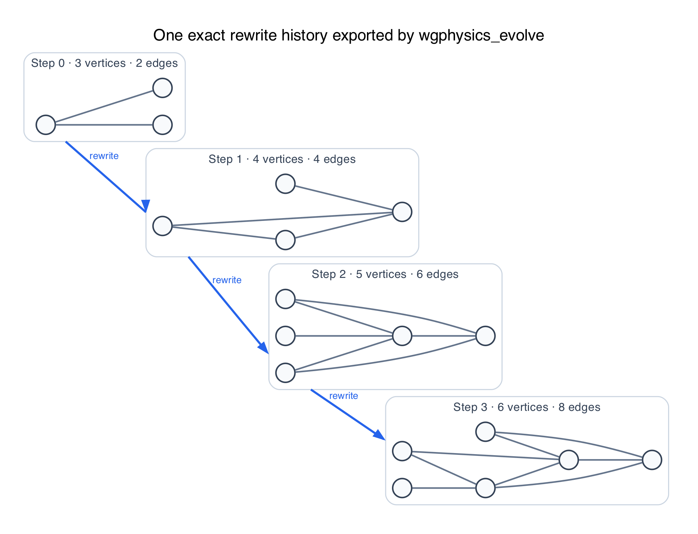
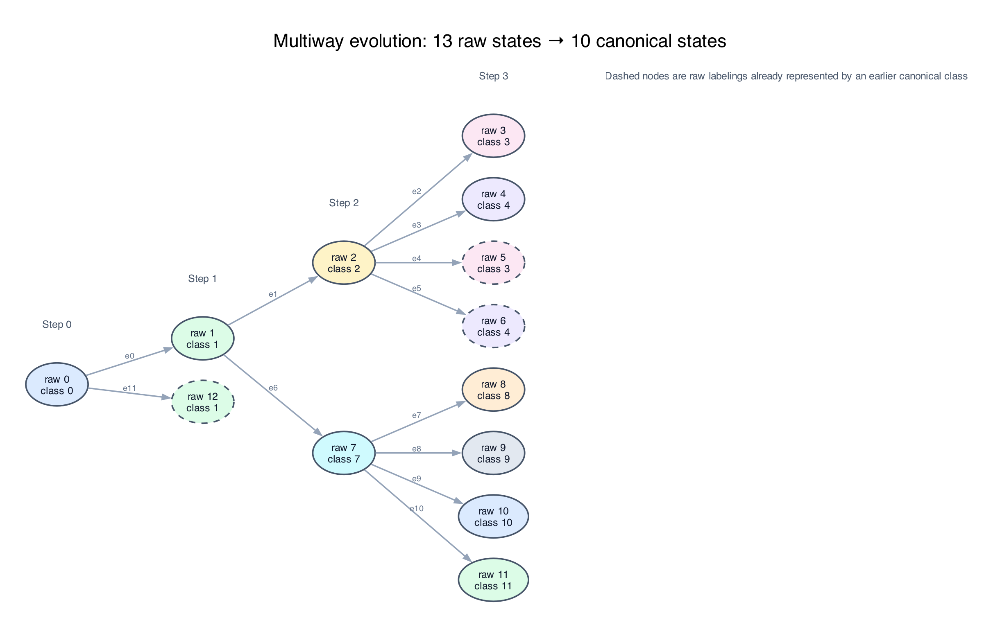

# Wolfram Physics Engine Exploration:<br/>Gauge Theory & the Standard Model

[](https://github.com/pirate/wolfram-gauge-physics/actions/workflows/ci.yml)

Stephen Wolfram launched the Wolfram Physics Project around a radical question: could familiar physics emerge from extremely simple computational rules, rather than being programmed into a simulation as the known equations of relativity, quantum mechanics, or the Standard Model? In the Wolfram model, a possible spatial state is represented by a hypergraph, local rules repeatedly replace small pieces of that graph, and a causal graph records which update events depend on earlier events. Following every possible order of updates produces a multiway graph of alternative histories; slices through that structure produce branchial graphs, which the project relates to quantum states and entanglement.

For suitable rules and under additional assumptions—especially locality, causal invariance, and an appropriate large-scale limit—the project argues that structures resembling continuous space, relativistic causal cones, and aspects of quantum mechanics can emerge. These are proposed mathematical correspondences, not yet a demonstrated model of our universe, and quantum probability is not simply the number of nodes in a hypergraph: Wolfram associates amplitude magnitude with path multiplicity in multiway evolution and phase with position in branchial space. The intuition is a little like Conway's Game of Life, except there is no fixed grid—the network of relationships that may become space is itself continually rewritten. This repository investigates whether gauge structure and field-like dynamics can be built at that microscopic level, with the long-term goal of testing for QED-like behavior and simple bound systems without inserting continuum fields or forces by hand; it does not yet derive QED, particles, physical constants, or molecules.

<table><tr>
<td>
<a href="https://www.youtube.com/watch?v=yAJTctpzp5w"><br/><small><code>Stephen Wolfram: Can space and time emerge from simple rules?</code></small></a>
</td>
<td>
<a href="https://www.wolframcloud.com/obj/wolframphysics/Tools/hands-on-introduction-to-the-wolfram-physics-project.nb"><br/><small><code>Hands-On Introduction to the Wolfram Physics Project</code></small></a>
</td>
</tr></table>

This repository asks a deliberately bottom-up question:

> Can gauge structure be computed from discrete fibers and rewrite symmetries before naming a
> continuum group, particle, force, lattice, or molecular geometry?

It connects the fiber and connection hierarchy explored by Wolfram Institute's
[InfraGaugeTheory](https://github.com/WolframInstitute/InfraGaugeTheory) to exact multiway
evolution from the
[HypergraphRewritingEngine](https://github.com/WolframInstitute/HypergraphRewritingEngine), then
adds the gauge-aware rewrite machinery needed between those two layers.

> [!IMPORTANT]
> This is experimental mathematical software, not a demonstrated derivation of the Standard
> Model, electromagnetism, particles, or continuum spacetime. Every result below is an exact
> statement about an implemented finite combinatorial model.

## Quick start

Requirements: CMake 3.20+ and a C++20 compiler.

```bash
git clone https://github.com/pirate/wolfram-gauge-physics.git
cd wolfram-gauge-physics
cmake -S . -B build -DCMAKE_BUILD_TYPE=Release
cmake --build build -j
ctest --test-dir build -L wgphysics --output-on-failure
./build/fiber_demo
./build/research_demo
./build/cell_dynamics_demo
```

To run a Wolfram-model rule with exact state canonicalization and export its evolution:

```bash
./build/wgphysics_evolve \
  --rule '0,1;0,2->0,2;0,3;1,3;2,3' \
  --init '1,2;1,3' \
  --steps 3 \
  --output out/evolution.json
```

# Progress So Far

The core construction now connects local combinatorial symmetry to gauge-aware multiway
evolution. This is one actual rewrite history produced by the quick-start rule above:



<sub>Generated from <code>out/evolution.json</code> by <code>tools/render_readme_graphs.py</code>; the
panels are graph states from the engine export, not an artist's reconstruction.</sub>

- **Derived microscopic gauge structure.** The local finite group
  $G_F = \mathrm{Aut}(F)$ is computed from fiber adjacency rather than supplied in advance.
  Oriented base edges carry transport maps $U_{xy}$, with
  $U_{yx}=U_{xy}^{-1}$; ordered products give parallel transport, loop holonomy, curvature,
  and obstructions to horizontal sections. Different fibers therefore produce different local
  symmetry groups without declaring $U(1)$, $SU(2)$, or another continuum group.

- **Exact gauge transformations and physical-state quotienting.** Independent frame changes act
  as $U_{xy}\mapsto g_yU_{xy}g_x^{-1}$. A spanning forest fixes redundant tree transport, while
  chord holonomies are canonicalized under simultaneous conjugation. Combining this with base-graph
  isomorphism gives an exact identity for physical connection states rather than treating gauge
  copies as distinct worlds.

- **Gauge-preserving hypergraph rewrites.** When a rewrite subdivides an edge, its transport is
  factored as $U_{xy}=U_{wy}U_{xw}$. All $|G_F|$ choices of the fresh frame are proven to form
  one gauge orbit. The corresponding quantum rewrite maps the parent to a normalized orbit with
  amplitude $1/\sqrt{|G_F|}$, so arbitrary frame labels do not create spurious physical branches.

- **A real rewriting-engine × gauge product.** Connections and oriented face boundaries are
  propagated through actual events from the official
  [HypergraphRewritingEngine](https://github.com/WolframInstitute/HypergraphRewritingEngine), using
  immutable consumed and produced edge identities. In the depth-four triangle subdivision example,
  436 raw states reduce to five physical product states while retaining all 435 events and 336
  causal edges. See the [product-evolution notes](docs/product-evolution.md).

The same export branches when more than one update is possible. Dashed states below are distinct
raw labelings that the exact graph-isomorphism quotient recognizes as the same canonical state:



- **Fiber inference and nonuniform bundles.** Induced local link graphs are classified by exact
  graph isomorphism and used to derive their automorphism groups; for example, a wheel exposes a
  square link with the nonabelian order-eight symmetry $D_4$. The bundle layer also supports
  non-isomorphic fibers and partial induced embeddings, with undefined horizontal lifts reported
  explicitly instead of silently approximated.

- **Dynamics discovered by finite search.** Reversible local maps are enumerated subject to
  identity preservation, orientation inversion, and conjugation equivariance. For the $D_4$
  example, every admissible unary map fixes all five physical curvature sectors—a useful no-go
  result. A reversible two-cell Hurwitz exchange,
  $(A,B)\mapsto(ABA^{-1},A)$, is the first implemented rule that moves curvature between adjacent
  cells while conserving total holonomy $AB$. See [causal dynamics](docs/causal-dynamics.md).

- **Causal curvature accounting.** Every supported engine event receives exact before-and-after
  holonomy sectors and the engine's causal dependencies. The analyzer distinguishes changes inside
  the causal future of a disturbance from off-causal changes; transport-preserving subdivision is
  verified as a zero-change control.

- **GPU-ready exact algebra and measured compression limits.** Group operations are compiled into
  dense integer multiplication, inverse, and action tables. On an Apple M1 Max, the Metal
  microbenchmark processed one million frame transformations in 0.318 ms and one million
  length-eight paths in 0.333 ms, with every result matching the CPU oracle. Separately, the
  elementary $D_4$ subdivision orbit has a flat rank-eight Schmidt spectrum, so truncating it to
  rank four necessarily discards half the norm—evidence that compression must report
  $\sum_{i>r}\sigma_i^2$, not hide it. Reproduction scripts and measurements are in
  [`bench/`](bench/).

- **Reproducible finite censuses.** Checked-in datasets cover every unlabeled simple fiber graph on
  one through four vertices, their derived symmetry and curvature sectors, admissible bounded
  dynamics, rewrite-orbit reduction, and the cross-product with the real subdivision closure. The
  generated data live in [`data/`](data/) and the exact definitions and limitations are collected
  in [research milestones](docs/research-milestones.md).

# Future Work

1. **Move the physical quotient into the rewriting engine.** Include connection state in arena and
   match keys so evolution constructs physical states directly instead of expanding raw provenance
   and quotienting afterward.

2. **Derive richer local dynamics.** Search beyond unary maps and the first Hurwitz exchange for
   reversible, gauge-covariant update laws generated by local rewrite symmetries. Independent gauge
   events should acquire causal dependencies from the face and link data they read and write.

3. **Generalize the microscopic bundle.** Compare fibers inferred from vertex links, rule
   automorphisms, repeated causal neighborhoods, and branchlike equivalence classes; then extend
   the implementation to twisted bundles, directed or ribbon fibers, hypergraph fibers, higher
   connections, and dynamically changing fiber types.

4. **Turn the GPU representation into an end-to-end evolution kernel.** Fuse matching,
   affected-cycle updates, canonical signatures, deduplication, and queue insertion in a persistent
   CUDA or Metal execution path, borrowing scheduling and sparse-aggregation techniques from modern
   graph-learning kernels.

5. **Test controlled amplitude compression.** Measure Schmidt spectra on multi-event contraction
   graphs and introduce tensor-network approximations only where the spectra actually decay, with
   explicit discarded-norm and observable-error bounds.

6. **Search for continuum and low-energy observables.** Look for propagation-speed convergence,
   foliation independence, effective dimension, localized persistent excitations, loop scaling,
   center sectors, and eventually QED-like long-range behavior. Molecular or atomic claims should
   wait until the model produces calibrated charges, masses, couplings, and stable bound states.

7. **Expand the public benchmark census.** Add nontrivial rule morphisms, larger and asymmetric
   fibers, more curvature sectors, scaling curves, and independently reproducible reference cases
   that can be compared across Wolfram Language, C++, CPU, and GPU implementations.

8. **Turn the static graph renderer into an interactive playground.** Render spatial hypergraphs,
   multiway branches, causal edges, fibers, transport labels, and holonomy sectors in one inspectable
   interface; export deterministic screenshots and small animations so conceptual and performance
   changes are easy to review in forum posts.

9. **Validate the construction with the Wolfram community.** Resolve which microscopic fiber
   object and gauge quotient best match the intended semantics of
   [InfraGaugeTheory](https://github.com/WolframInstitute/InfraGaugeTheory), identify the strongest
   early falsifiable observables, and converge on a shared small-rule benchmark suite.

Deeper references: [mathematical foundations](docs/infragauge-foundations.md),
[GPU execution plan](docs/gpu-execution.md),
[state of the art and contribution boundary](docs/STATE_OF_THE_ART.md), and
[repository contribution guide](CONTRIBUTING.md).

MIT licensed. This is an independent experimental project, not an official Wolfram Institute or
Wolfram Research repository. It depends on and cites their MIT-licensed research software; no
Wolfram Language source is vendored.
