# Wolfram Physics Engine Exploration:<br/>Gauge Theory & the Standard Model

[](https://github.com/pirate/wolfram-gauge-physics/actions/workflows/ci.yml)

Stephen Wolfram launched the Wolfram Physics Project around a radical question: could familiar physics emerge from extremely simple computational rules, rather than being programmed into a simulation as the known equations of relativity, quantum mechanics, or the Standard Model? In the Wolfram model, a possible spatial state is represented by a hypergraph, local rules repeatedly replace small pieces of that graph, and a causal graph records which update events depend on earlier events. Following every possible order of updates produces a multiway graph of alternative histories; slices through that structure produce branchial graphs, which the project relates to quantum states and entanglement.

For suitable rules and under additional assumptions—especially locality, causal invariance, and an appropriate large-scale limit—the project argues that structures resembling continuous space, relativistic causal cones, and aspects of quantum mechanics can emerge. These are proposed mathematical correspondences, not yet a demonstrated model of our universe, and quantum probability is not simply the number of nodes in a hypergraph: Wolfram associates amplitude magnitude with path multiplicity in multiway evolution and phase with position in branchial space. The intuition is a little like Conway's Game of Life, except there is no fixed grid—the network of relationships that may become space is itself continually rewritten. This repository investigates whether gauge structure and field-like dynamics can be built at that microscopic level, with the long-term goal of testing for QED-like behavior and simple bound systems without inserting continuum fields or forces by hand; it does not yet derive QED, particles, physical constants, or molecules.

<table><tr>
<td>
<a href="https://www.youtube.com/watch?v=yAJTctpzp5w"><br/><small><code>Stephen Wolfram: Can space and time emerge from simple rules?</code></small></a>
</td>
<td>
<a href="https://www.wolframcloud.com/obj/wolframphysics/Tools/hands-on-introduction-to-the-wolfram-physics-project.nb"><br/><small><code>Hands-On Introduction to the Wolfram Physics Project</code></small></a>
</td>
</tr></table>

This repository asks a deliberately bottom-up question:

> Can gauge structure be computed from discrete fibers and rewrite symmetries before naming a
> continuum group, particle, force, lattice, or molecular geometry?

It connects the fiber and connection hierarchy explored by Wolfram Institute's
[InfraGaugeTheory](https://github.com/WolframInstitute/InfraGaugeTheory) to exact multiway
evolution from the
[HypergraphRewritingEngine](https://github.com/WolframInstitute/HypergraphRewritingEngine), then
adds the gauge-aware rewrite machinery needed between those two layers.

> [!IMPORTANT]
> This is experimental mathematical software, not a demonstrated derivation of the Standard
> Model, electromagnetism, particles, or continuum spacetime. Algebraic results concern finite
> combinatorial models; sampled geometry estimates and visual projections are diagnostics.

## Quick start

Requirements: CMake 3.20+ and a C++20 compiler.

```bash
git clone https://github.com/pirate/wolfram-gauge-physics.git
cd wolfram-gauge-physics
cmake -S . -B build -DCMAKE_BUILD_TYPE=Release
cmake --build build -j
ctest --test-dir build -L wgphysics --output-on-failure
./build/fiber_demo
./build/research_demo
./build/cell_dynamics_demo
```

To run a Wolfram-model rule with exact state canonicalization and export its evolution:

```bash
./build/wgphysics_evolve \
  --rule '0,1;0,2->0,2;0,3;1,3;2,3' \
  --init '1,2;1,3' \
  --steps 3 \
  --output out/evolution.json
```

Open the simulation debugger with `python3 -m http.server 8765 --bind 127.0.0.1`, then visit
[localhost:8765/viewer/](http://localhost:8765/viewer/). See the [debugger guide](docs/debugger.md)
for its selections, view budgets, and projection limits.

# Progress So Far

The core construction now connects local combinatorial symmetry to gauge-aware multiway
evolution. This is one actual rewrite history produced by the quick-start rule above:


<sub>Generated from <code>out/evolution.json</code> by <code>tools/render_readme_graphs.py</code>; the
panels are graph states from the engine export, not an artist's reconstruction.</sub>

- **Derived microscopic gauge structure.** The local finite group
  $G_F = \mathrm{Aut}(F)$ is computed from fiber adjacency rather than supplied in advance.
  Oriented base edges carry transport maps $U_{xy}$, with
  $U_{yx}=U_{xy}^{-1}$; ordered products give parallel transport, loop holonomy, curvature,
  and obstructions to horizontal sections. Different fibers therefore produce different local
  symmetry groups without declaring $U(1)$, $SU(2)$, or another continuum group.

- **Exact gauge transformations and physical-state quotienting.** Independent frame changes act
  as $U_{xy}\mapsto g_yU_{xy}g_x^{-1}$. A spanning forest fixes redundant tree transport, while
  chord holonomies are canonicalized under simultaneous conjugation. Combining this with base-graph
  isomorphism gives an exact identity for physical connection states rather than treating gauge
  copies as distinct worlds.

- **Gauge-preserving hypergraph rewrites.** When a rewrite subdivides an edge, its transport is
  factored as $U_{xy}=U_{wy}U_{xw}$. All $|G_F|$ choices of the fresh frame are proven to form
  one gauge orbit. The corresponding quantum rewrite maps the parent to a normalized orbit with
  amplitude $1/\sqrt{|G_F|}$, so arbitrary frame labels do not create spurious physical branches.

- **A real rewriting-engine × gauge product.** Connections and oriented face boundaries are
  propagated through actual events from the official
  [HypergraphRewritingEngine](https://github.com/WolframInstitute/HypergraphRewritingEngine), using
  immutable consumed and produced edge identities. In the depth-four triangle subdivision example,
  436 raw states reduce to five physical product states while retaining all 435 events and 336
  causal edges. See the [product-evolution notes](docs/product-evolution.md).

The same export branches when more than one update is possible. Dashed states below are distinct
raw labelings that the exact graph-isomorphism quotient recognizes as the same canonical state:


- **Fiber inference and nonuniform bundles.** Induced local link graphs are classified by exact
  graph isomorphism and used to derive their automorphism groups; for example, a wheel exposes a
  square link with the nonabelian order-eight symmetry $D_4$. The bundle layer also supports
  non-isomorphic fibers and partial induced embeddings, with undefined horizontal lifts reported
  explicitly instead of silently approximated.

- **Dynamics discovered by finite search.** Reversible local maps are enumerated subject to
  identity preservation, orientation inversion, and conjugation equivariance. For the $D_4$
  example, every admissible unary map fixes all five physical curvature sectors—a useful no-go
  result. A reversible two-cell Hurwitz exchange,
  $(A,B)\mapsto(ABA^{-1},A)$, is the first implemented rule that moves curvature between adjacent
  cells while conserving total holonomy $AB$. See [causal dynamics](docs/causal-dynamics.md).

- **Causal curvature accounting.** Every supported engine event receives exact before-and-after
  holonomy sectors and the engine's causal dependencies. The analyzer distinguishes changes inside
  the causal future of a disturbance from off-causal changes; transport-preserving subdivision is
  verified as a zero-change control. These are event dependencies; spatial locality and quantum
  entanglement require separate tests.

- **Interactions across local fiber frames.** Two-cell updates now compare holonomies through
  explicit connector transport and expose their link read/write supports. Alongside Hurwitz
  transport, the established braid map $(A,B)\mapsto(ABA,A^{-1})$ changes individual curvature
  sectors while preserving $AB$. The square-fiber census resolves 64 pairs into 28 gauge orbits;
  tests check inverses, local gauge covariance, and braid identities on transported connections.
  See [pair interactions and their mathematical limits](docs/pair-interactions.md).

- **Intrinsic geometry probes and a simulation debugger.** Graph-distance ball growth and lazy
  diffusion estimate $d_H(r)$ and $d_s(t)$ independently of display coordinates. The debugger
  connects selected hypergraphs, event dependencies, branchial slices, and graph-distance 3-D
  projections. Its bounded views support small-state inspection; million-node streaming and
  reliable continuum-dimension detection remain future work.

- **Multi-cell dynamics with explanatory controls.** An exact compiled cell-chain runner agrees
  with the full transported-link implementation and records update dependencies. An 80-run census
  executes 2.83 million updates across four sizes. Its spreading patterns expose a conserved
  generated subgroup and an exact streaming-sublattice reduction, ruling out a naive particle
  interpretation of these controls. See the [experiments, derivations, and measured profiles](docs/chain-experiments.md).

- **An exhaustive finite interaction search and derived defect charges.** Symmetry-closed
  involutions enumerate 1,769,472 square-fiber pair laws; 3,592 both grow generated subgroups
  and satisfy the braid relation exactly. An independent screen of the fourteen simplest
  such laws derives three additive gauge-sector charges and observes conserved-defect motion
  and collisions. Spectator tests expose why gauge agreement on an isolated triple is too weak
  for local schedule consistency. See the [scope, tables, and collision controls](docs/equivariant-rule-search.md).

- **An exact bridge to statistical transport—and a limit on this rule family.** Microscopic
  gauge updates produce tagged-particle diffusion with $D=(1-\rho)/(2\rho)$ in single-layer
  units, with an exact finite-time distribution and 8.46 billion checked pair updates.
  This recovers known exclusion-process physics on a supplied chain, not emergent spacetime.
  All 5,731 exact braid rules reduce to 66 labeled block-exchange charge tables; minimal-closure
  factorization also proves autonomous pair-sector dynamics for every admitted involution on
  independent cell variables—not for all incident faces on a shared-link mesh.
  See the [derivation, numerical discrepancy, and reproduction](docs/emergent-diffusion.md)
  and the [finite-family classification and its scope](docs/braid-quotient-classification.md).

  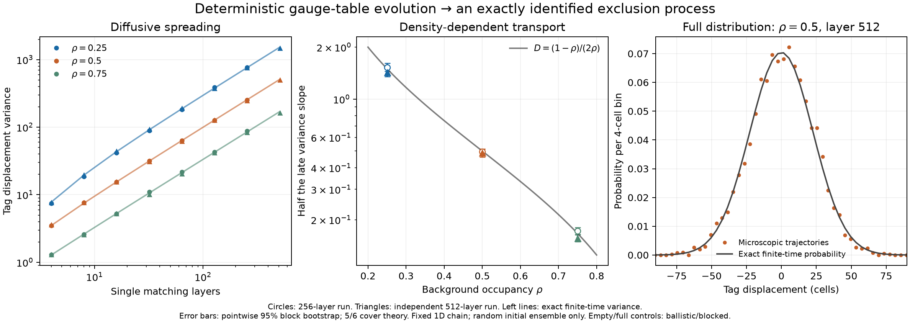

- **Multi-loop feedback and reversible coarse relaxation on shared-link meshes.** Keeping every
  incident face escapes the independent-cell restriction with the same microscopic table.
  An exhaustive 4,096-state patch census finds different neighboring curvature responses even
  with identical incoming face classes and exterior links. On periodic meshes, small link seeds
  spread toward local statistics near exact stationary uniform-link references; reversing the
  evolution restores every initial link. The former additive face-class counts are not global
  mesh charges. See the [counterexample, derivation, 80 controlled runs, and limitations](docs/shared-face-dynamics.md).

  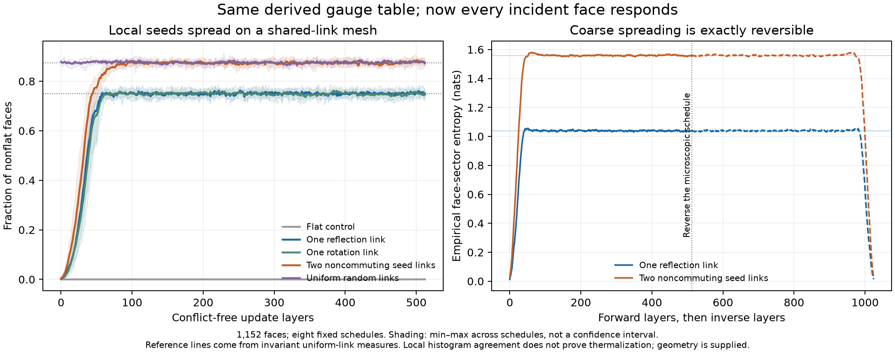

- **A structural obstruction that narrows the search for energy.** For the exclusive closing-link lift,
  a conserved face sum $E=\sum_f q(H_f)$ must descend to $G/N$, where $N$ is generated by
  the rule's transport increments; every surviving face value is individually frozen.
  All 5,730 nonidentity strict square-fiber braid rules have $N=G$, excluding nonconstant
  one-face energies throughout that family. Exact memory and larger-mesh tests also expose
  false coarse randomness and twelve finite-size neighboring-loop invariants.
  See the [finite-group proof and independent controls](docs/face-energy-obstruction.md)
  and the [memory, frozen-sector, and schedule audit](docs/observable-memory-and-invariants.md).

- **A constructive shared-edge lift and conserved transport on an actual mesh.** Keeping a
  two-face boundary fixed uniquely determines the shared-link update $S'=SA^{-1}X$.
  Unlike the exclusive-link lift, it changes no spectator faces and restores three derived
  global face charges without altering the pair rule. Independent link algebra replays
  4.92 million updates across two sizes. The trajectories expose an exact two-state curvature
  memory and a bipartite parity invariant; their charge projection is still exclusion dynamics,
  not a derivation of physical particles or energy. See the [construction and controls](docs/shared-edge-transport.md).

  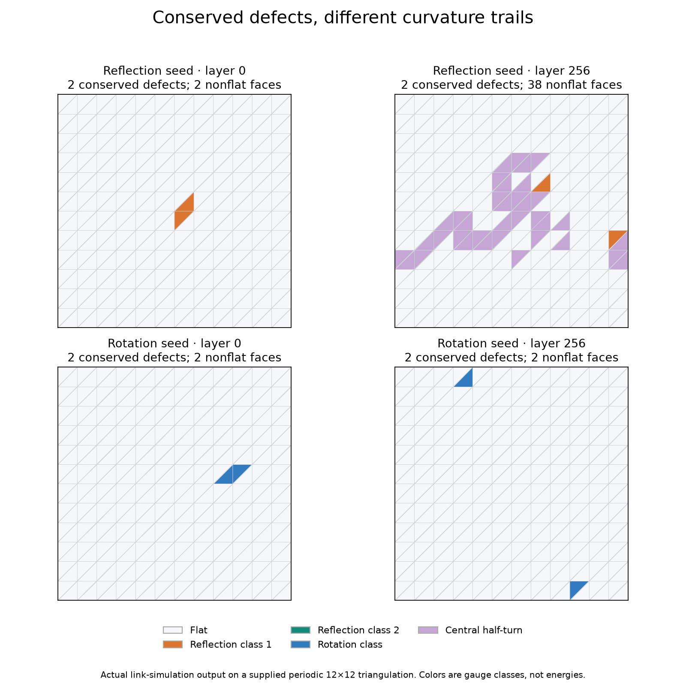

- **Conserved transport with relative-loop feedback.** Independent searches agree on 945 minimal
  three-face rules; 354 distinguish incoming states with identical face classes and boundary
  transport through their outgoing conserved densities. A boundary-fixed two-spoke realization
  reads every affected face. The selected rule derives $q(z)=2q(r)$ and supports a positive
  conserved weight; 15.31 million independently replayed updates verify conditional curvature
  conversion alongside transport-only controls. The model remains classical, schedule-dependent,
  and constrained by dual sublattices. See the [proof, actual states, and negative controls](docs/three-face-feedback.md).

  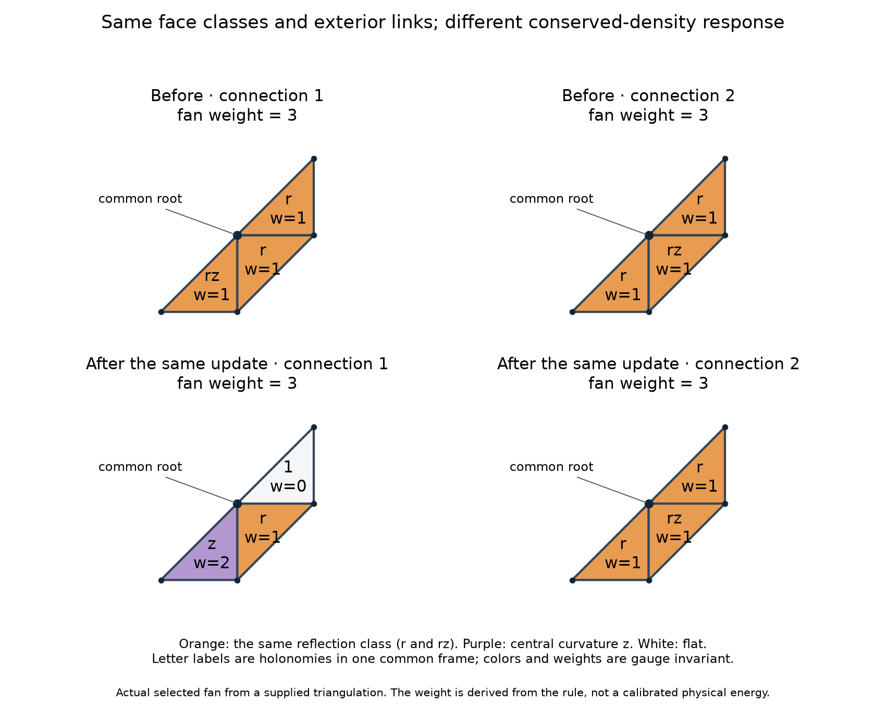

- **Sparse encounters and an exact kinetic-sector classification.** A subgroup reduction derived
  from the link equations finds transport-generated encounters without changing the rule.
  Complete small-mesh searches separate reactive and central-only states with identical additive
  charges. For an explicitly uniform random update ensemble, exact counting gives
  $\mathbb E[C_{\rm sweep}]=48/[m(m+1)]$ at total weight four, with $m$ faces per sublattice.
  Exact frame-stabilizer preservation explains why this fusion needs a noncentral remnant.
  Larger sparse runs retain both rare reactions and null results. This diagnoses a catalytic
  constraint, not molecular binding. See the [link replays, component proof, and rate benchmark](docs/three-face-encounters.md).

- **Compatible noncommuting reaction channels and an exact statistical reduction.** A positivity
  audit identifies 144 converting triple laws in three 48-rule charge families. Mixed-arity
  support lets those laws coexist with one-step shared-edge transport, removing the additive
  sublattice locks. Independent raw-link replay checks 252 controlled runs and 311 conversions.
  Uniform family sampling yields an exact classical face-class process, with a grand-canonical stationary
  occupation relation $\rho_a\rho_b/(\rho_h\rho_1)=2$ from internal class degeneracies—not
  a prescribed reaction constant or a molecular result. See the [charge cones, observer limit,
  and equilibrium assumptions](docs/nonabelian-channel-banks.md).

- **Link-realizable equilibrium predictions and a binding restriction.** Complete search reaches
  all 468,180 class states in one small noncommuting charge sector. Exact counting predicts
  $(\Pr(N_h=k))_{k=0}^{2}=(182,56,3)/241$ and a conversion frequency $440/86037$ per attempted
  update; independently replayed raw-link runs test both. The equilibrium class distribution
  has no distance preference beyond graph geometry, and positive state-independent reweighting
  of the same reversible generators cannot change it. This identifies a concrete obstacle to
  equilibrium class binding, not a molecule. See the [component proof, measurements, and scope](docs/reachable-gauge-equilibrium.md).

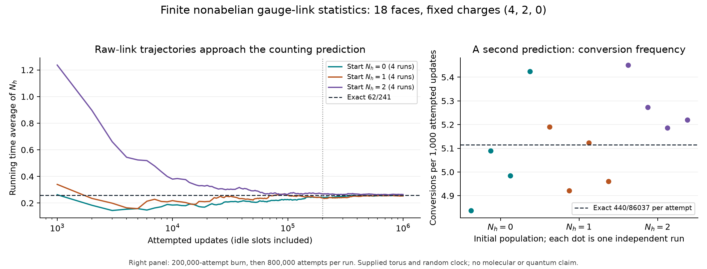

- **Complete loop information and a graph-derived mode probe.** Derived central-extension
  coordinates recover a square-fiber connection up to local frames; two- and three-loop
  relation probes expose information that individual loop classes lose. Two actual conversions
  have identical face classes and exterior links but different gauge-invariant relations and
  different spectra of the lifted bundle graph. The two-component mode space is derived from
  fiber adjacency and used only as a diagnostic—not an inserted Hamiltonian or quantum-matter
  claim. See the [reconstruction proof, link witness, and exact spectral comparison](docs/complete-loop-observer.md).

- **Certified localized modes—and a precise limit on their persistence.** A compact integer
  witness proves that two specified fiber-link defects support exactly two modes above the
  flat band of the derived two-component sector on the infinite triangular lattice, with an exponential spatial
  tail bound. Finite-size measurements resolve their separate densities through 36,864 base
  vertices. But an independently replayed single-edge update removes the last above-band mode
  in another state while preserving its curvature-class histogram: spatial localization is
  not yet dynamical particle stability. See the [proof, curvature bound, and exact crossing](docs/localized-fiber-modes.md).

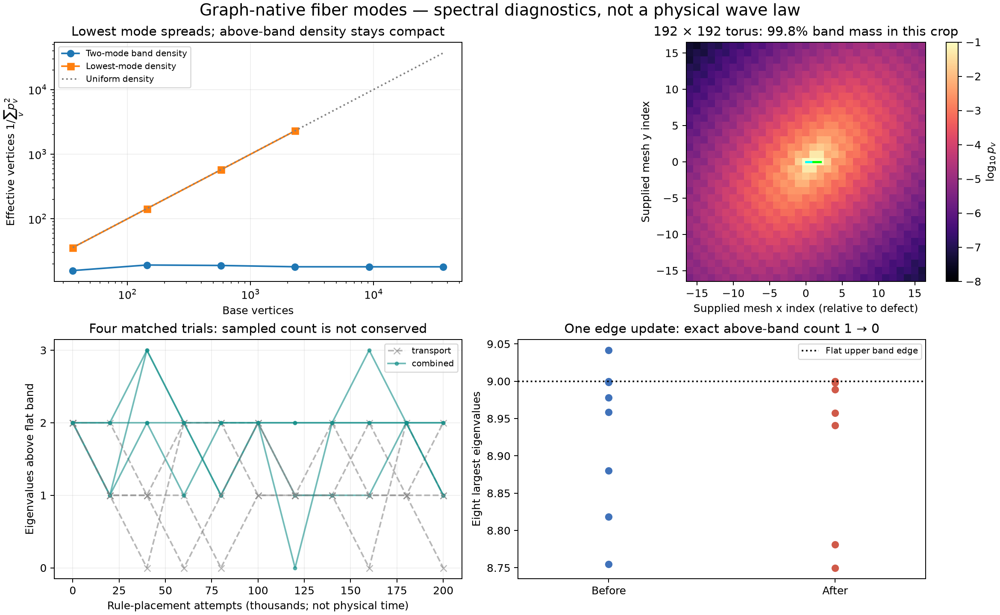

- **Classical holonomy memory from actual defect transport.** Moving a defect around a
  noncommuting defect with twelve existing link updates returns every curvature class to its
  original face but flips a gauge-invariant central relation and changes $\operatorname{tr}L^{14}$.
  A second circuit restores the gauge orbit; commuting and empty-interior controls do not
  change it. Forty-eight checked path detours differ only by local frames. The derived pure-winding
  orbit formula also exposes the square fiber's limitation: these pure actions commute.
  See the [raw-link braid experiment, proof, and next-fiber criterion](docs/transport-braid-memory.md).


- **Noncommuting transport from a triangle fiber, with an exact algebraic explanation.**
  Deriving $\operatorname{Aut}(C_3)=S_3$ from adjacency and using the same local vacancy rule
  makes two closed circuits order-dependent on actual links. Their four reachable complete
  gauge states realize $\operatorname{PSL}(2,\mathbb F_3)\cong A_4$: every measured action
  matches a fixed Hurwitz word, and all 27 neutral four-reflection tuples validate the
  projective-coordinate derivation. Opposite circuit orders preserve every face class but
  change the full bundle-graph spectrum; square-fiber and commuting-seed controls do not.
  This is controlled classical holonomy response, not quantum statistics or autonomous matter.
  See the [raw-link realization, finite-field proof, and controls](docs/noncommuting-fiber-transport.md).
  An [unrouted recurrence detector](docs/unrouted-transport.md) also finds gauge memory under
  state-independent local scheduling, with an exact torus-winding explanation of its
  commuting controls and explicit bounded-negative runs. The vacancy rule still has no
  hidden-state feedback into defect motion.

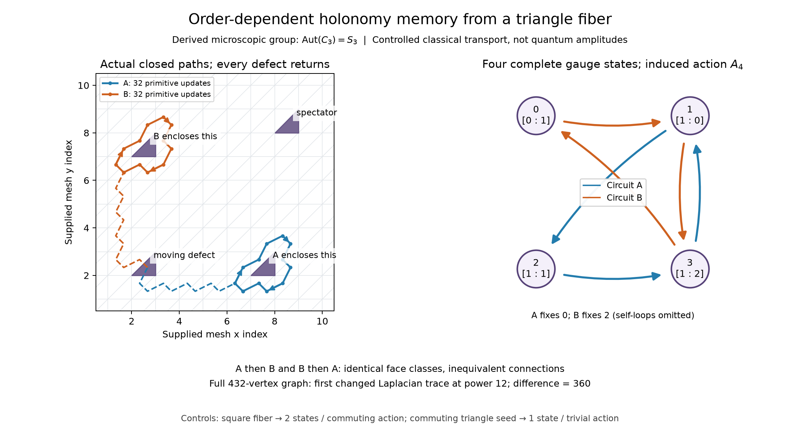

- **Stored holonomy changes local reaction dynamics.** The triangle fiber's independently
  enumerated 144 minimal three-face rules yield a twelve-rule reaction bank with derived
  positive charge $Q=N_R+2N_C$. Bringing stored braid-memory states into the same encounter
  gives different reaction rates despite identical face classes everywhere and the same
  encounter-boundary holonomy. C++ and Python enumerate all 11,232 rooted update choices:
  twelve enable a class-changing reaction in one state, none in the other. Unrouted runs
  independently reproduce reversible conversions and their negative controls. The same
  derived charge bounds full-graph spectral capacity, $n_+(L_{\rm bundle}-12I)\le\lfloor Q/2\rfloor$. This is
  classical gauge feedback, not yet stable matter or physical energy. See the
  [rule derivation, raw-link readout, and evolution](docs/triangle-feedback.md).

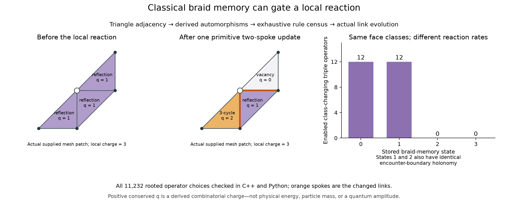

- **Full-graph localization with an exact persistence obstruction.** Two specified noncommuting
  triangle-fiber link defects support exactly two isolated modes above the **entire** infinite
  flat bundle spectrum. Compact integer witnesses prove both eigenvalues exceed $12.05$;
  a resolvent bound proves exponentially decaying tails. The equal-reflection control has
  exactly one mode. The stronger bound
  $n_+(L_{\rm bundle}-12I)\le\min(Q_\uparrow,Q_\downarrow)$ connects survival to the
  charge split between the two triangle orientations: concentrating all charge on either
  orientation forbids every above-band mode. Exact counts at all 860 changing events in a
  recorded run and all twelve reactions across four runs show actual mode loss, with the
  bound forcing every observed downward reaction crossing. These are localized graph modes
  on supplied geometry, not stable particles, atomic energies, or an assumed wave law.
  See the [integer certificates, full dynamics, and limitations](docs/triangle-modes.md).
  The [full-generator persistence audit](docs/triangle-mode-rates.md) strengthens this:
  every changing vacancy move of charge $q$ destroys at least $q$ modes when the
  $Q/2$ capacity is saturated. Exact one-step kernels also show that mode count,
  orientation charges, and defect populations do not close the dynamics, even within
  one reachable component.

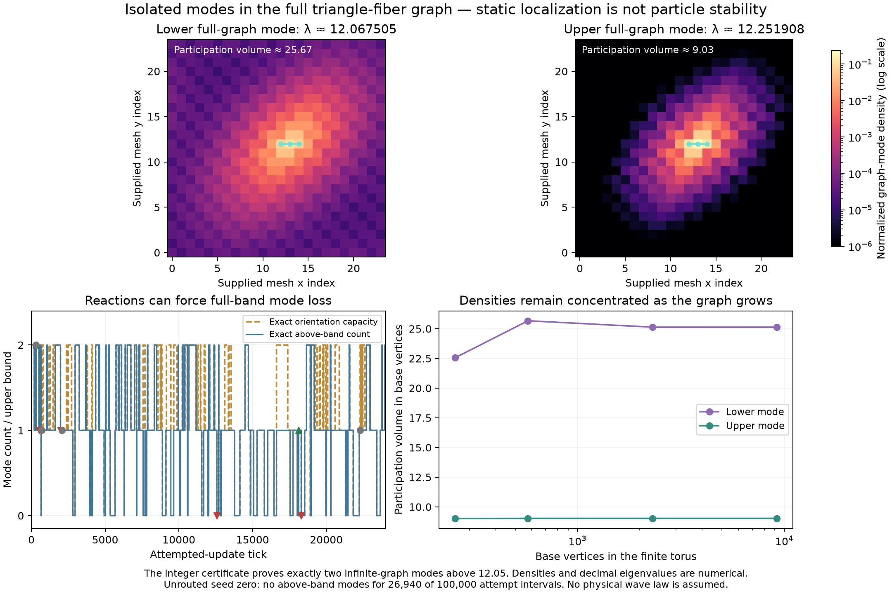

- **Conserved currents with gauge-dependent fluctuations.** Every primitive supplies a
  scalar-charge current across its actual written links, with exact continuity
  $\Delta\mathbf q=B\mathbf j$. Exhausting all 216 local inputs shows that mean charge
  drift depends only on the charge field, while noise retains relative-holonomy information.
  Prepared braid-memory states have identical full charge fields, mean currents, and
  encounter-boundary holonomy but different exact covariances. Autonomous runs then start
  from the same uniform $q_f=1$ field: a single-reflection connection stays frozen, while
  microscopic reflection disorder activates fluctuations and transport. Frozen and
  reaction-disabled controls, two mesh sizes, and independently replayed currents check
  the effect. Random scheduling and initial microscopic disorder are supplied; no separate
  charge-noise term or wave law is inserted.
  See the [current derivation, exact noise witness, and activation runs](docs/triangle-charge-current.md).

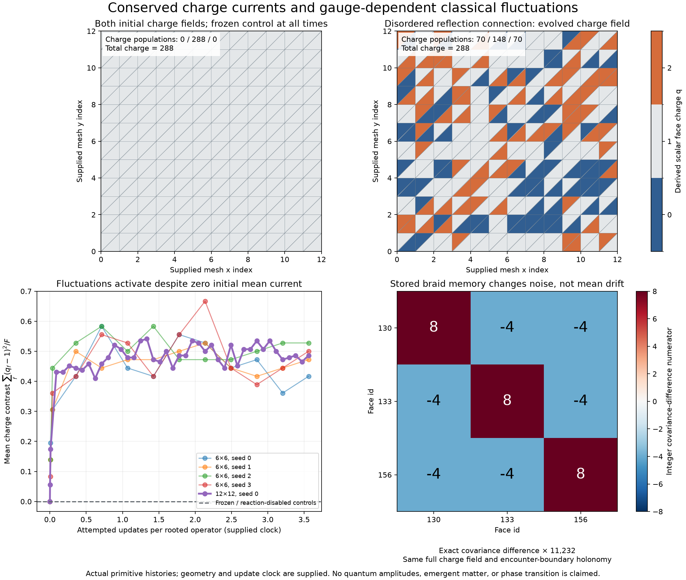

- **Exact connection statistics and microscopic freezing constraints.** Character counting
  and independent integer group convolution agree on the number of actual connections at
  fixed charge; an exact sampler reconstructs their raw links without burn-in. The reference
  is stationary, not assumed to describe every trajectory. An exact local activity detector
  proves that no state with $0<Q<F$ can be completely frozen on these connected meshes.
  At $Q=F$, freezing is determined by based reflection patterns around each vertex:
  even full noncommuting $S_3$ holonomy permits isolated frozen states. Thus total charge
  and holonomy group alone do not identify a reachable component. See the
  [counting formulas, sampler, and frozen-star criterion](docs/triangle-reference.md).


- **Locally seeded nonabelian activity spreads through actual connections.** A single
  changed link leaves the entire initial charge field unchanged but activates the
  existing reaction/transport bank. Across 36 controlled runs on 72-, 288-, and
  1,152-face meshes, every face eventually changes charge; untouched and
  reaction-disabled controls stay fixed. Every changing event has checked read/write
  ancestry back to the seed, and a common local gauge transformation preserves the
  measured response. First-passage maps and periodic-seam warnings distinguish
  spreading from finite-box saturation. This is externally seeded classical activity,
  not a localized particle or an established propagation law. See the
  [exact initial fluctuation rate, coupled controls, and spreading audit](docs/triangle-spreading.md).
  An [exact discrete event clock and local active-set cache](docs/triangle-event-clock.md)
  now support 32 independent seeds paired across two mesh sizes. Their translated
  microscopic prefixes agree exactly before the smaller boundary cutoff; censored
  first-passage trials remain explicitly counted instead of biasing the reported means.

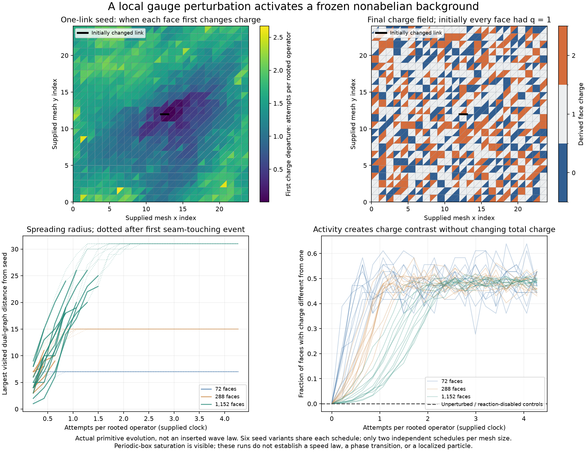

- **Derived transport equations with exact tests for missing gauge information.**
  In the two-defect reflection sector, summing the primitive updates gives an exact
  discrete heat equation for mean charge. Reactive sectors have a calculable two-step
  correction to linear diffusion; its per-face squared residual scales as $F^{-3}$
  at fixed four-charge content, from exact algebra rather than a fit. An independent
  census of all 5,508 allowed charge fields on the smallest mesh checks the response
  with correct connection weights. Two actual braid-memory preparations then show
  identical full charge fields and initial drift but different mean charge after two
  updates: relative-gauge activity must enter the effective description. Even adding
  current activity flags is insufficient: another raw-connection pair agrees through
  two-step mean response but separates after three updates. This is
  classical transport and a concrete closure obstruction, not QED or molecular binding.
  See the [response derivation and exact memory witnesses](docs/triangle-charge-response.md).

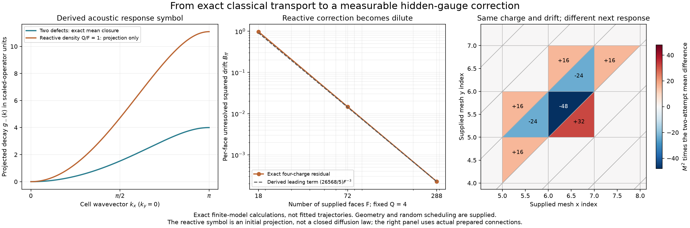

- **Gauge-complete patch dynamics with exact overlap information.** Short holonomy
  products distinguish all 49 gauge states of a three-loop patch, with linear-size
  reconstructible coordinates for larger tuples. Two separately complete patches
  still lose their relative alignment: 845 compatible patch-state pairs correspond
  to 1,393 states of their union. A double-coset gluing label retains exactly that
  missing information, including connector transport between different basepoints.
  All 61,292 transitions of the resulting boundary-contained kernel match C++ raw-link
  updates. Identical separate patch states can develop different mean charge after
  three controlled updates. This is a lossless local gauge reduction, not yet a
  whole-mesh or quantum model. See the [gluing construction and exact kernel](docs/triangle-patch-observer.md).

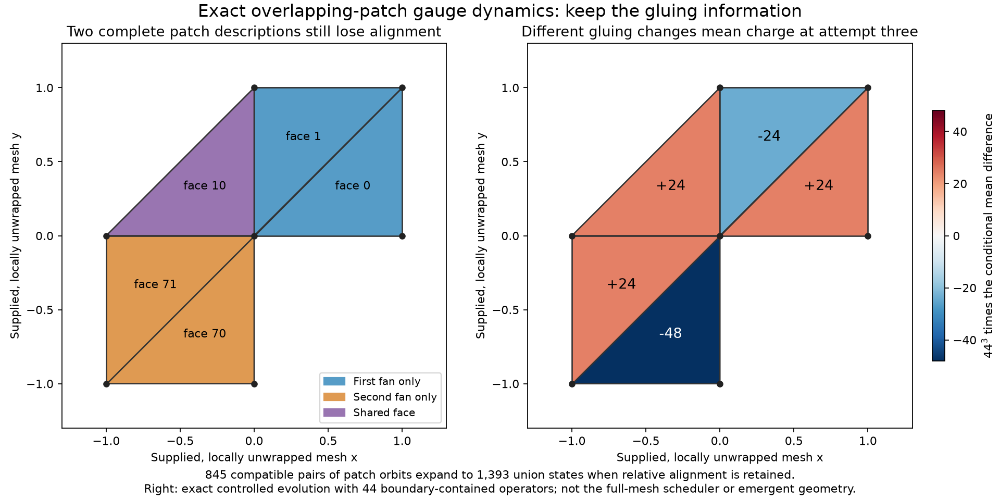

- **Whole-mesh evolution with complete loop information retained.** An incremental
  tree-gauge adapter now runs the original primitive bank while preserving every
  independent loop, including global torus handles. Lazy nonabelian subtree-frame
  updates avoid rebuilding the gauge coordinates after each event: the update path
  uses at most five frame queries and two interval corrections. Every rooted loop
  matches independent C++ histories on four mesh sizes. At the largest measured
  size, this is 2.7 times faster than eager gauge restoration, but raw-link evolution
  remains 14 times faster in the Python comparison. These are coordinate-maintenance
  improvements, not new physical interactions. See the
  [derivation, ordering controls, and benchmark](docs/triangle-lazy-gauge.md).

- **Minimal elastic collisions with an observable gauge-mediated response.** An
  exhaustive search finds 192 charge-preserving equivariant pair bijections. The
  two smallest non-involutive laws form an inverse pair: they change relative loop
  alignment without changing any face charge. In a separately identified candidate
  bank, these collisions release two frozen patch states and change whole-mesh mean
  charge after three automatic attempts, compared with an identity-padded control
  using exactly the same clock. All 1,176 entries of the local gauge kernel match
  raw C++ evolution. Its isolated patch has identical mean charge under both banks
  at every time, but different fluctuations—an exact warning against judging
  activation from mean density alone. A whole-mesh argument also excludes absorbing
  states in the candidate bank's full-$S_3$, $Q=F$ sector: freezing would require
  reduction to a commuting two-element holonomy group. This is classical gauge-mediated reaction
  dynamics, not particle binding or a quantum scattering matrix. See the
  [selection proof, automatic response, and activation law](docs/triangle-elastic-scattering.md).

- **GPU-ready exact algebra and measured compression limits.** Group operations are compiled into
  dense integer multiplication, inverse, and action tables. On an Apple M1 Max, the Metal
  microbenchmark processed one million frame transformations in 0.318 ms and one million
  length-eight paths in 0.333 ms, with every result matching the CPU oracle. The
  complete fixed-topology gauge observer now processes 1.08 million edges in a median 3.44 ms
  on the CPU after forest compilation; this is observation throughput, not evolution or rendering.
  Separately, the elementary $D_4$ subdivision orbit has a flat rank-eight Schmidt spectrum, so truncating it to
  rank four necessarily discards half the norm—evidence that compression must report
  $\sum_{i>r}\sigma_i^2$, not hide it. Reproduction scripts and measurements are in
  [`bench/`](bench/).

- **Reproducible finite censuses.** Checked-in datasets cover every unlabeled simple fiber graph on
  one through four vertices, their derived symmetry and curvature sectors, admissible bounded
  dynamics, rewrite-orbit reduction, and the cross-product with the real subdivision closure. The
  generated data live in [`data/`](data/) and the exact definitions and limitations are collected
  in [research milestones](docs/research-milestones.md).

# Future Work

1. **Move the physical quotient into the rewriting engine.** Include connection state in arena and
   match keys so evolution constructs physical states directly instead of expanding raw provenance
   and quotienting afterward.

2. **Derive richer local dynamics.** Search beyond unary maps and the first Hurwitz exchange for
   reversible, gauge-covariant update laws generated by local rewrite symmetries. Independent gauge
   events should acquire causal dependencies from the face and link data they read and write.
   Shared-face accounting now exposes multi-loop feedback beyond the independent-cell
   obstruction, while the shared-edge lift restores transported charges but retains an
   autonomous exclusion factor. The three-face fan now combines conserved transport with
   relative-loop feedback. Sparse encounters are now reachable, but exact sectors and rate
   counts expose catalytic dilution. Compare activation requirements and kinetic restrictions
   across the rule census, and test localization and overlapping schedules before assigning physical meaning;
   extend primitive searches without inserting a target energy or force law.
   The square-fiber compatible banks supply a closed classical conversion/transport
   reference. One small sector now has an exhaustive component proof and measured canonical
   statistics; its spatial exchangeability rules out equilibrium class binding even under
   positive constant schedule reweighting. Test larger sectors, transient localization, and
   extended loop correlations while keeping
   microscopic loop information distinct from what survives uniform rule averaging. The
   triangle-fiber reaction bank now retains hidden-state feedback even under uniform averaging and
   reads out stored braid memory through actual reaction rates. Test its encounter statistics,
   persistence, and positional correlations without assuming this alone evades equilibrium
   restrictions. Exact reference sampling and a local frozen-state criterion now separate
   stationary statistics from reachability; classify active components and measure relaxation
   without assuming nonabelian holonomy guarantees mixing. Single-link activation now
   spreads across three finite mesh sizes; measure independent pre-seam first-passage
   statistics and test persistent relational structures inside that active region.
   The first exact paired pre-boundary measurements and residence-time-preserving
   event sampler are now available; extend their distance range without confusing
   an advancing fluctuation with a persistent bound object.
   Exact charge-response calculations now identify both a closed two-defect heat
   equation and reactive nonclosure. Current based-fan activity also fails closure,
   with an exact three-attempt mean-response witness. Test transported relative-loop
   relations as additional observables before claiming a closed effective equation
   or a continuum transport coefficient.
   Short-word coordinates and double-coset gluing now give an exact boundary-contained
   patch kernel. Extend it to consistent overlapping covers with explicit boundary
   context; independently canonicalized patches must not discard their relative
   alignment when new encounters form.
   A complete whole-mesh tree-gauge adapter now preserves those global relations
   under the original updates; use it to test relational observables on longer
   encounters while keeping coordinate changes distinct from physical propagation.
   A separately derived inverse-paired elastic bank now changes encounter response
   and unfreezes two local gauge states without changing collision-time face charges.
   Measure its unbiased long-time encounter, fluctuation, and persistence statistics
   against the original bank with matched clocks; do not infer binding from activation.
   A complete
   loop observer now detects hidden relative bits, and a fiber-adjacency-derived spectral probe
   sees their effect on graph modes. Static localization now has an infinite-lattice certificate,
   but one primitive update can remove above-band modes. Identify and test mechanisms for persistence without
   promoting the diagnostic Laplacian into an assumed physical Hamiltonian.
   Geometry- and fiber-changing constructions remain separate milestones.

3. **Generalize the microscopic bundle.** Compare fibers inferred from vertex links, rule
   automorphisms, repeated causal neighborhoods, and branchlike equivalence classes; then extend
   the implementation to twisted bundles, directed or ribbon fibers, hypergraph fibers, higher
   connections, and dynamically changing fiber types. The closed-transport audit supplies a
   concrete first comparison: the square fiber has commuting pure-winding actions, while a
   triangle-adjacency-derived group now realizes a noncommuting four-state action on actual
   links, with an exact projective-coordinate explanation. Extend this beyond controlled
   circuits to autonomous encounters, other fiber-derived groups, and changing geometry;
   test which relational observables remain sufficient rather than assuming four loops
   classify arbitrary connections.

4. **Turn the GPU representation into an end-to-end evolution kernel.** Fuse matching,
   affected-cycle updates, canonical signatures, deduplication, and queue insertion in a persistent
   CUDA or Metal execution path, borrowing scheduling and sparse-aggregation techniques from modern
   graph-learning kernels.

5. **Test controlled amplitude compression.** Measure Schmidt spectra on multi-event contraction
   graphs and introduce tensor-network approximations only where the spectra actually decay, with
   explicit discarded-norm and observable-error bounds.

6. **Search for continuum and low-energy observables.** Look for propagation-speed convergence,
   foliation independence, effective dimension, localized persistent excitations, loop scaling,
   center sectors, and eventually QED-like long-range behavior. Molecular or atomic claims should
   wait until the model produces calibrated charges, masses, couplings, and stable bound states.
   See the [measurement and admission criteria](docs/phenomenon-detection.md).

7. **Expand the public benchmark census.** Add nontrivial rule morphisms, larger and asymmetric
   fibers, more curvature sectors, scaling curves, and independently reproducible reference cases
   that can be compared across Wolfram Language, C++, CPU, and GPU implementations.

8. **Scale the debugger's data access.** Add indexed snapshot queries and multiscale summaries,
   gauge-sector overlays, and bounded neighborhood retrieval so large simulations can be inspected
   without loading their full history into the browser. Track projection distortion separately
   from intrinsic dimension and keep causal and branchial relations identifiable.

9. **Validate the construction with the Wolfram community.** Resolve which microscopic fiber
   object and gauge quotient best match the intended semantics of
   [InfraGaugeTheory](https://github.com/WolframInstitute/InfraGaugeTheory), identify the strongest
   early falsifiable observables, and converge on a shared small-rule benchmark suite.

Deeper references: [mathematical foundations](docs/infragauge-foundations.md),
[GPU execution plan](docs/gpu-execution.md),
[state of the art and contribution boundary](docs/STATE_OF_THE_ART.md), and
[repository contribution guide](CONTRIBUTING.md).

MIT licensed. This is an independent experimental project, not an official Wolfram Institute or
Wolfram Research repository. It depends on and cites their MIT-licensed research software; no
Wolfram Language source is vendored.
