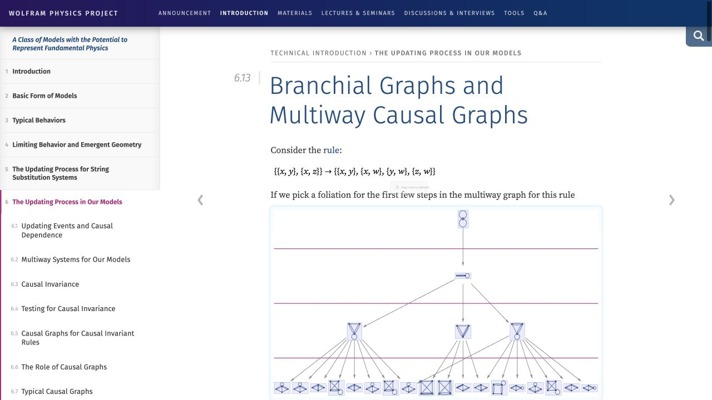
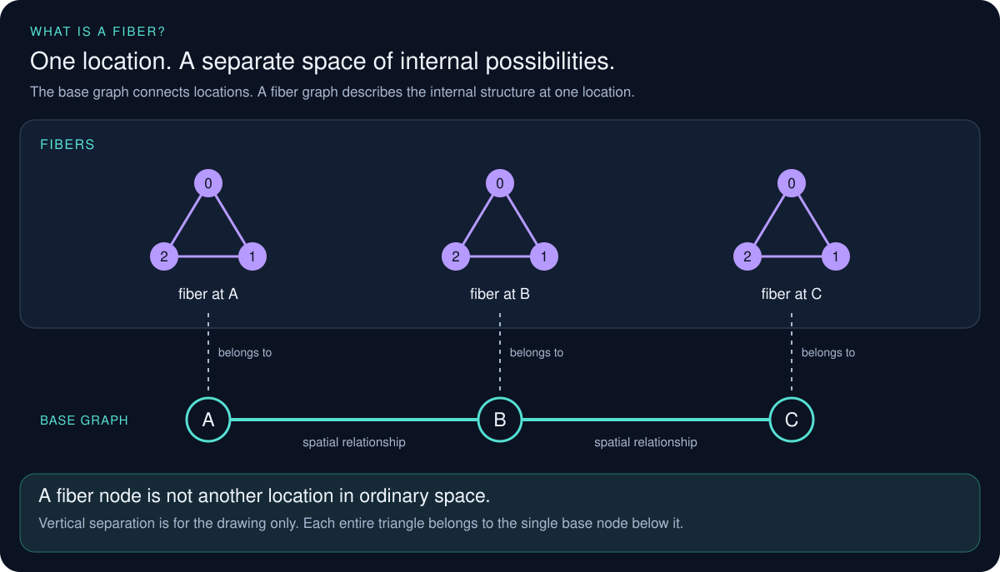
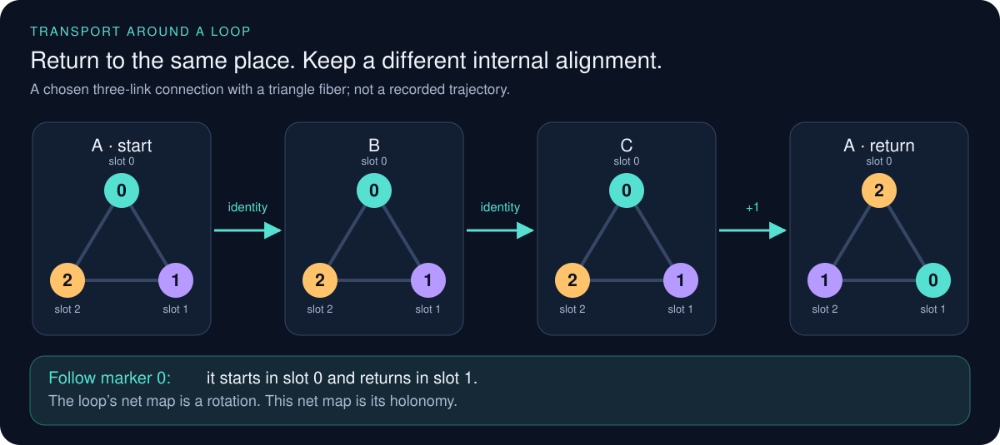
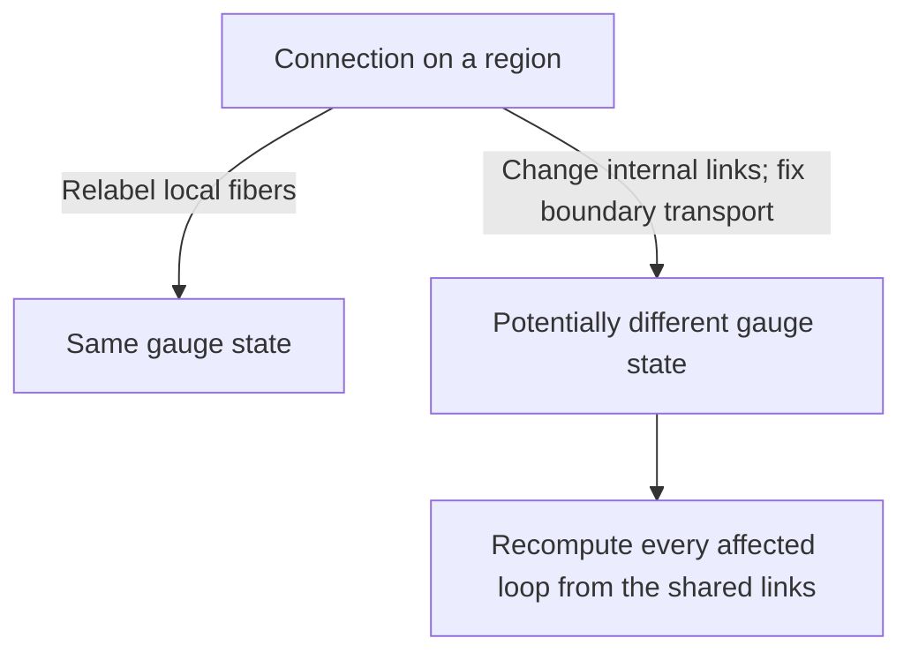
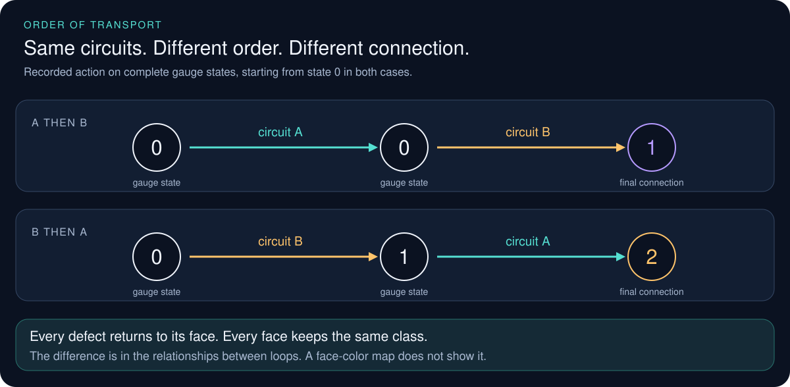
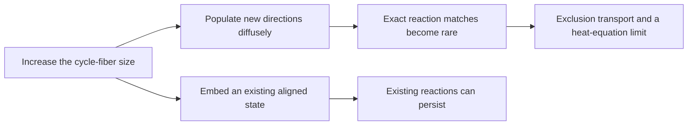
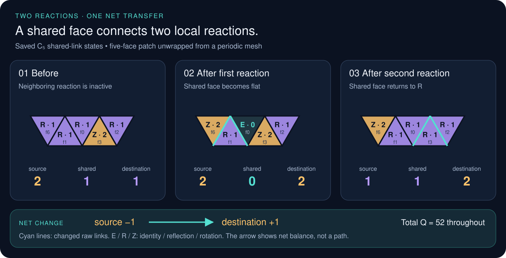
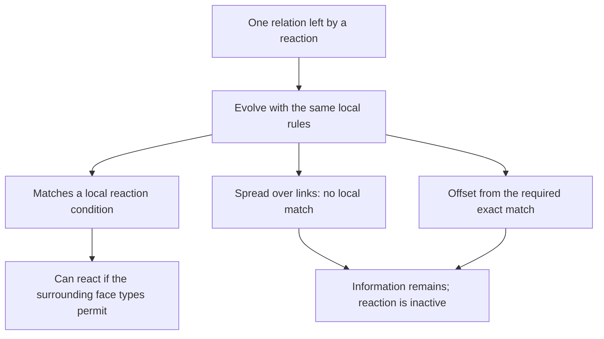
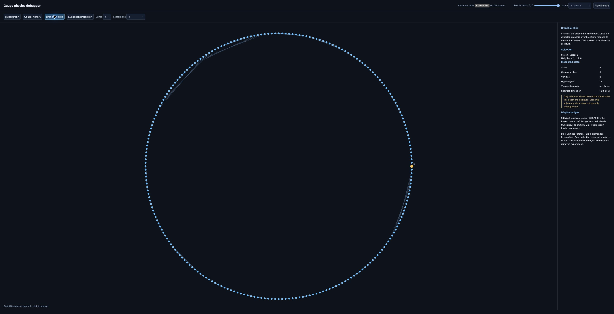

# Wolfram Physics Engine Exploration:<br/>Gauge Theory & the Standard Model

[](https://github.com/pirate/wolfram-gauge-physics/actions/workflows/ci.yml)

Stephen Wolfram launched the Wolfram Physics Project around a radical question: could familiar physics emerge from extremely simple computational rules, rather than being programmed into a simulation as the known equations of relativity, quantum mechanics, or the Standard Model? In the Wolfram model, a possible spatial state is represented by a hypergraph, local rules repeatedly replace small pieces of that graph, and a causal graph records which update events depend on earlier events. Following every possible order of updates produces a multiway graph of alternative histories; slices through that structure produce branchial graphs, which the project relates to quantum states and entanglement.

For suitable rules and under additional assumptions—especially locality, causal invariance, and an appropriate large-scale limit—the project argues that structures resembling continuous space, relativistic causal cones, and aspects of quantum mechanics can emerge. These are proposed mathematical correspondences, not yet a demonstrated model of our universe, and quantum probability is not simply the number of nodes in a hypergraph: Wolfram associates amplitude magnitude with path multiplicity in multiway evolution and phase with position in branchial space. The intuition is a little like Conway's Game of Life, except there is no fixed grid—the network of relationships that may become space is itself continually rewritten. This repository investigates whether gauge structure and field-like dynamics can be built at that microscopic level, with the long-term goal of testing for QED-like behavior and simple bound systems without inserting continuum fields or forces by hand; it does not yet derive QED, particles, physical constants, or molecules.

<table><tr>
<td>
<a href="https://www.youtube.com/watch?v=yAJTctpzp5w"><br/><small><code>Stephen Wolfram: Can space and time emerge from simple rules?</code></small></a>
</td>
<td>
<a href="https://www.wolframcloud.com/obj/wolframphysics/Tools/hands-on-introduction-to-the-wolfram-physics-project.nb"><br/><small><code>Hands-On Introduction to the Wolfram Physics Project</code></small></a>
</td>
</tr></table>

This repository asks a deliberately bottom-up question:

> Can gauge structure be computed from discrete fibers and rewrite symmetries before naming a
> continuum group, particle, force, lattice, or molecular geometry?

It connects the fiber and connection hierarchy explored by Wolfram Institute's
[InfraGaugeTheory](https://github.com/WolframInstitute/InfraGaugeTheory) to exact multiway
evolution from the
[HypergraphRewritingEngine](https://github.com/WolframInstitute/HypergraphRewritingEngine), then
adds the gauge-aware rewrite machinery needed between those two layers.

> [!IMPORTANT]
> This is experimental mathematical software, not a demonstrated derivation of the Standard
> Model, electromagnetism, particles, or continuum spacetime. Algebraic results concern finite
> combinatorial models; sampled geometry estimates and visual projections are diagnostics.

# Progress So Far

## 1. Why a graph, if the goal is spacetime?

An ordinary simulation starts with space: a grid, a distance scale, and
fields whose values live on that grid. This project asks whether some of
that structure can instead be a result. Start with relationships; ask
whether distance, dimension, and physical behavior emerge when many
relationships act together.

A base node is an abstract element, not a cubic voxel, a particle, or one
value of an electromagnetic field. It has no built-in width or position.
What it has is connections. Erase the coordinates from a drawing and those
connections remain. They are the starting data from which a notion of
"nearby" might be built. The neural-network analogy is closer than the
voxel analogy in this limited sense: a node participates in a larger
structure, rather than standing for one known physical quantity. But these
nodes are not trained neurons, and there is no learned decoder into physics.

A *hypergraph* lets a relationship involve more than two nodes. A *rewrite*
is a small replacement rule: wherever this pattern of relationships
occurs, replace it with that pattern. For example, replacing a direct link
with two links through a new node changes the network's distance structure.
The point is not to move a dot across a pre-existing stage. The proposed
stage itself can change.

In Python-like notation, a tiny example is:

```python
space = [(0, 1)]                    # a list of relationships between node IDs
rewritten_space = [(0, 2), (2, 1)]  # insert a fresh node, 2, between 0 and 1
```

Here a *label* is just a name. `2` identifies a node; it does not mean
two meters, twice the field strength, or a third coordinate. Each tuple
lists related nodes, not a point's coordinates. Using strings as names
would leave the mathematics unchanged.

Why might that resemble 3D space? In a regular three-dimensional region,
doubling a radius encloses roughly eight times as much volume. A network
can be tested for a corresponding growth in the number of nodes reached
within a given number of hops. That would be one clue, not a complete
derivation of Euclidean geometry. A picture with three coordinates proves
neither this scaling nor a physical length scale.

For time, record which rewrites require the results of earlier rewrites.
This supplies an order of events, not yet seconds on a clock. The current
hypergraph describes a candidate spatial state; its evolving causal
structure is part of the proposed route to spacetime.


*Read from top left to bottom right. Each arrow is one rewrite; the vertex
positions are a drawing layout, not measured positions in space.*

The repository studies two layers separately: the examples above rewrite
the base network; the larger gauge experiments below keep a triangular
mesh fixed while studying its internal dynamics. That mesh is a supplied
laboratory, not an already-derived model of 3D space.

<details>
<summary>Details: rewrite histories, equivalent states, and dimension</summary>

Events retain the identities of their consumed and produced hyperedges.
This supplies dependencies between events rather than inferring causality
from proximity in a drawing. Exact graph canonicalization identifies
different vertex labelings of the same state.

**Data and units.** A node ID is an `int`; a hyperedge is a
`tuple[int, ...]`; a spatial state is a `list` of those tuples, with
additional event records. The varying tuple lengths make this a ragged
list, not a dense matrix of field values. IDs have no physical units.
Graph distance counts link hops. A rewrite count is an integer; the
stochastic experiments also use a chosen continuous model-time clock.
Neither has yet been calibrated to meters or seconds.


The example has 13 raw states and 10 canonical graph states. This is a
graph-isomorphism quotient; it is distinct from the gauge quotient below.

Wolfram's own visual introduction puts the multiway history and its
branchial slices alongside each other:

[](https://www.wolframphysics.org/technical-introduction/the-updating-process-in-our-models/branchial-graphs-and-multiway-causal-graphs/)

*Screenshot of the official Wolfram Physics Project site. The small blue
diagrams are graph states; the horizontal lines select slices of their
multiway history. This is an upstream example, not an output of this
repository or a screenshot of our debugger.*

Intrinsic geometry probes use graph-ball volume and random-walk return
probability, looking for scaling ranges of the form

```math
|B(v,r)|\propto r^{d_H},
\qquad
p_t(v,v)\propto t^{-d_s/2}.
```

The quantities <span>d<sub>H</sub></span> and <span>d<sub>s</sub></span> are dimension estimates, not the number of
coordinates chosen by a renderer. Finite size and scale dependence matter.
Rewrite depth is an execution index, not derived proper time. Causal
dependencies alone establish neither spatial locality nor entanglement.

See [engine–gauge evolution](docs/product-evolution.md),
[geometry and phenomenon detection](docs/phenomenon-detection.md), and
[debugger interpretation](docs/debugger.md).

</details>

## 2. What is a fiber, and why attach one to a node?

A location and what can happen internally at that location are different
things. A compass gives a useful analogy: moving the compass changes
where it is; turning its needle changes its orientation without moving
it. The whole set of possible needle orientations is an example of an
internal space. One particular needle direction is a choice within that
space, not the space itself.

A *fiber* is the internal space attached to one base location. Here it is
a small graph. In the example below, each base node has a triangle fiber
with three internal vertices. Those three vertices are not three more
locations in ordinary space, and the triangle is not a little object
sitting above the node. The drawing separates the two layers so we can
see which structure belongs to which location.



*Read from the bottom up. A, B, and C belong to the base network. Each
entire triangle belongs to one of those nodes. Its numbered vertices
describe internal possibilities, not extra spatial coordinates.*

```python
fiber_vertices = [0, 1, 2]               # three names, not three spatial axes
fiber_edges = [(0, 1), (1, 2), (2, 0)]  # the triangle's internal connections
transport = [1, 2, 0]                    # 0 maps to 1; 1 to 2; 2 to 0
```

`transport` is a permutation: a `list[int]` with one destination for each
fiber vertex. It is not a vector of three measured field strengths. The
same internal label can occur at different base nodes; “slot 0 at A” and
“slot 0 at B” are different members of the full structure.

Why add this layer? Relationships between locations alone do not tell us
how to compare internal structure at different locations. A connection
provides that comparison: each base link carries a map matching the two
fibers. In these experiments, those link maps are dynamical data; there
is not also a physical compass needle or electron assigned to each node.

The fiber constrains the possible maps. A triangle can be rotated or
reflected while keeping its edges intact. Its allowed rearrangements form
its *symmetry group*. We calculate that group from the chosen fiber
rather than begin by declaring an electromagnetic gauge group.

Now follow the matching maps around a closed base loop. You can return to
the same location with the internal labels rearranged, just as successive
turns can change an orientation. That net rearrangement is *holonomy*.
It makes a loop's transport mismatch something we can calculate.



*Follow the cyan marker. The last panel repeats location A, not a fourth
base vertex. The chosen link maps return the marker to a different slot
in the same fiber. This is a specified connection example, not a measured
trajectory.*

<details>
<summary>Mathematics: fibers, connections, and loop holonomy</summary>

For a homogeneous fiber <span>F</span>, the allowed local frame changes form

```math
G_F=\mathrm{Aut}(F).
```

For example, <span>Aut(C<sub>3</sub>) = S<sub>3</sub></span> and
<span>Aut(C<sub>4</sub>) = D<sub>4</sub></span>, where <span>D<sub>4</sub></span> has eight elements. The
evolution kernels use isomorphic fibers; a separate construction represents
non-isomorphic fibers and partial lifts.

An oriented base edge carries an isomorphism
<span>U<sub>xy</sub>: F<sub>x</sub> → F<sub>y</sub></span>, with <span>U<sub>yx</sub> = U<sub>xy</sub><sup>−1</sup></span>. For a path
<span>γ = (x<sub>0</sub>, …, x<sub>k</sub>)</span>,

```math
U_\gamma=U_{x_{k-1}x_k}\cdots U_{x_0x_1}.
```

A closed path gives a fiber automorphism. Identity holonomy is flat on
that loop; nonidentity holonomy records a transport mismatch. This is a
discrete connection observable, not yet a continuum field strength.

For cycle fibers, every automorphism has the exact form

```math
U(v)=sv+a\pmod n,\qquad s\in\{-1,1\},\quad a\in\mathbb Z_n.
```

This represents <span>Aut(C<sub>n</sub>) = D<sub>n</sub></span> without expanding every
fiber vertex. It does not replace the finite group with <span>U(1)</span>.

**Data shape.** For a fiber with `n` vertices, a permutation has `n`
integer entries. A whole connection is conceptually a
`dict[tuple[int, int], list[int]]`: each oriented base link maps to one
permutation. A permutation could be written as an `n`-by-`n` matrix of
zeros and ones, but that is another representation, not additional data.
For uniform fibers, every location uses the same fiber definition.

The cycle family also has an exact compact representation:
`(sign, shift)`, a `tuple[int, int]` acting as
`new_label = (sign * old_label + shift) % n`, with `sign` equal to `1`
or `-1`. There is no floating-point angle in that representation.
The cycle's `n` vertices are not `n` spatial dimensions.

See [fiber and connection foundations](docs/infragauge-foundations.md)
and [cycle-fiber rules](docs/cycle-relational-dynamics.md).

</details>

## 3. Separate a change of labels from a change of state

Each fiber can use its own labels. Relabeling them changes the written link
maps but must not change the answer to an experiment. This freedom is
called *gauge freedom*.

A real update changes the connection, the base network, or both. To define
a local interaction, the model changes internal links while preserving
transport around the chosen region's boundary. Neighboring faces share
links, so their loop states cannot be updated independently.



<details>
<summary>Mathematics: gauge equivalence and boundary-preserving updates</summary>

Independent frame changes act as

```math
U_{xy}\mapsto g_yU_{xy}g_x^{-1}.
```

A loop based at <span>x</span> transforms by conjugation,
<span>H → g<sub>x</sub>Hg<sub>x</sub><sup>−1</sup></span>. A spanning forest sets tree transports to
identity; the remaining chord holonomies are compared under simultaneous
conjugation. This removes redundant frames without discarding relative
loop information.

For edge subdivision, boundary transport is preserved by

```math
U_{xy}=U_{wy}U_{xw}.
```

All <span>|G<sub>F</sub>|</span> choices of the fresh frame at <span>w</span> belong to one gauge orbit.
A separate amplitude construction assigns normalized weight
<span>1/√|G<sub>F</sub>|</span> across those representatives. That construction is not
a derivation of quantum probabilities for the stochastic experiments.

On a fixed mesh, a basic reversible pair map is the Hurwitz move

```math
H(A,B)=(ABA^{-1},A),\qquad H(A,B)_1H(A,B)_2=AB.
```

The based loop maps are lifted to actual shared links. Boundary transport
is fixed, and every face affected by a written link is accounted for.
Reversibility and gauge covariance constrain the rule search; they do
not select a unique law of nature.

**Data being changed.** An interaction reads a small set of link maps
from the connection and replaces some of those maps. Its input and output
have the same shape. It composes and inverts permutations; it does not
add decimal-valued forces to a velocity vector. A loop holonomy has the
same type as one link map: composing permutations gives a permutation.

See [shared-edge transport](docs/shared-edge-transport.md),
[three-face updates](docs/three-face-feedback.md), and
[local rule search](docs/equivariant-rule-search.md).

</details>

## 4. Find what the updates conserve

For an odd cycle fiber, a face loop can do nothing, reflect the fiber, or
rotate it by a nonzero amount. Call these three types E, R, and Z.

The selected reaction rules can turn three reflection faces into one
face of each type, and reverse that change. Assign weights zero, one, and
two to E, R, and Z. The total then stays the same: three ones become zero
plus one plus two.

This conserved total is called *charge* in the model. The name describes
a conserved quantity; it does not identify it with electric charge.
Likewise, “reaction” means an allowed local rearrangement, not a chemical
reaction.


*The left and middle panels show one update. Orange lines are the changed
links. The right panel shows why the face types alone do not determine
whether a reaction is possible—the next section explains the missing information.*

<details>
<summary>Mathematics: relational reaction rules and the conserved charge</summary>

For odd <span>n</span>, let <span>E = e</span>, let <span>R</span> denote reflections, and let <span>Z</span> denote
nonidentity rotations. The twelve relational rules act on triples of
based holonomies with one equal adjacent reflection pair:

```math
(r,r,s)\quad\text{or}\quad(s,r,r),\qquad r\ne s.
```

They preserve the ordered product and exchange types
<span>RRR ↔ ERZ</span>, with the latter in different layouts.
Each rule is an involution and is equivariant under simultaneous
conjugation.

After setting <span>q(e) = 0</span>, the common additive class-charge space is

```math
q(E)=0,\qquad q(R)=c,\qquad q(Z)=2c.
```

Taking <span>c = 1</span> gives

```math
Q=\sum_f q_f=N_R+2N_Z,
\qquad
(\Delta N_E,\Delta N_R,\Delta N_Z)=(1,-2,1)
```

for a forward reaction. At the event level, currents on the written
links satisfy a discrete continuity equation,
<span>Δq = Bj</span>, with <span>B</span> the oriented incidence matrix
for charge transport.

The rules are modeling choices. The original finite-bank selection
included a positive-charge condition; writing the resulting laws as
group words does not make that selection an unbiased derivation from
adjacency alone.

**Data and units.** The charge field is a derived `list[int]`, one entry
per face, with values `0`, `1`, or `2`. Its total is an `int`. These are
dimensionless conserved weights, not coulombs or joules. For example,
`[1, 1, 1]` can become `[0, 1, 2]` without changing the sum. The update
still acts on the underlying link maps: this list alone does not contain
enough information to decide whether a reaction is allowed.

See [reaction formulas and conservation](docs/cycle-relational-dynamics.md)
and [event-derived currents](docs/triangle-charge-current.md).

</details>

## 5. Keep the relationships that a coarse picture hides

Two connections can give every face the same type and charge, yet react
differently. A reflection can have a different alignment relative to
another reflection. The face-type map hides that relationship.

Transport can change these relationships even when every defect returns
to its starting face. In the triangle-fiber example below, making circuit
A and then circuit B gives a different connection from doing B and then
A. The state retains information about the order of the motions.

This is memory in the current connection—not a separate history field
added to the rules. It can change the fluctuations of charge and, later,
its average motion.



*Read each row left to right. The circles are complete connection states,
not spatial positions. Both rows start from the same state and execute
the same two closed circuits. Only their order changes.*

<details>
<summary>Mathematics: relative holonomy, noise, and complete observations</summary>

Individual conjugacy classes do not determine the simultaneous-conjugacy
orbit of a loop tuple. For the displayed <span>C<sub>3</sub></span> example, the four reachable
gauge states carry an action of
<span>PSL(2, 𝔽<sub>3</sub>) ≅ A<sub>4</sub></span>.

The spatial circuits and the full four-state action are shown here:


For any odd cycle, write <span>r<sub>a</sub>(v) = a − v</span> and <span>t<sub>k</sub>(v) = v + k</span>.
The tuples

```math
w_1=(r_1,r_0,r_0,t_1),\qquad
w_2=(r_1,r_0,r_1,t_2)
```

have the same ordered product <span>r<sub>0</sub></span> and charge field <span>(1, 1, 1, 2)</span>.
An allowed angular move connects them without changing these quantities.
The first three loops enable twelve reaction channels in <span>w<sub>1</sub></span> and none
in <span>w<sub>2</sub></span>.

For jump rates <span>c(w, w′)</span>, distinguish the instantaneous drift from the
increment covariance:

```math
b_i(w)=\sum_{w'}c(w,w')\Delta q_i,
\qquad
\Gamma_{ij}(w)=\sum_{w'}c(w,w')\Delta q_i\Delta q_j.
```

In the equal-rate bank, <span>b</span> depends only on the charge field, but
<span>Γ</span> also depends on relative holonomy. Equal initial drift therefore
does not imply equal later mean response. This is classical stochastic
memory, not quantum phase or entanglement.

**Data shape.** The connection still contains the memory. An observer
extracts loop permutations and relationships between them; it need not
append a new hidden scalar to every face. For a patch with `k` faces,
the mean charge-change rate has `k` real entries. Its fluctuation
covariance is a `k`-by-`k` real matrix, conceptually `list[list[float]]`.
The units are weight per model time and weight squared per model time,
respectively. These are calculated observations, not the microscopic state.

A complete three-loop <span>S<sub>3</sub></span> patch has 49 gauge states. Separate complete
patch descriptions still need relative alignment to describe their union;
double-coset gluing retains that information. Whole-mesh loop coordinates
also retain the noncontractible loops of the periodic mesh.

See [closed transport](docs/noncommuting-fiber-transport.md),
[relative-angle response](docs/fiber-relative-angle.md),
[patch gluing](docs/triangle-patch-observer.md), and
[whole-mesh gauge coordinates](docs/triangle-lazy-gauge.md).

</details>

## 6. Ask what survives at larger scales

Making the fiber larger adds internal directions. It does not, by itself,
produce richer large-scale physics.

If those directions are populated diffusely, the exact alignments needed
for reactions become rare. Over a fixed observation time, the charge
process approaches a simpler one: binary occupations exchange between
neighboring faces. On large meshes, their average density obeys a heat
equation. That equation follows from the link rules; it is not used to
drive them.

This result depends on how the initial states and limits are chosen.
Embedding an already aligned small-fiber state in a larger fiber can
preserve its reactions.



<details>
<summary>Mathematics: the diffuse ensemble and its diffusion limit</summary>

Let <span>F = 2L<sup>2</sup></span> be the face count, and <span>n</span> the odd cycle size. With independent
uniform raw links, twelve reaction channels per rooted fan at rate one give

```math
\mathbb E[\lambda_{\rm reaction}]
=\frac{18F(n-1)}{n^2}.
```

Let <span>η<sub>f</sub></span> indicate even holonomy, including identity. Then

```math
q_f=1+\eta_f-2\mathbf1_{\{E_f\}}.
```

The Hurwitz channels exchange the parity bits at rate four per undirected
dual edge. Couple an exclusion process <span>ξ</span> to those same clocks.
For the stationary reference,

```math
\Pr\!\left(\exists t\le T:q_t\ne1+\xi_t\right)
\le
\min\!\left(1,\frac{F}{2n}+\frac{18FT(n-1)}{n^2}\right).
```

This bound is uniform over finite angular rates, including sequences of
rates that grow with <span>n</span>. A separate bound treats nonuniform initial
density with conditional-uniform internal shifts.

The exclusion mean closes exactly:

```math
\partial_t\mathbb E\xi=-4\mathcal L_{\rm dual}\mathbb E\xi.
```

With <span>X = x/L</span>, <span>Y = y/L</span>, and <span>t = L<sup>2</sup>τ</span>, the corresponding density limit is

```math
\partial_\tau\rho=\nabla\cdot D\nabla\rho,
\qquad
D=\begin{pmatrix}4/3&2/3\\2/3&4/3\end{pmatrix}.
```

These are mesh cell coordinates. The sufficient scaling
<span>n/L<sup>4</sup> → ∞</span> transfers the nonuniform-profile limit to the raw-link
charge process. It is not asserted to be necessary. The geometry and
clock are supplied; this is neither emergent spacetime nor a quantum
wave equation.

**Resolution and precision.** Increasing `n` adds positions around the
internal cycle. It does not add decimal places to a float or subdivide
ordinary space. For `n = 1_000_000_007`, a link can still be represented
exactly by one sign and one integer shift; there is no billion-entry
list of angles. The finite link rules need exact integer arithmetic,
not a tolerance such as “equal within six decimal places.”

Numerical averages, waiting times, projections, and spectral calculations
use `float`. Those need error estimates or convergence checks, not a
universal promised digit count. There is not yet a physical calibration
from fiber size or graph hops to an atomic length scale.

See [coupling bounds and profile measurements](docs/fiber-refinement-limit.md)
and [embedded-state refinement](docs/cycle-relational-dynamics.md).

</details>

## 7. A rare reaction can make nearby reactions more likely

Rarity at a randomly chosen time does not mean isolation once a reaction
occurs. A reaction leaves a local alignment that nearby updates can use.

One example exchanges a flat two-face region for a flat single face.
“Flat” means that transport around its boundary returns the fiber
unchanged. A neighboring reaction can consume that new flat face. The
two reactions together can move conserved charge beyond the region of
the first reaction.

This saved two-event example shows the charge movement:



*Read the panels from left to right. Face colors show conserved weights;
cyan edges show the actual changed links. One unit moves from source to
destination, while the shared face returns to its initial charge. Every
other face also has its initial charge after the pair. The drawing unwraps
a patch of the supplied periodic mesh; it does not infer physical space.*

<details>
<summary>Mathematics: event-conditioned rates and overlapping reactions</summary>

For a rooted three-face fan <span>p</span>,

```math
\lambda_p=
\begin{cases}
12,& RRR\text{ with exactly one adjacent equality},\\
4,& ERZ\text{ in any order},\\
0,& \text{otherwise}.
\end{cases}
```

Under uniform raw-link measure <span>μ</span>,
<span>λ̄<sub>p</sub> = 6(n − 1)/n<sup>2</sup></span>. The distribution immediately after a typical
stationary reaction on <span>p</span> is the event-conditioned, or Palm, law

```math
\mu_p^+(x)=\frac{\mu(x)\lambda_p(x)}{\bar\lambda_p}.
```

Reversibility gives the same incoming and outgoing event weights.
Exact counting yields

```math
\mathbb E_{\mu_p^+}\lambda_p=8,\qquad
\mathbb E_{\mu_p^+}\lambda_q=
\frac13+\frac{16(n-1)}{3n^2}
```

for a specified one-face-overlap neighbor <span>q</span> with the stated independent
exterior rim links. At fixed mesh volume,

```math
\lim_{n\to\infty}
\mathbb E_{\mu_p^+}\lambda_{\rm total}
=\tfrac12(20+30)=25.
```

These are rates in the specified per-channel clock, not probabilities.
The ordinary stationary total rate still tends to zero. Different
neighbors can compete for the same new identity face, so their possible
reactions are not independent offspring in a branching process.

The figure uses the saved <span>C<sub>5</sub></span> witness: source face 3, shared face 0,
destination face 6, and unchanged total <span>Q = 52</span>. It is an allowed
two-event sequence, not an estimate of its spontaneous frequency.

See [reaction bursts, local rates, and the link-level witness](docs/fiber-reaction-bursts.md).

</details>

## 8. Follow the memory after it stops looking local

The alignment left by a reaction need not remain attached to one
recognizable face. Local updates can spread the relation over many links.
The information can still be present even when no nearby reaction can
use it.

For one typical rare reaction, a limiting description tracks the link
signs and one exact relation among their internal shifts. The same local
rules update that relation. It can become inactive because it spreads
across too many links, shifts away from an exact match, or lacks a
suitable neighboring face.



*These are possible states of one evolving relation, not three independent
objects. Inactive states reached by the reversible dynamics have a reverse
path back to activity; that does not guarantee a typical return time.*

<details>
<summary>Mathematics: the integer constraint carried by the connection</summary>

Write each raw link as <span>U<sub>e</sub>(v) = s<sub>e</sub>v + a<sub>e</sub> (mod n)</span>. The generic
event-conditioned relation is represented by

```math
(s,\ell,b),\qquad
\ell\in\mathbb Z^m\text{ primitive},\qquad
\ell\cdot a=b,
```

with <span>m</span> raw links. It begins as a flat triangle or two-face boundary.
For a branch with invertible integer affine update <span>a′ = Ma + d</span>,

```math
\ell'=M^{-T}\ell,\qquad b'=b+\ell'\cdot d.
```

Reaction branches map the incoming constraint plane to the outgoing
plane using the original link formulas. The local zero tests are
determined by this relation and the signs. Its twisted closure,
<span>C<sub>s</sub>ℓ = 0</span>, makes the condition invariant under vertex-frame
translations; its support, absolute coefficient norms, and <span>|b|</span> are
gauge-invariant diagnostics.

At fixed volume, finite angular rate, and finite observation time,
accidental additional equalities vanish in probability as odd <span>n</span>
grows. This gives a one-constraint limit, not a model for arbitrarily
long times or for many independently arriving correlations.

In this limit, <span>N<sub>E</sub></span> is zero or one and reaction directions alternate:

```math
\left|N_{RRR\to ERZ}(t)-N_{ERZ\to RRR}(t)\right|\le1.
```

An auxiliary two-sheeted cover gives a topological interpretation.
For <span>R = N<sub>R</sub> &gt; 0</span> on the supplied torus,

```math
g=1+R/2,\qquad g+N_E=1+F-Q/2.
```

The second identity is the existing charge conservation law in cover
coordinates, not an additional conserved quantity. This constructed
surface is a diagnostic, not a change in physical spacetime topology.

**Data shape.** This limiting state contains `signs: list[int]`,
`coefficients: list[int]`, and `offset: int`. Each list has one entry per
raw link. They describe one exact relation among the link shifts—not a
list of matrices or a vector of complex amplitudes. The integer
coefficients can grow, so arbitrary-size integers are used rather than
rounding them to a fixed number of digits.

See [integer constraint dynamics, gauge invariance, and the cover construction](docs/fiber-constraint-dynamics.md).

</details>

## 9. Distinguish a localized pattern from a persistent object

The graph can support mathematical modes concentrated near a defect.
A useful analogy is a vibration concentrated near a flaw in a material.
Here, however, the mode is a probe of the connection at one instant;
no physical vibration law has been established.

Some such modes are proved to be localized, even on an infinite supplied
lattice. But an allowed update can remove them. A bright spot in a mode
plot is therefore not enough to identify a particle or a bound state.

Memory needs a similar distinction. A pattern that remains because no
update has touched it is different from one that survives encounters,
moves, and keeps its internal relationships.


*The upper panels show where two modes are concentrated. The lower-left
panel shows that the number of localized modes changes under the rules.
The plotted density is a graph-mode diagnostic, not an electron probability density.*

<details>
<summary>Mathematics: spectral localization, persistence, and binding limits</summary>

The bundle graph defines a diagnostic Laplacian <span>L<sub>bundle</sub></span>.
For the displayed triangle-fiber construction, two modes lie above the
entire infinite flat spectrum, with eigenvalues exceeding <span>12.05</span> and
exponentially decaying spatial tails. This does not promote
<span>L<sub>bundle</sub></span> to a physical Hamiltonian.

The instantaneous above-band mode count obeys

```math
n_+(L_{\rm bundle}-12I)
\le \min(Q_\uparrow,Q_\downarrow)
\le \lfloor Q/2\rfloor.
```

Here <span>Q<sub>↑</sub></span> and <span>Q<sub>↓</sub></span> are the charge sums on the two
triangle orientations. Updates can change their split while preserving
<span>Q</span>, forcing mode loss.

**Data shape.** For `V` base vertices and `n` vertices in each fiber,
the full bundle graph has `V * n` vertices. Its Laplacian is mathematically
a `(V * n)`-by-`(V * n)` real matrix, though sparse calculations need not
store every zero. A real mode is a `list[float]` of length `V * n` and
its eigenvalue is one `float`. The plotted mode density squares and sums
entries belonging to each base location.

These are not yet quantum wavefunctions with physical energies. A
separate subdivision-amplitude construction uses `complex` numbers;
that does not turn this classical mode calculation into quantum dynamics.

Separate encounter-resolved measurements distinguish untouched memory
from change-and-return histories. In the measured triangle-fiber runs,
most long-wavelength persistence comes from untouched patches; a smaller
return signal after reconfiguration is transient.

Equilibrium also imposes restrictions. A studied square-fiber bank has
no separation preference beyond graph geometry in its reachable class
equilibrium. Positive, state-independent reweighting of the same
reversible generators does not change that equilibrium. The diffuse
exclusion limit likewise supplies no attractive interaction.

See [localization and mode-loss bounds](docs/triangle-modes.md),
[encounter-resolved memory](docs/triangle-encounter-memory.md), and
[equilibrium restrictions](docs/reachable-gauge-equilibrium.md).

</details>

# Future Work

1. **Describe encounters between independent correlations.** Extend the
   one-relation description to two or more relations. Determine which
   encounters create, preserve, or remove local reaction conditions.

2. **Determine whether dispersed memory returns.** Separate finite-time
   inactivity from eventual escape. Find return probabilities, time
   scales, and their dependence on mesh size and angular dynamics.

3. **Connect rare events to sustained large-scale behavior.** Study times
   that grow with fiber size and ensembles in which alignment is produced
   by the dynamics. Keep these limits separate from the fixed-time
   diffuse result.

4. **Find a sufficient large-scale state description.** Determine which
   transported loop relations must accompany charge density to predict
   currents, fluctuations, and encounters. Preserve the relative
   alignment between overlapping regions.

5. **Test persistent localized structures.** Ask whether a structure
   survives actual encounters and has reproducible relative motion.
   Compare separation statistics with the accessible equilibrium before
   interpreting clustering as binding.

6. **Let geometry and fibers evolve together.** Extend the fixed-mesh
   dynamics to gauge-aware base rewrites and changing fiber types.
   Measure dimension, propagation, and dependence on update order without
   reading them from a chosen drawing.

7. **Establish the missing route to physical predictions.** Quantum
   probabilities, a physical time and length scale, effective forces,
   and stable bound states remain to be derived and calibrated.
   A molecular interpretation requires these steps, not just a shape
   that resembles an orbital.

<details>
<summary>Details: mathematical questions and supporting computation</summary>

The immediate problems are recurrence versus transience of the reversible
integer-constraint process, the rank and interaction of multiple inherited
constraints, and a controlled long-time/refinement limit. A fixed-reference
[alignment-boundary calculation](docs/fiber-alignment-boundary.md) gives a
conditional limit; establishing a sufficiently persistent reference in
the unrestricted dynamics is a separate problem.

For changing geometry, connection data must participate in rewrite
identity and matching. Causal dependencies must follow actual read/write
supports. Comparisons with
[InfraGaugeTheory](https://github.com/WolframInstitute/InfraGaugeTheory)
should state which fiber, connection, and quotient are being represented.

Computation serves these questions. Finite groups already compile to
integer lookup tables; an end-to-end GPU path still needs matching,
affected-loop updates, and state reduction. Any amplitude compression
must bound discarded norm and observable error rather than assume a
small representation exists. The elementary square-fiber subdivision
orbit has a flat rank-eight Schmidt spectrum: rank-four truncation loses
half its norm.

See [measurement criteria](docs/phenomenon-detection.md),
[GPU execution](docs/gpu-execution.md),
[finite-model reference data](data/), and
[mathematical scope](docs/STATE_OF_THE_ART.md).

</details>

## Run and inspect an example

The debugger keeps the current network, event ancestry, alternative
states, and a best-effort spatial projection in separate views. It is an
inspection tool for the calculations above.



*This is an actual debugger screenshot. A three-coordinate projection
does not establish three-dimensional space; view limits and projection
distortion are reported separately.*

<details>
<summary>Commands: build, export a rewrite history, and open the debugger</summary>

Requirements: CMake 3.20+ and a C++20 compiler.

```bash
git clone https://github.com/pirate/wolfram-gauge-physics.git
cd wolfram-gauge-physics
cmake -S . -B build -DCMAKE_BUILD_TYPE=Release
cmake --build build -j
ctest --test-dir build -L wgphysics --output-on-failure
./build/fiber_demo
./build/research_demo
./build/cell_dynamics_demo
```

Run a Wolfram-model rule with exact state canonicalization and export
its evolution:

```bash
./build/wgphysics_evolve \
  --rule '0,1;0,2->0,2;0,3;1,3;2,3' \
  --init '1,2;1,3' \
  --steps 3 \
  --output out/evolution.json
```

From the repository directory, start the local viewer:

```bash
python3 -m http.server 8765 --bind 127.0.0.1
```

Open [localhost:8765/viewer/](http://localhost:8765/viewer/) and load the
export. See the [debugger guide](docs/debugger.md) for view budgets and
interpretation. The individual mathematical notes link their experiment
scripts and datasets; the rewrite command above is not a molecular
simulation.

</details>

MIT licensed. This is an independent experimental project, not an official
Wolfram Institute or Wolfram Research repository. It depends on and cites
their MIT-licensed research software; no Wolfram Language source is vendored.
The attributed Wolfram website screenshot remains the original publisher's
material, not part of this repository's MIT license. See
[figure sources and reproduction](docs/readme-visuals.md).
