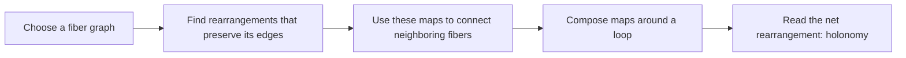
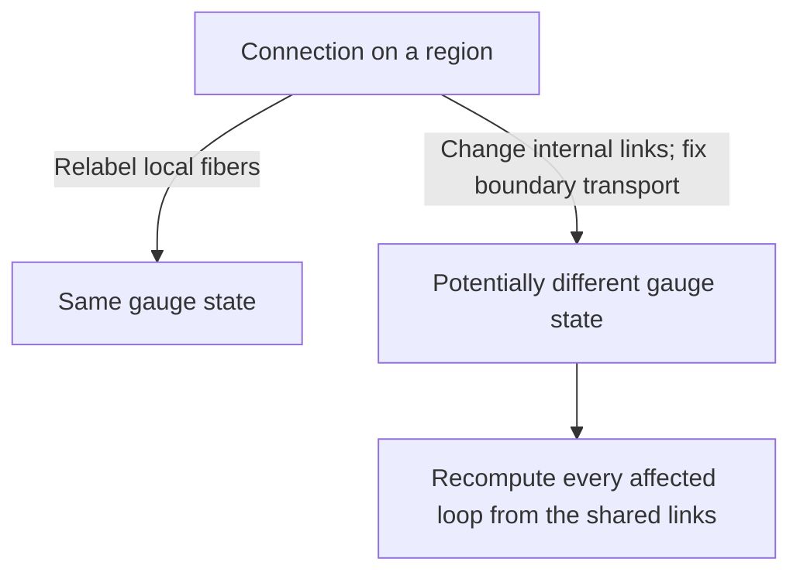
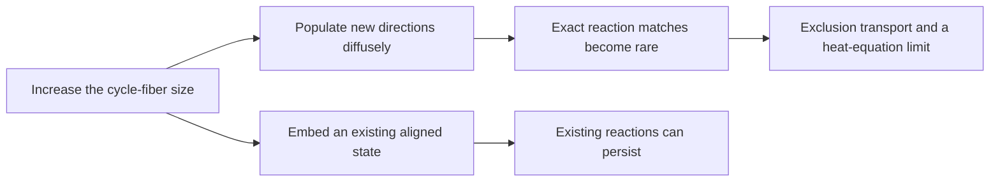
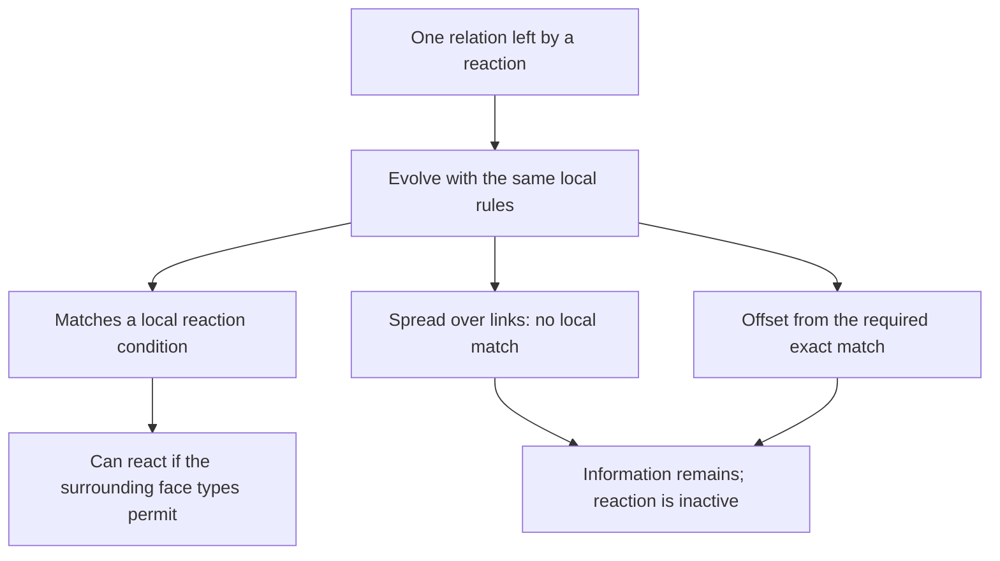

# Wolfram Physics Engine Exploration:<br/>Gauge Theory & the Standard Model

[](https://github.com/pirate/wolfram-gauge-physics/actions/workflows/ci.yml)

Stephen Wolfram launched the Wolfram Physics Project around a radical question: could familiar physics emerge from extremely simple computational rules, rather than being programmed into a simulation as the known equations of relativity, quantum mechanics, or the Standard Model? In the Wolfram model, a possible spatial state is represented by a hypergraph, local rules repeatedly replace small pieces of that graph, and a causal graph records which update events depend on earlier events. Following every possible order of updates produces a multiway graph of alternative histories; slices through that structure produce branchial graphs, which the project relates to quantum states and entanglement.

For suitable rules and under additional assumptions—especially locality, causal invariance, and an appropriate large-scale limit—the project argues that structures resembling continuous space, relativistic causal cones, and aspects of quantum mechanics can emerge. These are proposed mathematical correspondences, not yet a demonstrated model of our universe, and quantum probability is not simply the number of nodes in a hypergraph: Wolfram associates amplitude magnitude with path multiplicity in multiway evolution and phase with position in branchial space. The intuition is a little like Conway's Game of Life, except there is no fixed grid—the network of relationships that may become space is itself continually rewritten. This repository investigates whether gauge structure and field-like dynamics can be built at that microscopic level, with the long-term goal of testing for QED-like behavior and simple bound systems without inserting continuum fields or forces by hand; it does not yet derive QED, particles, physical constants, or molecules.

<table><tr>
<td>
<a href="https://www.youtube.com/watch?v=yAJTctpzp5w"><br/><small><code>Stephen Wolfram: Can space and time emerge from simple rules?</code></small></a>
</td>
<td>
<a href="https://www.wolframcloud.com/obj/wolframphysics/Tools/hands-on-introduction-to-the-wolfram-physics-project.nb"><br/><small><code>Hands-On Introduction to the Wolfram Physics Project</code></small></a>
</td>
</tr></table>

This repository asks a deliberately bottom-up question:

> Can gauge structure be computed from discrete fibers and rewrite symmetries before naming a
> continuum group, particle, force, lattice, or molecular geometry?

It connects the fiber and connection hierarchy explored by Wolfram Institute's
[InfraGaugeTheory](https://github.com/WolframInstitute/InfraGaugeTheory) to exact multiway
evolution from the
[HypergraphRewritingEngine](https://github.com/WolframInstitute/HypergraphRewritingEngine), then
adds the gauge-aware rewrite machinery needed between those two layers.

> [!IMPORTANT]
> This is experimental mathematical software, not a demonstrated derivation of the Standard
> Model, electromagnetism, particles, or continuum spacetime. Algebraic results concern finite
> combinatorial models; sampled geometry estimates and visual projections are diagnostics.

# Progress So Far

The sections below follow the construction from its smallest objects to its
large-scale behavior. The rewrite examples change the network itself. The
reaction and transport experiments use a fixed triangular mesh so that the
internal dynamics can be studied separately.

The inputs are a network, a small internal graph, local update rules, an
initial state, and an update schedule. The calculations determine what those
choices conserve, how information moves, and which simpler descriptions
retain enough information to predict the next change.

## 1. Start with relationships, then record changes

A hypergraph records which vertices belong to each relationship. Unlike an
ordinary edge, a hyperedge can connect more than two vertices. A rewrite
replaces a matching part of that network with another small part.

Three different views answer three different questions: the current
hypergraph shows **what is connected**; the causal graph shows **which
changes depend on earlier changes**; the multiway graph shows **which
alternative histories are possible**. None of these views needs drawing
coordinates to define its connections.


*Read from top left to bottom right. Each arrow is one rewrite; the vertex
positions are a drawing layout, not measured positions in space.*

<details>
<summary>Details: rewrite histories, equivalent states, and dimension</summary>

Events retain the identities of their consumed and produced hyperedges.
This supplies dependencies between events rather than inferring causality
from proximity in a drawing. Exact graph canonicalization identifies
different vertex labelings of the same state.


The example has 13 raw states and 10 canonical graph states. This is a
graph-isomorphism quotient; it is distinct from the gauge quotient below.

Intrinsic geometry probes use graph-ball volume and random-walk return
probability, looking for scaling ranges of the form

$$
|B(v,r)|\propto r^{d_H},
\qquad
p_t(v,v)\propto t^{-d_s/2}.
$$

The quantities $d_H$ and $d_s$ are dimension estimates, not the number of
coordinates chosen by a renderer. Finite size and scale dependence matter.
Rewrite depth is an execution index, not derived proper time. Causal
dependencies alone establish neither spatial locality nor entanglement.

See [engine–gauge evolution](docs/product-evolution.md),
[geometry and phenomenon detection](docs/phenomenon-detection.md), and
[debugger interpretation](docs/debugger.md).

</details>

## 2. Give each location an internal structure

Place a small graph at each base vertex. This internal graph is called a
*fiber*. It describes local possibilities, not a tiny object already
embedded in physical space.

A triangle fiber can be rotated or reflected without changing its
connections. These rearrangements form its symmetry group. The group is
computed from the fiber, rather than declared to be an electromagnetic or
other familiar gauge group.

A link between base vertices tells us how to match their fibers. Following
several links composes those matches. Following a closed loop may return
the internal labels rearranged. That net rearrangement is called
*holonomy*: it measures how transport around the loop differs from doing
nothing.



<details>
<summary>Mathematics: fibers, connections, and loop holonomy</summary>

For a homogeneous fiber $F$, the allowed local frame changes form

$$
G_F=\operatorname{Aut}(F).
$$

For example, $\operatorname{Aut}(C_3)=S_3$ and
$\operatorname{Aut}(C_4)=D_4$, where $D_4$ has eight elements. The
evolution kernels use isomorphic fibers; a separate construction represents
non-isomorphic fibers and partial lifts.

An oriented base edge carries an isomorphism
$U_{xy}:F_x\to F_y$, with $U_{yx}=U_{xy}^{-1}$. For a path
$\gamma=(x_0,\ldots,x_k)$,

$$
U_\gamma=U_{x_{k-1}x_k}\cdots U_{x_0x_1}.
$$

A closed path gives a fiber automorphism. Identity holonomy is flat on
that loop; nonidentity holonomy records a transport mismatch. This is a
discrete connection observable, not yet a continuum field strength.

For cycle fibers, every automorphism has the exact form

$$
U(v)=sv+a\pmod n,\qquad s\in\{-1,1\},\quad a\in\mathbb Z_n.
$$

This represents $\operatorname{Aut}(C_n)=D_n$ without expanding every
fiber vertex. It does not replace the finite group with $U(1)$.

See [fiber and connection foundations](docs/infragauge-foundations.md)
and [cycle-fiber rules](docs/cycle-relational-dynamics.md).

</details>

## 3. Separate a change of labels from a change of state

Each fiber can use its own labels. Relabeling them changes the written link
maps but must not change the answer to an experiment. This freedom is
called *gauge freedom*.

A real update changes the connection, the base network, or both. To define
a local interaction, the model changes internal links while preserving
transport around the chosen region's boundary. Neighboring faces share
links, so their loop states cannot be updated independently.



<details>
<summary>Mathematics: gauge equivalence and boundary-preserving updates</summary>

Independent frame changes act as

$$
U_{xy}\mapsto g_yU_{xy}g_x^{-1}.
$$

A loop based at $x$ transforms by conjugation,
$H\mapsto g_xHg_x^{-1}$. A spanning forest sets tree transports to
identity; the remaining chord holonomies are compared under simultaneous
conjugation. This removes redundant frames without discarding relative
loop information.

For edge subdivision, boundary transport is preserved by

$$
U_{xy}=U_{wy}U_{xw}.
$$

All $|G_F|$ choices of the fresh frame at $w$ belong to one gauge orbit.
A separate amplitude construction assigns normalized weight
$1/\sqrt{|G_F|}$ across those representatives. That construction is not
a derivation of quantum probabilities for the stochastic experiments.

On a fixed mesh, a basic reversible pair map is the Hurwitz move

$$
H(A,B)=(ABA^{-1},A),\qquad H(A,B)_1H(A,B)_2=AB.
$$

The based loop maps are lifted to actual shared links. Boundary transport
is fixed, and every face affected by a written link is accounted for.
Reversibility and gauge covariance constrain the rule search; they do
not select a unique law of nature.

See [shared-edge transport](docs/shared-edge-transport.md),
[three-face updates](docs/three-face-feedback.md), and
[local rule search](docs/equivariant-rule-search.md).

</details>

## 4. Find what the updates conserve

For an odd cycle fiber, a face loop can do nothing, reflect the fiber, or
rotate it by a nonzero amount. Call these three types E, R, and Z.

The selected reaction rules can turn three reflection faces into one
face of each type, and reverse that change. Assign weights zero, one, and
two to E, R, and Z. The total then stays the same: three ones become zero
plus one plus two.

This conserved total is called *charge* in the model. The name describes
a conserved quantity; it does not identify it with electric charge.
Likewise, “reaction” means an allowed local rearrangement, not a chemical
reaction.


*The left and middle panels show one update. Orange lines are the changed
links. The right panel shows why the face types alone do not determine
whether a reaction is possible—the next section explains the missing information.*

<details>
<summary>Mathematics: relational reaction rules and the conserved charge</summary>

For odd $n$, let $E=e$, let $R$ denote reflections, and let $Z$ denote
nonidentity rotations. The twelve relational rules act on triples of
based holonomies with one equal adjacent reflection pair:

$$
(r,r,s)\quad\text{or}\quad(s,r,r),\qquad r\ne s.
$$

They preserve the ordered product and exchange types
$RRR\leftrightarrow ERZ$, with the latter in different layouts.
Each rule is an involution and is equivariant under simultaneous
conjugation.

After setting $q(e)=0$, the common additive class-charge space is

$$
q(E)=0,\qquad q(R)=c,\qquad q(Z)=2c.
$$

Taking $c=1$ gives

$$
Q=\sum_f q_f=N_R+2N_Z,
\qquad
(\Delta N_E,\Delta N_R,\Delta N_Z)=(1,-2,1)
$$

for a forward reaction. At the event level, currents on the written
links satisfy a discrete continuity equation,
$\Delta\mathbf q=B\mathbf j$, with $B$ the oriented incidence matrix
for charge transport.

The rules are modeling choices. The original finite-bank selection
included a positive-charge condition; writing the resulting laws as
group words does not make that selection an unbiased derivation from
adjacency alone.

See [reaction formulas and conservation](docs/cycle-relational-dynamics.md)
and [event-derived currents](docs/triangle-charge-current.md).

</details>

## 5. Keep the relationships that a coarse picture hides

Two connections can give every face the same type and charge, yet react
differently. A reflection can have a different alignment relative to
another reflection. The face-type map hides that relationship.

Transport can change these relationships even when every defect returns
to its starting face. In the triangle-fiber example below, making circuit
A and then circuit B gives a different connection from doing B and then
A. The state retains information about the order of the motions.

This is memory in the current connection—not a separate history field
added to the rules. It can change the fluctuations of charge and, later,
its average motion.


*The paths on the left return the defects to their original faces.
On the right, following a blue arrow then an orange arrow need not reach
the same state as following them in the opposite order.*

<details>
<summary>Mathematics: relative holonomy, noise, and complete observations</summary>

Individual conjugacy classes do not determine the simultaneous-conjugacy
orbit of a loop tuple. For the displayed $C_3$ example, the four reachable
gauge states carry an action of
$\operatorname{PSL}(2,\mathbb F_3)\cong A_4$.

For any odd cycle, write $r_a(v)=a-v$ and $t_k(v)=v+k$.
The tuples

$$
w_1=(r_1,r_0,r_0,t_1),\qquad
w_2=(r_1,r_0,r_1,t_2)
$$

have the same ordered product $r_0$ and charge field $(1,1,1,2)$.
An allowed angular move connects them without changing these quantities.
The first three loops enable twelve reaction channels in $w_1$ and none
in $w_2$.

For jump rates $c(w,w')$, distinguish the instantaneous drift from the
increment covariance:

$$
b_i(w)=\sum_{w'}c(w,w')\Delta q_i,
\qquad
\Gamma_{ij}(w)=\sum_{w'}c(w,w')\Delta q_i\Delta q_j.
$$

In the equal-rate bank, $b$ depends only on the charge field, but
$\Gamma$ also depends on relative holonomy. Equal initial drift therefore
does not imply equal later mean response. This is classical stochastic
memory, not quantum phase or entanglement.

A complete three-loop $S_3$ patch has 49 gauge states. Separate complete
patch descriptions still need relative alignment to describe their union;
double-coset gluing retains that information. Whole-mesh loop coordinates
also retain the noncontractible loops of the periodic mesh.

See [closed transport](docs/noncommuting-fiber-transport.md),
[relative-angle response](docs/fiber-relative-angle.md),
[patch gluing](docs/triangle-patch-observer.md), and
[whole-mesh gauge coordinates](docs/triangle-lazy-gauge.md).

</details>

## 6. Ask what survives at larger scales

Making the fiber larger adds internal directions. It does not, by itself,
produce richer large-scale physics.

If those directions are populated diffusely, the exact alignments needed
for reactions become rare. Over a fixed observation time, the charge
process approaches a simpler one: binary occupations exchange between
neighboring faces. On large meshes, their average density obeys a heat
equation. That equation follows from the link rules; it is not used to
drive them.

This result depends on how the initial states and limits are chosen.
Embedding an already aligned small-fiber state in a larger fiber can
preserve its reactions.



<details>
<summary>Mathematics: the diffuse ensemble and its diffusion limit</summary>

Let $F=2L^2$ be the face count, and $n$ the odd cycle size. With independent
uniform raw links, twelve reaction channels per rooted fan at rate one give

$$
\mathbb E[\lambda_{\rm reaction}]
=\frac{18F(n-1)}{n^2}.
$$

Let $\eta_f$ indicate even holonomy, including identity. Then

$$
q_f=1+\eta_f-2\mathbf1_{\{E_f\}}.
$$

The Hurwitz channels exchange the parity bits at rate four per undirected
dual edge. Couple an exclusion process $\xi$ to those same clocks.
For the stationary reference,

$$
\Pr\!\left(\exists t\le T:q_t\ne1+\xi_t\right)
\le
\min\!\left(1,\frac{F}{2n}+\frac{18FT(n-1)}{n^2}\right).
$$

This bound is uniform over finite angular rates, including sequences of
rates that grow with $n$. A separate bound treats nonuniform initial
density with conditional-uniform internal shifts.

The exclusion mean closes exactly:

$$
\partial_t\mathbb E\xi=-4\mathcal L_{\rm dual}\mathbb E\xi.
$$

With $X=x/L$, $Y=y/L$, and $t=L^2\tau$, the corresponding density limit is

$$
\partial_\tau\rho=\nabla\cdot D\nabla\rho,
\qquad
D=\begin{pmatrix}4/3&2/3\\2/3&4/3\end{pmatrix}.
$$

These are mesh cell coordinates. The sufficient scaling
$n/L^4\to\infty$ transfers the nonuniform-profile limit to the raw-link
charge process. It is not asserted to be necessary. The geometry and
clock are supplied; this is neither emergent spacetime nor a quantum
wave equation.

See [coupling bounds and profile measurements](docs/fiber-refinement-limit.md)
and [embedded-state refinement](docs/cycle-relational-dynamics.md).

</details>

## 7. A rare reaction can make nearby reactions more likely

Rarity at a randomly chosen time does not mean isolation once a reaction
occurs. A reaction leaves a local alignment that nearby updates can use.

One example exchanges a flat two-face region for a flat single face.
“Flat” means that transport around its boundary returns the fiber
unchanged. A neighboring reaction can consume that new flat face. The
two reactions together can move conserved charge beyond the region of
the first reaction.

This saved two-event example shows the charge movement:

| Face role | Before | After first reaction | After second reaction |
| --- | ---: | ---: | ---: |
| Source outside the first region | 2 | 2 | 1 |
| Shared face | 1 | 0 | 1 |
| Destination in the first region | 1 | 2 | 2 |

*One unit moves from source to destination; the shared face returns to its
initial charge. Every other face has its initial charge after the pair.
These values come from actual shared-link states, not independent face assignments.*

<details>
<summary>Mathematics: event-conditioned rates and overlapping reactions</summary>

For a rooted three-face fan $p$,

$$
\lambda_p=
\begin{cases}
12,& RRR\text{ with exactly one adjacent equality},\\
4,& ERZ\text{ in any order},\\
0,& \text{otherwise}.
\end{cases}
$$

Under uniform raw-link measure $\mu$,
$\bar\lambda_p=6(n-1)/n^2$. The distribution immediately after a typical
stationary reaction on $p$ is the event-conditioned, or Palm, law

$$
\mu_p^+(x)=\frac{\mu(x)\lambda_p(x)}{\bar\lambda_p}.
$$

Reversibility gives the same incoming and outgoing event weights.
Exact counting yields

$$
\mathbb E_{\mu_p^+}\lambda_p=8,\qquad
\mathbb E_{\mu_p^+}\lambda_q=
\frac13+\frac{16(n-1)}{3n^2}
$$

for a specified one-face-overlap neighbor $q$ with the stated independent
exterior rim links. At fixed mesh volume,

$$
\lim_{n\to\infty}
\mathbb E_{\mu_p^+}\lambda_{\rm total}
=\tfrac12(20+30)=25.
$$

These are rates in the specified per-channel clock, not probabilities.
The ordinary stationary total rate still tends to zero. Different
neighbors can compete for the same new identity face, so their possible
reactions are not independent offspring in a branching process.

The table uses the saved $C_5$ witness: source face 3, shared face 0,
destination face 6, and unchanged total $Q=52$. It is an allowed
two-event sequence, not an estimate of its spontaneous frequency.

See [reaction bursts, local rates, and the link-level witness](docs/fiber-reaction-bursts.md).

</details>

## 8. Follow the memory after it stops looking local

The alignment left by a reaction need not remain attached to one
recognizable face. Local updates can spread the relation over many links.
The information can still be present even when no nearby reaction can
use it.

For one typical rare reaction, a limiting description tracks the link
signs and one exact relation among their internal shifts. The same local
rules update that relation. It can become inactive because it spreads
across too many links, shifts away from an exact match, or lacks a
suitable neighboring face.



*These are possible states of one evolving relation, not three independent
objects. Inactive states reached by the reversible dynamics have a reverse
path back to activity; that does not guarantee a typical return time.*

<details>
<summary>Mathematics: the integer constraint carried by the connection</summary>

Write each raw link as $U_e(v)=s_ev+a_e\pmod n$. The generic
event-conditioned relation is represented by

$$
(s,\ell,b),\qquad
\ell\in\mathbb Z^m\text{ primitive},\qquad
\ell\cdot a=b,
$$

with $m$ raw links. It begins as a flat triangle or two-face boundary.
For a branch with invertible integer affine update $a'=Ma+d$,

$$
\ell'=M^{-T}\ell,\qquad b'=b+\ell'\cdot d.
$$

Reaction branches map the incoming constraint plane to the outgoing
plane using the original link formulas. The local zero tests are
determined by this relation and the signs. Its twisted closure,
$C_s\ell=0$, makes the condition invariant under vertex-frame
translations; its support, absolute coefficient norms, and $|b|$ are
gauge-invariant diagnostics.

At fixed volume, finite angular rate, and finite observation time,
accidental additional equalities vanish in probability as odd $n$
grows. This gives a one-constraint limit, not a model for arbitrarily
long times or for many independently arriving correlations.

In this limit, $N_E$ is zero or one and reaction directions alternate:

$$
\left|N_{RRR\to ERZ}(t)-N_{ERZ\to RRR}(t)\right|\le1.
$$

An auxiliary two-sheeted cover gives a topological interpretation.
For $R=N_R>0$ on the supplied torus,

$$
g=1+R/2,\qquad g+N_E=1+F-Q/2.
$$

The second identity is the existing charge conservation law in cover
coordinates, not an additional conserved quantity. This constructed
surface is a diagnostic, not a change in physical spacetime topology.

See [integer constraint dynamics, gauge invariance, and the cover construction](docs/fiber-constraint-dynamics.md).

</details>

## 9. Distinguish a localized pattern from a persistent object

The graph can support mathematical modes concentrated near a defect.
A useful analogy is a vibration concentrated near a flaw in a material.
Here, however, the mode is a probe of the connection at one instant;
no physical vibration law has been established.

Some such modes are proved to be localized, even on an infinite supplied
lattice. But an allowed update can remove them. A bright spot in a mode
plot is therefore not enough to identify a particle or a bound state.

Memory needs a similar distinction. A pattern that remains because no
update has touched it is different from one that survives encounters,
moves, and keeps its internal relationships.


*The upper panels show where two modes are concentrated. The lower-left
panel shows that the number of localized modes changes under the rules.
The plotted density is a graph-mode diagnostic, not an electron probability density.*

<details>
<summary>Mathematics: spectral localization, persistence, and binding limits</summary>

The bundle graph defines a diagnostic Laplacian $L_{\rm bundle}$.
For the displayed triangle-fiber construction, two modes lie above the
entire infinite flat spectrum, with eigenvalues exceeding $12.05$ and
exponentially decaying spatial tails. This does not promote
$L_{\rm bundle}$ to a physical Hamiltonian.

The instantaneous above-band mode count obeys

$$
n_+(L_{\rm bundle}-12I)
\le \min(Q_\uparrow,Q_\downarrow)
\le \lfloor Q/2\rfloor.
$$

Here $Q_\uparrow$ and $Q_\downarrow$ are the charge sums on the two
triangle orientations. Updates can change their split while preserving
$Q$, forcing mode loss.

Separate encounter-resolved measurements distinguish untouched memory
from change-and-return histories. In the measured triangle-fiber runs,
most long-wavelength persistence comes from untouched patches; a smaller
return signal after reconfiguration is transient.

Equilibrium also imposes restrictions. A studied square-fiber bank has
no separation preference beyond graph geometry in its reachable class
equilibrium. Positive, state-independent reweighting of the same
reversible generators does not change that equilibrium. The diffuse
exclusion limit likewise supplies no attractive interaction.

See [localization and mode-loss bounds](docs/triangle-modes.md),
[encounter-resolved memory](docs/triangle-encounter-memory.md), and
[equilibrium restrictions](docs/reachable-gauge-equilibrium.md).

</details>

# Future Work

1. **Describe encounters between independent correlations.** Extend the
   one-relation description to two or more relations. Determine which
   encounters create, preserve, or remove local reaction conditions.

2. **Determine whether dispersed memory returns.** Separate finite-time
   inactivity from eventual escape. Find return probabilities, time
   scales, and their dependence on mesh size and angular dynamics.

3. **Connect rare events to sustained large-scale behavior.** Study times
   that grow with fiber size and ensembles in which alignment is produced
   by the dynamics. Keep these limits separate from the fixed-time
   diffuse result.

4. **Find a sufficient large-scale state description.** Determine which
   transported loop relations must accompany charge density to predict
   currents, fluctuations, and encounters. Preserve the relative
   alignment between overlapping regions.

5. **Test persistent localized structures.** Ask whether a structure
   survives actual encounters and has reproducible relative motion.
   Compare separation statistics with the accessible equilibrium before
   interpreting clustering as binding.

6. **Let geometry and fibers evolve together.** Extend the fixed-mesh
   dynamics to gauge-aware base rewrites and changing fiber types.
   Measure dimension, propagation, and dependence on update order without
   reading them from a chosen drawing.

7. **Establish the missing route to physical predictions.** Quantum
   probabilities, a physical time and length scale, effective forces,
   and stable bound states remain to be derived and calibrated.
   A molecular interpretation requires these steps, not just a shape
   that resembles an orbital.

<details>
<summary>Details: mathematical questions and supporting computation</summary>

The immediate problems are recurrence versus transience of the reversible
integer-constraint process, the rank and interaction of multiple inherited
constraints, and a controlled long-time/refinement limit. A fixed-reference
[alignment-boundary calculation](docs/fiber-alignment-boundary.md) gives a
conditional limit; establishing a sufficiently persistent reference in
the unrestricted dynamics is a separate problem.

For changing geometry, connection data must participate in rewrite
identity and matching. Causal dependencies must follow actual read/write
supports. Comparisons with
[InfraGaugeTheory](https://github.com/WolframInstitute/InfraGaugeTheory)
should state which fiber, connection, and quotient are being represented.

Computation serves these questions. Finite groups already compile to
integer lookup tables; an end-to-end GPU path still needs matching,
affected-loop updates, and state reduction. Any amplitude compression
must bound discarded norm and observable error rather than assume a
small representation exists. The elementary square-fiber subdivision
orbit has a flat rank-eight Schmidt spectrum: rank-four truncation loses
half its norm.

See [measurement criteria](docs/phenomenon-detection.md),
[GPU execution](docs/gpu-execution.md),
[finite-model reference data](data/), and
[mathematical scope](docs/STATE_OF_THE_ART.md).

</details>

## Run and inspect an example

The debugger keeps the current network, event ancestry, alternative
states, and a best-effort spatial projection in separate views. It is an
inspection tool for the calculations above.


*This is an actual debugger screenshot. A three-coordinate projection
does not establish three-dimensional space; view limits and projection
distortion are reported separately.*

<details>
<summary>Commands: build, export a rewrite history, and open the debugger</summary>

Requirements: CMake 3.20+ and a C++20 compiler.

```bash
git clone https://github.com/pirate/wolfram-gauge-physics.git
cd wolfram-gauge-physics
cmake -S . -B build -DCMAKE_BUILD_TYPE=Release
cmake --build build -j
ctest --test-dir build -L wgphysics --output-on-failure
./build/fiber_demo
./build/research_demo
./build/cell_dynamics_demo
```

Run a Wolfram-model rule with exact state canonicalization and export
its evolution:

```bash
./build/wgphysics_evolve \
  --rule '0,1;0,2->0,2;0,3;1,3;2,3' \
  --init '1,2;1,3' \
  --steps 3 \
  --output out/evolution.json
```

From the repository directory, start the local viewer:

```bash
python3 -m http.server 8765 --bind 127.0.0.1
```

Open [localhost:8765/viewer/](http://localhost:8765/viewer/) and load the
export. See the [debugger guide](docs/debugger.md) for view budgets and
interpretation. The individual mathematical notes link their experiment
scripts and datasets; the rewrite command above is not a molecular
simulation.

</details>

MIT licensed. This is an independent experimental project, not an official
Wolfram Institute or Wolfram Research repository. It depends on and cites
their MIT-licensed research software; no Wolfram Language source is vendored.
