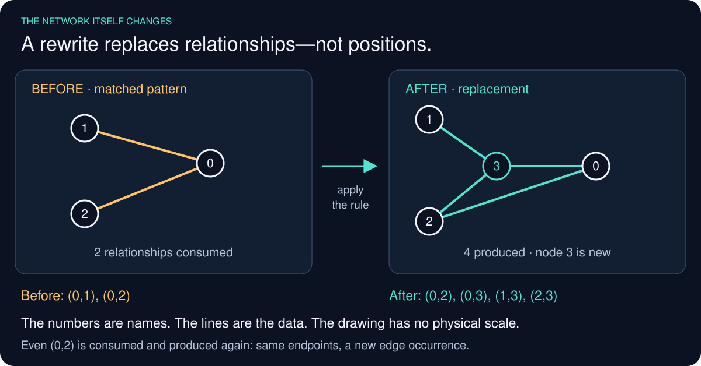
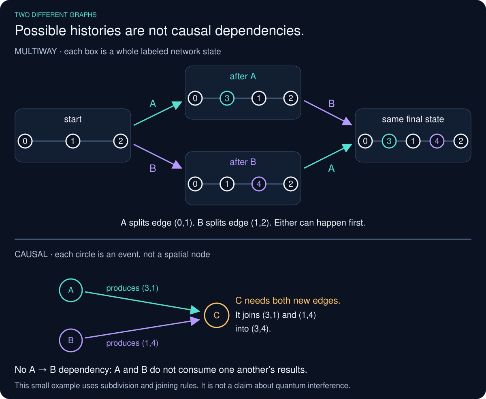
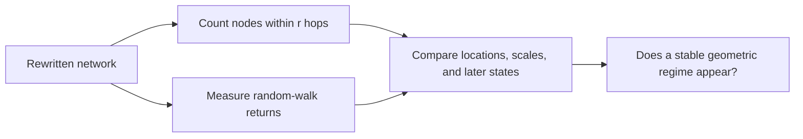
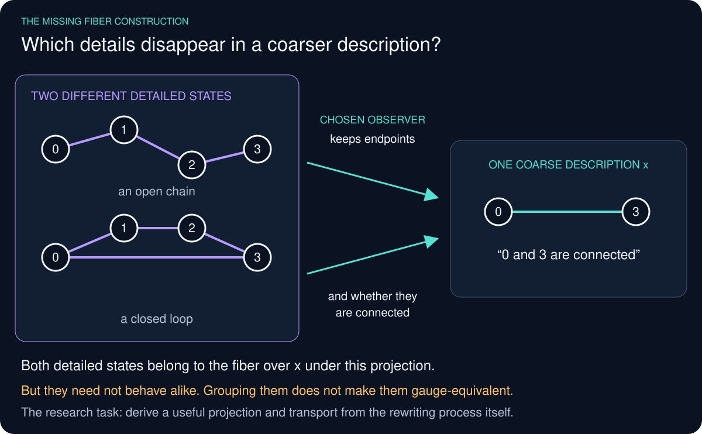

# Wolfram Physics Engine Exploration:<br/>Gauge Theory & the Standard Model

[](https://github.com/pirate/wolfram-gauge-physics/actions/workflows/ci.yml)

Stephen Wolfram launched the Wolfram Physics Project around a radical question: could familiar physics emerge from extremely simple computational rules, rather than being programmed into a simulation as the known equations of relativity, quantum mechanics, or the Standard Model? In the Wolfram model, a possible spatial state is represented by a hypergraph, local rules repeatedly replace small pieces of that graph, and a causal graph records which update events depend on earlier events. Following every possible order of updates produces a multiway graph of alternative histories; slices through that structure produce branchial graphs, which the project relates to quantum states and entanglement.

For suitable rules and under additional assumptions—especially locality, causal invariance, and an appropriate large-scale limit—the project argues that structures resembling continuous space, relativistic causal cones, and aspects of quantum mechanics can emerge. These are proposed mathematical correspondences, not yet a demonstrated model of our universe, and quantum probability is not simply the number of nodes in a hypergraph: Wolfram associates amplitude magnitude with path multiplicity in multiway evolution and phase with position in branchial space. The intuition is a little like Conway's Game of Life, except there is no fixed grid—the network of relationships that may become space is itself continually rewritten. This repository investigates whether gauge structure and field-like dynamics can be built at that microscopic level, with the long-term goal of testing for QED-like behavior and simple bound systems without inserting continuum fields or forces by hand; it does not yet derive QED, particles, physical constants, or molecules.

<table><tr>
<td>
<a href="https://www.youtube.com/watch?v=yAJTctpzp5w"><br/><small><code>Stephen Wolfram: Can space and time emerge from simple rules?</code></small></a>
</td>
<td>
<a href="https://www.wolframcloud.com/obj/wolframphysics/Tools/hands-on-introduction-to-the-wolfram-physics-project.nb"><br/><small><code>Hands-On Introduction to the Wolfram Physics Project</code></small></a>
</td>
</tr></table>

## The questions we are trying to answer

This project starts from the interview above. The goal is to take one of
Wolfram's unfinished ideas, turn it into a precise computational question,
and find an answer—or a specific reason it fails.

Three questions organize the work:

- **How does the network become space?** Can local rewrites produce a
  stable large-scale dimension, and what happens when that dimension
  varies? Wolfram discusses [dimension fluctuations at 1:11:17](https://www.youtube.com/watch?v=yAJTctpzp5w&t=4277s).
- **Where would fields and charge come from?** Can choices within the
  rewriting process give rise to internal degrees of freedom and their
  interactions? He explicitly leaves [electric charge unresolved at 1:07:07](https://www.youtube.com/watch?v=yAJTctpzp5w&t=4027s).
- **What could persist as a particle?** Can a recognizable structure
  survive while its underlying network changes, move relative to its
  surroundings, and interact with another such structure? He identifies
  the missing [particle model at 1:25:38](https://www.youtube.com/watch?v=yAJTctpzp5w&t=5138s).

Molecules are a later target, not the assumed interpretation of a graph
pattern. None of these three questions has been solved here. The
calculations below provide starting tools and some restrictions on
candidate answers.

## 1. Start with relationships, not a stage to put particles on

In an ordinary simulation, space is already there. Objects have positions
and fields have values at those positions. In the proposal discussed in
the interview, the network is what might eventually look like space.
There is no separate stage underneath it.

A node is an identifiable abstract element. It is not a voxel, an atom,
or a sample of a known field. A hyperedge records a relationship between
two or more elements. A rewrite replaces a small pattern of relationships
with another, possibly creating new elements.

```python
before = [(0, 1), (0, 2)]
after  = [(0, 2), (0, 3), (1, 3), (2, 3)]
```

This example replaces two relationships with four, using a fresh node.
The integers are IDs, like dictionary keys—not positions or measured
values. The tuples list related IDs, not coordinates. Strings could name
the same nodes without changing the structure.

It illustrates what a rewrite is; it is not established as a rule that
produces matter.



*The same rule used by the runnable example below. Node 3 is new.
Dot positions help draw the connections; they are not measured positions
in space. Even the unchanged endpoint pair (0,2) is a new edge occurrence
after this rule consumes and reproduces it.*

<details>
<summary>Details: the state, the rule, and what has units</summary>

A state is conceptually a `list[tuple[int, ...]]`. Repeated relationships
can be distinct occurrences, so the engine also retains their identities.
A rule contains two patterns: the relationships to consume and those to
produce. Repeated names within a pattern identify the same node; fresh
names on the output side introduce new nodes.

Node IDs, adjacency, pattern matching, and event counts are discrete,
exact data. There is no required floating-point precision at this layer.
The count of nodes is not a length in meters; the count of rewrites is
not elapsed time in seconds.

Relabeling a graph changes its written representation, not its
connectivity. Canonicalization detects that equivalence. It must preserve
whatever additional data an experiment has actually put in the state;
two bare graphs can be identical while their attached data differs.

The rewrite engine is the Wolfram Institute's
[HypergraphRewritingEngine](https://github.com/WolframInstitute/HypergraphRewritingEngine).


*An actual engine history, read top left to bottom right. Each arrow is
one rewrite; the layouts are not physical coordinates.*

Our [engine–gauge integration](docs/product-evolution.md) is more limited:
its supported base change is transport-preserving edge subdivision,
not arbitrary coupled geometry-and-field evolution.

</details>

## 2. Keep track of what happened—and what else could have happened

A rewrite can use a relationship made by an earlier rewrite. That gives
a dependency: the producer must happen before the consumer. Collect those
dependencies and you have a causal graph.

There may also be several places where the rule can apply. Following
each possibility produces a multiway graph. Histories branch when there
are alternatives and merge when they reach equivalent states.

These are different records. A causal edge connects dependent **events**.
A multiway edge connects a **state** to a possible next state.



*A fully specified small example. Above: A and B can happen in either
order and reach the same network. Below: C needs a relationship made by
each, so its causal graph has two prerequisites. The colors track events,
not fields. Node names are retained here; ignoring names can identify the
two intermediate graphs as equivalent too. This illustrates the distinction,
not quantum interference.*

Why retain the alternatives? Wolfram's proposal makes their structure
part of the physics question. Selecting one random history may be useful
for some measurements, but it does not reproduce the whole multiway
system or establish quantum probabilities.

<details>
<summary>Details: event dependencies, branching, and quantum claims</summary>

An event record identifies consumed and produced hyperedge occurrences.
A dependency follows from actual production and consumption; added
interaction layers must also account for their read and write supports.

A path can be stored as a `tuple[int, ...]` of event IDs. Storing
`(A, B)` instead of `(B, A)` records order; the rewrite rule determines
whether both orders are possible and whether their results agree.
Order dependence is something to examine, not an extra microscopic
substance.

The engine exports finite multiway and causal structures. A branchial
view compares alternatives across a selected slice. Its adjacency is
not by itself an entanglement measure. Nor do path counts alone provide
complex amplitudes, interference, or the Born rule.


This export has 13 raw states and 10 graph-isomorphism classes. Detecting
equivalent node labelings is not a proof that all update orders have
equivalent causal histories.

Causal invariance is a stronger question than whether two finite
histories end at the same graph. A bounded computation can find a
counterexample or establish a bounded result; a general conclusion
requires an argument covering the unexamined histories.

[](https://www.wolframphysics.org/technical-introduction/the-updating-process-in-our-models/branchial-graphs-and-multiway-causal-graphs/)

*Screenshot of Wolfram's technical introduction. The small blue diagrams
are graph states; horizontal lines mark slices through their history.
This is an upstream illustration, not our simulation result.*

See [event-preserving integration](docs/product-evolution.md) and
[causality, locality, and correlation](docs/phenomenon-detection.md#dependency-spatial-locality-and-quantum-correlation).

</details>

## 3. Measure whether something like space appears

Stand at a node and count how many other nodes are reachable within one
hop, two hops, three hops, and so on. In a region resembling ordinary
three-dimensional space, doubling a sufficiently large radius should
enclose roughly eight times as many nodes.

That gives a way to ask about dimension without first drawing the graph
in 3D. Repeat the measurement at different locations and times: does the
same dimension persist, or does the growth pattern change?

This is a direct route into the interview's dimension question. The
current probes can make these measurements, but the small rule survey
does not establish a three-dimensional regime or physical dimension
fluctuations.



<details>
<summary>Mathematics: dimension measurements and their limits</summary>

Let `ball_counts` be a `list[int]`: entry `r` counts nodes within
graph distance `r` of a selected source. A local scaling estimate is

```math
d_H(r)=\frac{d\log |B(v,r)|}{d\log r}.
```

An independent probe follows an auxiliary random walk and estimates its
return probability. A power-law regime would have

```math
p_t(v,v)\propto t^{-d_s/2}.
```

The estimated dimensions and probabilities are `float` values.
The walk's time counts probe steps; it is not the time of the rewrites.
Different dimension notions need not agree on a general graph.

The current probes use the undirected simple 2-section of a hypergraph:
nodes sharing a hyperedge are connected. This measurement choice forgets
edge ordering and multiplicity. Small graphs, boundaries, the projection,
and source sampling can all affect the estimate.

A useful result needs a scaling window that survives larger graphs,
different source choices, and continued evolution. Fluctuations must be
distinguished from estimator noise. Curvature requires additional
geometric information; a changing dimension estimate is not automatically
a gravitational wave.

See [measurement definitions and limitations](docs/phenomenon-detection.md).
The existing [38-rule, three-step survey](data/novelty-sweep-v1.json)
selects diverse graph statistics, not a target shape. It is a starting
survey, not an exhaustive rule search or a continuum-limit result.

</details>

## 4. Ask where internal structure would come from

In the interview, the starting data are relationships and rewrites.
There is no instruction to attach a triangle to every node.

The gauge-theory lead is more specific in Wolfram's
[technical introduction](https://www.wolframphysics.org/technical-introduction/potential-relation-to-physics/local-gauge-invariance/):
different local rewrite choices may serve as equivalent descriptions,
while a choice made here affects which choices remain possible later.
The proposal connects this structure to gauge freedom and field
propagation. That connection is something to construct and test.

A **fiber** is the collection of detailed states or descriptions that
lie over one location in a chosen description. To derive one here, we
would first need to specify what that description retains and which
underlying distinctions it groups together.



*An intentionally simple projection: keep the two endpoints and whether
they are connected, but hide the route between them. A chain and a loop
then look alike to that observer. They can still evolve differently.
This explains a fiber as a set of alternatives; it does not derive a
physical observer, a graph connection, or gauge equivalence.*

[InfraGaugeTheory](https://github.com/WolframInstitute/InfraGaugeTheory)
provides a language for graph fibers, projections, connections, and
transport. Its stated goals include natural clustering into fibers and
obtaining fibered graphs from hypergraph rewriting. Those are directly
relevant open construction problems.

### What the triangle experiments do—and do not—supply

Our existing finite-gauge studies work in the opposite direction:
**choose a fiber, calculate its symmetries, then study specified
interactions.** This is a controlled laboratory for candidate structures.
It has not derived the fiber or its dynamics from the bare rewrite system.

Why three vertices? A triangle is the smallest simple graph whose
symmetries can act differently when applied in different orders. It is
small enough to enumerate exactly. That is a practical reason for a
test case, not a reason that nature must use it.

A five-node ring is another possible choice. So is a fifty-node ring.
The connections matter as well as the count: ring-preserving maps are
rotations and reflections, not arbitrary permutations. Current
cycle-reaction results assume odd ring size; an even ring introduces
additional algebraic cases. Adding internal vertices is not automatically
increasing spatial resolution.

<details>
<summary>Mathematics: supplied fibers versus a rewrite-derived construction</summary>

For a projection from detailed states or graph elements to a retained
description, a fiber is a preimage:

```math
F_x=p^{-1}(x).
```

This definition alone supplies neither an internal adjacency nor a
connection, symmetry group, or evolution law. Those structures need
separate derivations. In particular, physically distinct alternatives
must not be discarded merely because a selected observer fails to
distinguish them.

In the current homogeneous graph-fiber experiments, the internal
adjacency is supplied. Its automorphisms are then calculated exactly:

```math
G=\mathrm{Aut}(F).
```


*Each upper triangle is a separately supplied internal graph. Dashed
lines say which base node it belongs to; they are not extra spatial
connections. Unlike the preceding projection example, this construction
supplies the fiber's internal adjacency from the start.*

For a cycle with `n >= 3` vertices, each map has the form

```math
U(v)=sv+a\pmod n,
\qquad s\in\{-1,1\},\quad a\in\mathbb Z_n.
```

There are `2*n` such maps. A map can be represented as a
`list[int]` of length `n`, or exactly as a `(sign, shift)` tuple
for this cycle family. It does not require an `n`-by-`n` floating-point
matrix or an angle tolerance.

The triangle allows all six permutations of its three vertices.
A link carries one allowed map. Following links composes maps; following
a closed loop gives its holonomy—the net internal transformation on
return to the starting point.


*This chosen connection returns to the same base node with the internal
labels rotated. It explains the measurement; it is not a particle orbit
or evidence that the connection emerged from rewrites.*

Changing local fiber labels transforms link maps as

```math
U_{xy}\mapsto g_yU_{xy}g_x^{-1}.
```

The corresponding loop map changes by conjugation. Measurements that
ignore this arbitrary frame choice are gauge invariant within the
specified model.

A rewrite-derived construction must explain why its alternatives admit
these kinds of maps—or show that a different mathematical structure is
needed. It must also distinguish a change of description from a change
that affects later invariant measurements.

See [finite-fiber assumptions and construction](docs/infragauge-foundations.md)
and the [research questions and acceptance criteria](docs/research-direction.md).

</details>

## 5. Look for something that survives the changing network

Wolfram suggests that particles might be persistent structures in the
network, rather than objects placed on it. The useful question is not
“does this picture resemble an electron?” It is “what remains the same
while the surrounding structure and its constituent nodes change?”

A candidate must survive actual rewrites. Its identity cannot depend
on keeping the same node IDs or freezing the region that supports it.
Motion must be measured relative to the surrounding network, not the
positions assigned by a renderer.

The present fixed-fiber calculations give a useful warning: a prepared
defect can support localized graph modes, yet allowed interactions can
remove those modes. Localization in one snapshot is not persistence.


*These calculations use a supplied two-dimensional lattice, triangle
fibers, and prepared link defects. They concern the graph's spectrum.
They are not electron orbitals, and no atomic energy scale is assigned.*

<details>
<summary>Mathematics: localization, persistence, and interaction</summary>

For a graph with `N` vertices, its Laplacian is mathematically an
`N`-by-`N` real matrix. A normalized real eigenmode is a
`list[float]` of length `N`; its eigenvalue is one `float`.
A spatially concentrated mode does not by itself define a quantum state
or a physical Hamiltonian.

The [specified triangle-fiber defect](docs/triangle-modes.md) has an
exact certificate for two modes above the full flat background spectrum.
The same work bounds the possible mode count using the conserved weight
on the two face orientations:

```math
n_+(L_{\mathrm{bundle}}-12I)
\le\min(Q_\uparrow,Q_\downarrow).
```

Actual reactions can redistribute that weight and force mode loss.
This is a reason to test temporal stability rather than infer particles
from static eigenvectors.

A stronger candidate would need an invariant descriptor, a tracked
causal history, a lifetime measured against local background activity,
and survival under encounters. A motif copied by a rule is not
automatically a particle; an apparently persistent patch that has never
been updated is a separate control.

For a bound pair, compare separation and breakup behavior with isolated
candidates and the model's accessible background. No attractive
potential, target bond distance, or molecular geometry should be fed
into the update law to obtain the desired answer.

See [phenomenon-detection criteria](docs/phenomenon-detection.md) and
[encounter-resolved persistence](docs/triangle-encounter-memory.md).

</details>

# Progress So Far

- **Exact finite rewrite histories and event provenance.** We can
  inspect spatial states, dependencies, and alternative histories using
  the upstream engine. A restricted connection-aware extension preserves
  these records through edge subdivision. This is a starting point for
  the interview's causal and multiway questions, not a general evolving
  gauge field. [Construction](docs/product-evolution.md).

- **Intrinsic geometry measurements and a bounded rule survey.**
  Graph-ball and random-walk probes measure structure without taking
  dimension from a drawing. The present short survey has not found or
  established emergent 3D spacetime. [Scope](docs/phenomenon-detection.md).

- **Exact descriptions of specified finite gauge states.** Small-patch
  results show when local measurements lose information needed to
  predict an interaction, and how relative alignment restores it. This
  supplies a concrete test for a future observer-based description;
  it does not derive that observer or fiber.
  [Patch reconstruction and gluing](docs/triangle-patch-observer.md).

- **Restrictions on proposed routes to matter.** In studied models,
  some apparent internal motion is only relabeling; diffuse large fibers
  reduce to ordinary exchange diffusion; and localized modes can be
  destroyed by the permitted dynamics. These delimit particular
  constructions, not all rewriting models.
  [Unary restriction](docs/causal-dynamics.md),
  [refinement limit](docs/fiber-refinement-limit.md),
  [localization and loss](docs/triangle-modes.md).

<details>
<summary>Supporting finite-model work: what it is useful for</summary>

The fixed-mesh reaction and memory studies are available as experiments
in conditional dynamics. Their relevance is to specific questions:
which internal relations affect later changes, whether those relations
survive encounters, and when a reduced description loses predictive
information.

The triangle reaction bank and its odd-cycle extensions have a conserved
integer weight with values 0, 1, and 2 on three holonomy types. Here
“charge” names that weight; it has not been identified with electric
charge. The rules remain chosen, including the original positive-charge
selection criterion.

[Reaction construction](docs/cycle-relational-dynamics.md),
[relative-angle dependence](docs/fiber-relative-angle.md),
[reaction bursts](docs/fiber-reaction-bursts.md), and
[transported constraints](docs/fiber-constraint-dynamics.md) contain the
assumptions, derivations, scripts, and saved results.

These studies warrant further compute when they resolve a stated
obstacle to the rewrite-based program, not merely because a larger run
is possible. A diffusion limit is useful here as a restriction on that
model; recovering the known heat equation is not itself progress toward
quantum matter.

The [research map](docs/STATE_OF_THE_ART.md) separates reusable
constructions from the missing physical connections. The [research
direction](docs/research-direction.md) defines which questions should
drive new experiments.

</details>

# Future Work

1. **Construct internal alternatives from actual rewrites.** On a small,
   completely explored example, specify a projection or observer and
   derive its candidate fibers and the maps between them. Determine
   which choices are equivalent descriptions and which change later
   observable behavior. A failure to define consistent transport is a
   useful result; attaching a preferred fiber is not a substitute.

2. **Follow the consequences of a local rewrite choice.** Compare
   alternatives with a common prior state and boundary. Track which
   later matches become possible or impossible, preserving event
   dependencies. Determine whether any effect survives relabeling,
   branch merging, and a change of description. This directly tests
   Wolfram's proposed route from local choices to gauge-like effects.

3. **Find and characterize stable geometric regimes.** Extend selected
   rule families far enough to separate growth, finite-size effects,
   and local dimension variation. Test several seeds and update
   schedules. Explain any regularity from the rewrite process before
   interpreting it as space or curvature.

4. **Search for persistent, moving structures.** Identify candidates by
   invariant relationships, follow them through replacement of their
   constituent nodes, and test encounters. Distinguish genuine survival
   from inactivity, imposed defects, and renderer artifacts.

5. **Connect measured dynamics to an effective physical description.**
   If a reproducible geometric or interaction regime appears, derive
   its scale dependence and observable laws. Quantum amplitudes,
   interference, physical charge, and mass each need their own
   construction. Known physics provides comparison targets, not hidden
   terms in the microscopic updates.

6. **Spend compute on the limiting question.** Use parallel enumeration
   for finite rule/transition problems and longer runs for declared
   persistence or scaling questions. Optimize the limiting operation
   only when it unlocks an otherwise inaccessible mathematical test.
   Keep counterexamples, null results, and incomplete runs.

## Inspect the experiments


*The debugger separates graph state, causal ancestry, branchial slices,
and a best-effort spatial projection. It is a way to inspect the
calculation—not evidence that the pictured state is three-dimensional.*

<details>
<summary>Commands: build, export a history, and view it</summary>

Requirements: CMake 3.20+ and a C++20 compiler.

```bash
git clone https://github.com/pirate/wolfram-gauge-physics.git
cd wolfram-gauge-physics
cmake -S . -B build -DCMAKE_BUILD_TYPE=Release
cmake --build build -j
./build/wgphysics_evolve \
  --rule '0,1;0,2->0,2;0,3;1,3;2,3' \
  --init '1,2;1,3' \
  --steps 3 \
  --output out/evolution.json
python3 -m http.server 8765 --bind 127.0.0.1
```

Open [localhost:8765/viewer/](http://localhost:8765/viewer/) and load
the export. See the [debugger guide](docs/debugger.md) for interpretation.
Experiment notes link their own scripts and data; this command exports
a rewrite history, not a molecular simulation.

</details>

MIT licensed. This is an independent experimental project, not an official
Wolfram Institute or Wolfram Research repository. The attributed Wolfram
website screenshot remains the original publisher's material, not part
of this repository's MIT license. See [figure sources](docs/readme-visuals.md).
