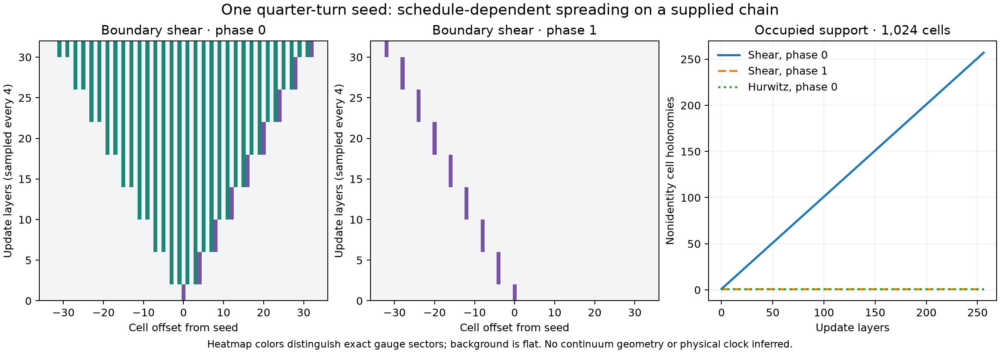

# Multi-cell experiments: what the first spreading patterns actually mean

The first 80 chain runs execute 2,832,800 exact pair updates. They establish a reproducible
multi-cell implementation and reveal restrictions of the current laws. They do **not** establish
emergent continuum physics, stable particles, or molecular binding.

## Model and controls

The geometry is a supplied open chain of triangular cells, with one fixed connector between
successive cell basepoints. Each cell's closing link is exclusive. Its holonomy therefore
captures the changing connection degree of freedom exactly. `src/cell_chain.hpp` compiles the
two pair maps into integer tables for the group derived from the fiber.

Tests compare this representation with full link updates on eight triangles with nontrivial
connectors. All 112 oracle updates agree, all transported total products are conserved, and
reversing the event sequence with inverse rules recovers the initial values. The optional event
ledger records the preceding writers of the two updated cells, deduplicates parents, and computes
dependency depth. Connector values are static inputs in this fixture. This ledger is not yet the
official engine's event arena and does not describe arbitrary overlapping faces.
Tests replay a different topological ordering of the recorded DAG, verify each event sees the
same input versions, and recover the same final connection. This certifies the supported
independent-event reorderings, not arbitrary changes of the alternating matching schedule.

The experiment uses $\operatorname{Aut}(C_4)$, both pair rules, 64/128/256/1,024 cells, five
initial conditions, and two matching phases. Initial states are flat except for a quarter turn,
a reflection, a neutral adjacent rotation/inverse pair, or a noncommuting rotation/reflection
pair. These are supplied perturbation controls, not spontaneously generated particles.

Each layer updates disjoint neighbors; even and odd matchings alternate. Runs end after $N/4$
layers, before a disturbance from the center can reach a boundary. The one-cell-per-layer
support bound follows from the supplied local schedule. It is not a measured universal speed
of light. Counts below are measured from the actual group elements, with exact gauge-sector
profiles exported for the 128-cell runs.



## Observations and their algebraic explanation

At 256 layers on 1,024 cells:

| Quarter-turn seed | Occupied cells | Occupied offsets from the seed |
|---|---:|---|
| Hurwitz, even matching first | 1 | $+256$ |
| Hurwitz, odd matching first | 1 | $-256$ |
| Boundary shear, even matching first | 257 | $-255$ through $+256$, sparsely occupied |
| Boundary shear, odd matching first | 1 | $-256$ |

The flat controls remain flat. Reflection seeds remain single moving cells under either rule.
The neutral and noncommuting two-cell seeds also show substantial schedule dependence.
Changing system size with the same central seed gives the same pre-boundary local experiment;
it is a boundary control, not a refinement or continuum-limit test.

### Generated-subgroup obstruction

Parallel transport all cell holonomies to a common root through the fixed connector tree.
Let $K$ be the subgroup they generate. The forward pair maps express each output as a group
word in the inputs, so $K'\subseteq K$. Their word inverses imply $K\subseteq K'$. Hence

$$K'=K.$$

This holds for any number of cells under the supported updates. A root-frame change conjugates
$K$, leaving its order and isomorphism type unchanged. Tests and every experiment check subgroup
conservation. The initial subgroup orders in the five controls are respectively 1, 4, 2, 4, and 8.

Consequently a single rotation seed cannot explore the full nonabelian gauge group, regardless
of run length. More computation alone cannot overcome that restriction. The noncommuting seed
does generate all of $D_4$, but that fact alone supplies neither a particle spectrum nor thermalization.

### Cyclic reduction

For holonomies $A=R^a$, $B=R^b$, $R^4=1$, the shear becomes exactly

$$\binom{a'}{b'}=
\begin{pmatrix}2&1\\-1&0\end{pmatrix}\binom{a}{b}\pmod4.$$

The matrix is unipotent: $M^k=I+k(M-I)$. Its order modulo four explains the four-cycle in
the pair census. The 32-layer chain test agrees with an independently implemented exponent
recurrence at every site. For an order-two seed this reduces to a swap, explaining the moving
reflection without invoking a propagating field equation.

### Exact two-layer reduction, including nonabelian states

There is a stronger restriction beyond cyclic initial conditions. Write the input cells as
$(a_j,b_j)$ in even/odd pairs, with identity connector transport. After an even layer followed
by an odd layer, away from the boundaries,

$$a'_j=a_{j-1},\qquad
b'_j=a_j^{-1}a_{j+1}b_{j+1}a_{j+1}a_j^{-1}.$$

This follows by substituting $(A,B)\mapsto(ABA,A^{-1})$ twice. One sublattice streams exactly;
the other is driven by it. The code checks this identity in the nonabelian group
$\operatorname{Aut}(K_3)=S_3$ as well as checking the cyclic reduction separately.
With cyclic states the second equation reduces to
$b'_j=b_{j+1}+2(a_{j+1}-a_j)$ modulo four.

The observed phase difference is therefore an algebraically identifiable distinction between
the two initial sublattices. It is not evidence that a physical excitation spontaneously acquires
two different dynamics. Any coarse-grained interpretation must retain or justify eliminating
this extra microscopic structure.

## Reproduction and next discriminating experiments

```bash
cmake -S . -B build -DCMAKE_BUILD_TYPE=Release
cmake --build build -j
ctest --test-dir build -L wgphysics --output-on-failure
./build/wgphysics_chain_experiments --output out/chain-experiments.json
diff -u data/d4-chain-experiments.json out/chain-experiments.json
uv run --with matplotlib python tools/plot_chain_experiments.py
```

The experiment measures support and sector profiles, not energy, mass, or entanglement. The
spreading control is exactly reducible to a modular cellular automaton. Its pattern alone cannot
support a physical radiation claim.

Next, test finite noncommuting backgrounds and collisions using invariant two-cell correlations,
and compare against the exact two-layer recurrence rather than pictures. To investigate behavior
beyond this fixed-background word dynamics, the geometry/fiber evolution must participate:
changing connectors, cell incidence, or fiber type invalidates some of the reductions and must
be tracked explicitly. Any new update still needs a mathematically specified reversible or
multiway realization and full incident-face accounting. Arbitrarily prescribing a desired force
or a wave equation would bypass the intended research question.
