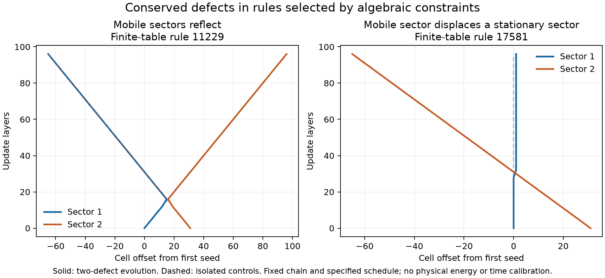

# Beyond word maps: an exhaustive finite interaction family

The chain experiments proved that our original word maps conserve the subgroup generated by
the transported holonomies. That restriction need not hold for every gauge-covariant rule.
This search constructs finite update tables from algebraic constraints on the derived group
$G=\operatorname{Aut}(C_4)$, without a target waveform, geometry, particle, or continuum force.

## The precise search space

An admitted map $F:G^2\to G^2$ must be a bijection, fix $(1,1)$, preserve the ordered product
$AB$, commute with simultaneous conjugation, and satisfy orientation/time reversal
$JFJ=F^{-1}$, where $J(A,B)=(B^{-1},A^{-1})$. In this census we additionally require
$F^2=1$. Hence the reversal condition becomes $FJ=JF$.

Self-inversion is a restriction of this experiment, not a requirement of every viable physics
model. The original Hurwitz and shear maps need not be involutions on raw group-element pairs.
These constraints define candidate microscopic laws; they do not select a unique law from the
fiber's adjacency. No claim of a new general classification theorem is made here.

For each proposed transposition $x\leftrightarrow y$ with equal products, close it under all
gauge conjugations and under $J$. Reject inconsistent assignments and ones moving the flat
vacuum. This produces 29 minimal tables including the identity. Every admitted involution
decomposes into disjoint closures of its transpositions: equivariance and commutation with $J$
force each closure to be present, and different such closures either coincide or have disjoint
supports. Enumerating their compatible disjoint unions therefore exhausts the stated family.
The visitor stops with an error if its explicit candidate cap is exceeded; this run exhausted
the search before that cap.

| Classification | Count |
|---|---:|
| All admitted involutions | 1,769,472 |
| Exact three-cell braid solutions | 5,731 |
| Exact braid solutions that grow some pair's generated subgroup | 3,592 |
| Solutions equivalent only after allowing gauge comparison of isolated triples, including exact ones | 18,225 |

The complete accepted tables and counts are in `data/d4-involution-braid-search.json`.
`data/d4-pair-involutions.json` records the minimal closures and their seed experiments.
The C++ tests compare the order-two-fiber case with brute-force enumeration of all pair
permutations, and check 1,856 transported-link cases for the square-fiber minimal tables.

## A gauge-quotient trap in schedule tests

The braid relation compares $F_{12}F_{23}F_{12}$ with $F_{23}F_{12}F_{23}$. For an isolated
triple it is tempting to accept outputs related by simultaneous conjugation. However, the
required gauge transformation can also alter untouched spectator holonomies.

The dataset includes a concrete counterexample with a generating rotation/reflection spectator
pair. Its first three outputs are gauge-equivalent in isolation, but the full five-cell outputs
are inequivalent. The independent Python screen verifies this directly. Consequently only the
5,731 **exact** solutions are admitted to the subsequent local-interaction screen. Isolated
triple quotient agreement is not a compositional proof of local schedule consistency.

Even exact braid identities certify particular schedule relations, not arbitrary rearrangements
of overlapping updates or causal invariance of a geometry-changing rewriting system.

## Conserved quantities discovered from the tables

Among the 3,592 subgroup-growing exact solutions, minimize the number of changed pair inputs.
Fourteen laws tie at 24 moved inputs. This is a combinatorial complexity filter, not selection
for a physical-looking output. An independent Python implementation rederives the square's
automorphism group, rechecks product conservation, self-inversion, gauge covariance, and all
512 braid triples for each selected law.

For each law, solve the exact rational equations

$$q(A)+q(B)=q(C)+q(D),\quad (C,D)=F(A,B),$$

with $q$ constant on gauge conjugacy classes and $q(1)=0$. This recovers all additive
class-function charges of that form. For all fourteen laws the solution space has dimension
three: the counts of the two reflection sectors and the quarter-turn sector. The central
half-turn sector has zero weight in every such charge and can be created or removed.

Thus the conserved defect counts were inferred from the dynamics, rather than stipulated as
particle counts in the search. They are finite-model charges, with no identification as electric
charge, mass, or energy. The conservation statement applies to this fixed set of exclusive
cell loops; geometry rewrites and changes in face incidence require additional accounting.

The independent screen checks 196 single-seed runs on 256 cells and 84 two-defect runs on
512 cells, including stationary/no-contact controls. Measured charges remain constant.
For some rules, mobile conserved sectors reverse directions after meeting; for others, a
mobile sector moves a stationary one by one cell. The records include isolated controls,
contact times, outgoing velocities, and any constant late displacement from those controls.



These were the first observed particle-like transport/collision phenomena in this constrained
finite family. Subsequent exact factorization identifies their charge dynamics as a colored
exclusion process. The [many-body diffusion experiment](emergent-diffusion.md) derives a
finite-time tagged-particle distribution and checks it against microscopic ensembles. The
[full braid-family classification](braid-quotient-classification.md) shows this is not merely
an artifact of selecting the fourteen smallest tables. These results are not evidence of
emergent spacetime or molecules; geometric coupling remains unbuilt.

## The surviving one-seed obstruction

Although generated-subgroup conservation can fail for the new tables, there is a broader
symmetry restriction. An equivariant bijection preserves each state's stabilizer exactly.
For a single holonomy seed $h$ in an otherwise flat, commonly based tuple, the stabilizer is
$C_G(h)$. Every deterministically evolved holonomy must therefore lie in

$$C_G(C_G(h))=Z(C_G(h)).$$

The equality follows because $h\in C_G(h)$, so the double centralizer lies in $C_G(h)$ and
centralizes it. This is abelian. Thus even the broader deterministic covariant rules cannot
produce a nonabelian tuple from one seed in this fixed-gauge-action setting. For a square-fiber
reflection, the accessible abelian group can grow from order two to order four, which is
exactly what the minimal-table experiments observe.

This argument does not apply unchanged to multiway branching, a changing fiber group/action,
or additional local degrees of freedom. Those extensions need explicit constructions. It
also does not forbid nonabelian dynamics starting from a genuinely noncommuting multi-seed
state.

## Reproduce

```bash
cmake -S . -B build -DCMAKE_BUILD_TYPE=Release
cmake --build build -j
ctest --test-dir build -L wgphysics --output-on-failure
./build/wgphysics_involution_census --output out/pair-involutions.json
./build/wgphysics_involution_braid_search --output out/involution-braid-search.json
diff -u data/d4-pair-involutions.json out/pair-involutions.json
diff -u data/d4-involution-braid-search.json out/involution-braid-search.json
python3 tools/screen_braid_rules.py --output out/braid-rule-screen.json
diff -u data/d4-braid-rule-screen.json out/braid-rule-screen.json
uv run --with matplotlib python tools/plot_braid_collisions.py
```

The effective defect description is now exactly classified. The next discriminating work is
to test multi-loop observables and explicit changes in cells, connectors, and fibers against
the autonomous-sector obstruction. The goal remains an emergent physical theory; this
finite-law census and its observed transport phenomena do not complete that goal.
