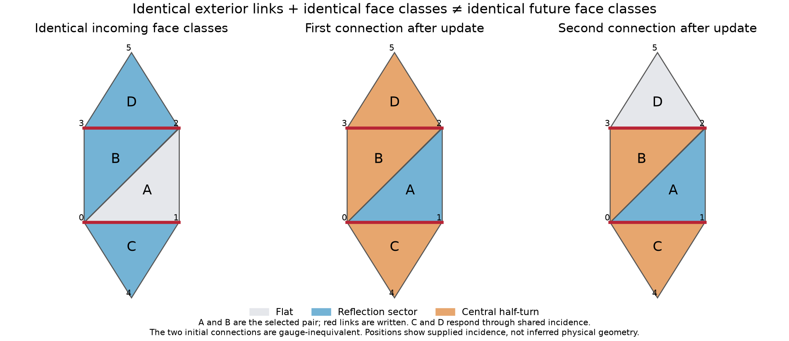

# Shared links restore multi-loop feedback

The same microscopic table that reduced to an exclusion process on independent cells now
has a non-closed face-sector description on a genuine shared-link two-complex. No new force
or target dynamics was added. The missing ingredient was accounting for **every face incident
to a written link**, not only the two faces selected by the operator.

This does not contradict the [pair-table classification](braid-quotient-classification.md).
That theorem concerns independent cell variables. A link-level realization on a mesh can
also change neighboring faces, whose outputs depend on relative loop information discarded
by individual conjugacy classes. The new code keeps the full connection and updates these
neighboring observables exactly.



## The mathematical counterexample

Use the same square fiber and selected table 11229 as the diffusion experiment. Four oriented
triangles have boundaries

$$A=(0,1,2,0),\quad B=(0,2,3,0),\quad
C=(0,4,1,0),\quad D=(2,5,3,2).$$

Apply the existing pair operator to rotated boundaries $(1,2,0,1)$ and $(3,0,2,3)$, with
connector $(3,0,2,1)$. It writes links $01$ and $23$. Those links are also incident to $C$
and $D$, respectively. All six links of the outer boundary $(0,4,1,2,5,3,0)$ remain untouched.
The connector runs entirely through unchanged links of the selected two-face patch.

A spanning-tree gauge makes the four initial holonomies independent. Set

$$U_{01}=U_{02}=U_{03}=U_{04}=U_{25}=1,\qquad
U_{12}=A,\quad U_{23}=B,\quad U_{14}=C^{-1},\quad U_{35}=(BD)^{-1}.$$

With $(X,Y)=F(A,A^{-1}BA)$ and $L=XA^{-1}$, direct path multiplication gives the updated
holonomies at the canonical face basepoints:

$$A'=AL,\qquad B'=AYA^{-1},\qquad
C'=L^{-1}C,\qquad D'=(B')^{-1}BD.$$

Thus $C'$ and $D'$ contain relative group information, not just the incoming individual
classes. The C++ experiment enumerates all $8^4=4,096$ gauge-fixed inputs, checks its compact
kernel against a separate full-connection realization, verifies unchanged outer-boundary
transport, and reverses each update to the exact original links. Python independently checks
all four output formulas.

Of the 625 incoming ordered face-class tuples, **108 have multiple possible outgoing tuples**,
with up to four alternatives. This is an exhaustive finite check, not inference from a picture.
The dataset also contains a stronger witness: two gauge-inequivalent connections with identical
incoming face classes **and byte-for-byte identical exterior transports**, but different
outgoing class on $D$. A boundary-tree frame transformation aligns their boundary connections;
an independent test exhausts all possible root frames to rule out gauge equivalence.

The two inputs both have classes $(1,[\tau],[\tau],[\tau])$. Their outputs have classes
$([\tau],[z],[z],[z])$ and $([\tau],[z],[z],1)$, where $z$ is the central half-turn.
All initial/final link values, loops, group permutations, and the complete census are recorded
in `data/d4-shared-mesh.json`.

## The independent-cell charges are not global mesh charges

Solve every local conservation equation

$$q([A])+q([B])+q([C])+q([D])
=q([A'])+q([B'])+q([C'])+q([D'])$$

for rational class functions with $q(1)=0$. The exact nullspace has dimension **zero** for this
table and patch. Because only internal links change, embedding this patch in a larger mesh
does not add compensating changes on exterior faces. Therefore no nontrivial global invariant
of the form $\sum_f q([H_f])$ can hold for all configurations and these admitted updates.
Without $q(1)=0$, the constant face-count function is a trivial invariant on fixed geometry.

This invalidates interpreting the chain's three derived counts as global charges of this
shared-link dynamics. It does **not** rule out multi-face, nonlocal, torsion-valued, or
topological invariants. None of these finite-model quantities has been identified with
electric charge or energy.

## A sparse shared-link evolution kernel

`src/mesh_dynamics.hpp` compiles oriented paths to link IDs and directions. Each update uses
integer multiplication/inverse tables, changes two links, and refreshes the union of their
incident face holonomies. Full snapshots independently check the cache. The mesh is supplied
as an oriented complex; faces are never guessed from arbitrary graph cycles.

The operator set contains every ordered adjacent triangle pair, every exclusive closing-link
choice, and its unique connector in the remaining three-edge tree. Read/write conflict
coloring produces layers of commuting **link** updates. Tests reverse the order inside every
layer and check equality. Different overlapping-event schedules are not claimed equivalent.
Recorded causal parents include every latest writer of a link the operator actually reads.
Observer-cache reads are not new physical causal interactions.

This is a CPU implementation. A parallel implementation must first complete all link writes,
then refresh the union of affected face caches: commuting link updates can still affect a
common observer cache. The current code does not claim an end-to-end GPU kernel.

## Deterministic spreading and an exact reversal echo


We ran 288-face and 1,152-face periodic triangulations for 256 and 512 conflict-free layers,
respectively. Each uses eight seeded schedule orderings and five initial conditions: flat,
one reflection link, one rotation link, two noncommuting seed links, and independent uniform
random links. The isolated and paired seeds use the same locations and schedule within each
trial. Seeds are microscopic link assignments, not inserted particles or wavefunctions.

Schedules are fixed after initialization. Flat inputs stay flat. Local seeds spread with a
checked dual-face distance bound $r\le2t$, where $t$ counts conflict-free layers. The initial
two- or four-face disturbance develops broad curvature distributions. Reversing every update
recovers each preceding face histogram and finally every initial link exactly, in all 80 runs.
The reversal plot uses these verified intermediate echoes, not a dissipative reverse equation.

### A stationary reference derived from the exact symmetry

Let $S$ be the set of seeded group elements. Simultaneous-conjugation covariance implies
that a deterministic update cannot lose an initially preserved global frame symmetry. In
the displayed initial gauge, all evolving links remain in

$$K=C_G(C_G(S)).$$

For the reflection and rotation seeds these are different order-four subgroups; for the
noncommuting pair, $K=G$ has order eight. The flat-fixing rule gives the stronger vacuum
restriction $K=\{1\}$. The analysis also checks closure of each $K^2$ under the actual table.

The update is a bijection on $K^E$, so the uniform independent-link measure on $K^E$ is exactly
stationary. A simple face holonomy is uniform in $K$ under that measure. Hence

$$p_{\rm ref}([h])=\frac{|[h]\cap K|}{|K|},\qquad
\Pr_{\rm ref}(H_f\ne1)=1-\frac1{|K|}.$$

This is a uniform measure on labeled connections, not uniform weighting of physical gauge
orbits. It is an exact stationary reference, **not a proof that a given seeded orbit samples
it**. Gauge-equivalent frame descriptions give the same face-class observables.

| Initial condition | Stationary nonflat fraction | Mean final fraction, 1,152 faces |
|---|---:|---:|
| Flat | 0 | 0 |
| Reflection seed | 0.7500 | 0.7465 |
| Rotation seed | 0.7500 | 0.7520 |
| Noncommuting pair | 0.8750 | 0.8720 |
| Uniform random links | 0.8750 | 0.8761 |

The face-class entropy and density approach values near that reference and fluctuate, despite
exact microscopic reversibility. The entropy here is an empirical histogram statistic, not
fine-grained ensemble entropy or a calibrated thermodynamic entropy. Its reference value is
not an upper bound on class-label entropy, because conjugacy classes have unequal sizes.
Eight schedule trials and local histograms do not establish ergodicity or thermalization.
We have not measured a temperature, conserved energy, stable bound state, or continuum limit.

The supplied two-dimensional triangulation is also not an emergent dimension. These results
demonstrate multi-loop feedback and reversible coarse relaxation in this finite gauge model;
they do not derive electromagnetism, quantum mechanics, gravity, or molecules.

## Reproduce and next discriminating tests

```bash
cmake -S . -B build -DCMAKE_BUILD_TYPE=Release
cmake --build build -j
ctest --test-dir build -L wgphysics --output-on-failure
python3 tests/shared_mesh.py
python3 tools/run_mesh_experiments.py --output out/shared-mesh.json
python3 tools/run_mesh_experiments.py --side 24 --layers 512 --seed 1819031 --output out/shared-mesh-replication.json
python3 tools/run_mesh_experiments.py --reanalyze data/d4-shared-mesh.json --output out/shared-mesh-reanalyzed.json
uv run --with matplotlib python tools/plot_shared_mesh.py
```

The immediate questions are whether multi-face or topological conservation laws survive,
whether connected correlation functions relax, and how responses scale with mesh size,
schedule, and microscopic seed. Localized persistent excitations need a detector that rejects
transient fronts and stationary histogram noise. Geometry-changing rewrites remain a separate
construction: no transport rule for a diagonal flip was smuggled into these runs.
