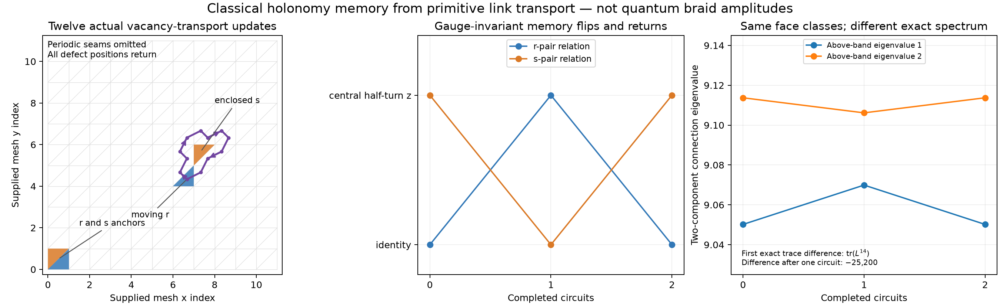

# Closed transport exposes classical holonomy memory

One curvature defect can return to its original face after circling another, leaving
**every face-curvature class unchanged but a different gauge connection and graph
spectrum**. We now realize this with twelve applications of the existing boundary-fixed
vacancy-transport rule on actual links, rather than applying a braid map directly to
abstract labels. A second circuit restores the gauge orbit, though not every raw link.

This reproduces the *classical holonomy mechanism* associated with flux metamorphosis
in discrete gauge theory. That mechanism is established physics, not a novelty claim;
see [de Wild Propitius, section 1.4.2](https://staff.science.uva.nl/f.a.bais/scripties/mdwp1995.pdf)
and [Bais, de Wild Propitius, Discrete gauge theories](https://arxiv.org/abs/hep-th/9511201).
Our contribution here is its checked realization from this repository's primitive
link rule, a reconstruction-level observer, and exact graph-spectral consequences.
We have not obtained a gauge-Higgs model, quantum statistics, interference amplitudes,
an energy law, or stable particles. The paths below are controlled diagnostic schedules,
not evidence that the freely evolving simulation organizes itself into these braids.



## 1. Prepare and transport on raw links

Start with the existing compact two-link seed on the $12\times12$ triangular torus.
Its four nonflat faces belong to the two reflection classes. Twenty-eight applications
of the **same** vacancy-transport primitive park two defects outside a small circuit and
place a third on that circuit. No link is directly edited during this preparation.

The closed dual-face walk contains twelve edges. An integer winding calculation in a
non-wrapping planar chart checks that it encloses exactly one other defect and excludes
both parked spectators. Each step has one nonflat source and an identity-holonomy target;
the raw one-edge lift swaps their classes and leaves spectator face classes unchanged.
The circuit uses rule 0 only: none of the class-converting three-face rules is involved.

The complete preparation and two circuits are independently replayed by the C++ engine
and Python link oracle, then reversed exactly. The complete Python observer, compiled
observer, and legacy gauge quotient agree on all three sampled connections. Tests also
apply arbitrary local frames to the entire initial connection and repeat the compiled
history, obtaining the correspondingly transformed final links.

The noncommuting experiment returns to the original gauge orbit after two circuits but
not to the original raw link vector. Explicit vertex-frame arrays witness the return.
Raw equality would have mistaken this harmless frame difference for persistent memory.

## 2. A short loop word reveals what changed

Transport every face loop to the same root using fixed spanning-tree paths. These paths
are part of the observable definition; holonomies at unrelated basepoints are never
multiplied as if their frames were identified. For the occupied faces $(0,1,108,135)$,
the based holonomies are

$$ (r,sz,r,s)\ \longrightarrow\ (r,sz,rz,sz)
\ \longrightarrow\ (r,sz,r,s). $$

Here $z$ is the central half-turn, and the moving and enclosed defects occupy the last
two entries. Their conjugacy classes have not changed. The same-class relative words do:

$$H_0H_{108}^{-1}:\quad 1\to z\to1,$$
$$H_1H_{135}^{-1}:\quad z\to1\to z.$$

These words are central, hence invariant under the common root-frame conjugation.
They distinguish the first-circuit state even though defect positions, all pair distances,
and **every individual face-curvature class** match the initial state. Separation and local
curvature labels therefore cannot by themselves predict the gauge state or its spectrum.

## 3. The effect survives checked path deformations

Replace one edge of the transport path by the other five edges around an adjacent
degree-six primal vertex, provided those alternative target faces are empty. All twelve
admissible detours in the noncommuting experiment preserve its final gauge orbit.
Each resulting connection differs from the reference by an explicitly reconstructed
frame change at **that one primal vertex only**. Independent C++ replay checks every detour.

There is a local reason. For a six-face star, write its spokes as $s_i$ and fixed outer
boundary links as $b_i$. With consistently oriented faces,

$$H_i=s_{i+1}^{-1}b_i s_i.$$

Five flat faces impose $s_{i+1}=b_i s_i$ along the five-edge chain. Once one spoke is
chosen, all others are fixed; the remaining face holonomy follows from the outer boundary.
Changing the initial spoke right-multiplies every spoke by one common element, precisely
a frame change at the central vertex. Thus direct and empty-star-detour transport to the
same target cannot create a new gauge orbit. This statement needs no special $D_4$ identity.

Two controls complete the raw experiment: circling a commuting reflection, and circling
an empty interior. Both preserve their gauge orbit after one circuit. Their twelve and
twenty-four admissible detours respectively do so as well: **48 checked deformations total**.
These local checks do not establish invariance under arbitrary graph rewrites, collisions,
or all globally possible path deformations on a punctured torus.

## 4. Derive the square-fiber pure-winding algebra

For comparison with actual link transport, evaluate the adjacent Hurwitz action

$$\sigma(A,B)=(ABA^{-1},A)$$

and its inverse using the group tables derived from square adjacency. Its square is
the pure winding action. In $D_4$, commutators are central involutions, so

$$\sigma^2(A,B)=(\kappa A,\kappa B),\qquad
\kappa=[A,B]\in\{1,z\}.$$

The actual based-face tuples above agree with this independently evaluated word.
For nonadjacent strands, the code brings the selected pair together using adjacent
Hurwitz moves, applies the square, and undoes the preparatory moves. Exhaustion through
four entries verifies the same pairwise central-flip formula without assuming it in
the word evaluator.

An important restriction follows: **all these pure-winding generators commute and have
order at most two**. Their commutators depend only on quotient coordinates, which the
central flips leave unchanged. The full Hurwitz actions can still permute strands and
need not commute; the restriction concerns pure windings that return the ordered labels.
Noncommuting fluxes are not, by themselves, evidence for noncommuting pure-winding actions
or a quantum anyon representation.
This restriction is on the classical flux-tuple action, not on all charged or quantum
representations of the quantum double of $D_4$.

### How much gauge-invariant memory can pure windings access?

Consider a fixed ordered tuple, with $n$ noncentral entries and quotient coordinates
$q_i\in D_4/\langle z\rangle\cong\mathbb F_2^2$. If their rank is below two, all
entries commute and the pure action is trivial. Otherwise, the graph joining noncommuting
entries is connected: it is complete multipartite across the present nonzero quotient
types. Its edge-incidence vectors span all even-parity central flips, a space of dimension
$n-1$.

The common root-frame action has rank two and shifts the central bits by
$c_i\mapsto c_i+\omega(u,q_i)$, where
$\omega((a,b),(d,f))=af+bd$. Its intersection with the even-parity flip space has dimension
two when $Q=\sum_iq_i=0$, and dimension one otherwise. Therefore the number of distinct
gauge orbits accessible by pure windings is

$$
|\mathcal O_{\rm pure}/\text{frames}|=
\begin{cases}
1,&\operatorname{rank}\{q_i\}<2,\\
2^{n-3},&\operatorname{rank}\{q_i\}=2,\ Q=0,\\
2^{n-2},&\operatorname{rank}\{q_i\}=2,\ Q\ne0.
\end{cases}
$$

Exhaustive searches of actual Hurwitz-word orbits verify this for every tuple through
length four. Among the 4,096 four-entry inputs, 1,696 have orbit size one, 1,440 size two,
and 960 size four. These are counts **over raw input tuples**, not counts of distinct
orbits. The four noncentral entries in our experiment have $Q=0$, giving two accessible
states: one classical memory bit. Two noncommuting fluxes alone, modulo unrestricted common
conjugation, have no such distinct pure-winding orbit; the external reference defects matter.
This tuple formula does not count complete torus connections with arbitrary handle holonomies.

## 5. The memory changes the exact graph spectrum

The derived two-component connection operator has different characteristic polynomials
before and after one circuit, and the same polynomial after two. The first different
trace moment is

$$\operatorname{tr}L^{14}:\quad
923579768635720\ \longrightarrow\ 923579768610520
\ \longrightarrow\ 923579768635720.$$

Every lower trace moment agrees. Integer characteristic polynomials and Newton identities
give this result; separate signed-integer matrix powers verify the first fourteen moments
with an explicit no-overflow bound. The two above-band eigenvalues change approximately
from $(9.050175,9.113718)$ to $(9.069911,9.106158)$ and then return. Both controls retain
their exact spectra. These are spectral diagnostics, not eigenfrequencies of an established
physical wave law; the [restricted-sector qualification](localized-fiber-modes.md) still applies.
We also construct the **full 576-vertex unweighted bundle graph** and compare its exact
characteristic polynomials. Its first changed trace power is likewise fourteen, with the
same difference of $-25,200$ after one circuit and restoration after two. The spectral
memory is therefore present in the actual graph, not only in a selected mode projection.

## 6. A next-fiber criterion, now realized in a separate experiment

The square-fiber limitation is not a reason simply to use more vertices. Enumerating
automorphisms of a **triangle** derives a six-element group, $\operatorname{Aut}(C_3)\cong S_3$.
Its pure-winding actions can already fail to commute on gauge orbits. In a bounded algebraic
scan of 540 paired-neutral-seed/generator-pair cases, 78 have this property.

For the exported triangle-group indices, take $(1,1,2,2)$ and pure generators on pairs
$(0,1)$ and $(0,2)$, using zero-based positions. Applying them in opposite orders produces
$(5,1,5,2)$ and $(1,2,5,2)$, which have the same individual classes and identity ordered
product but are not simultaneously conjugate. All automorphisms and words are derived
and saved. This scan is algebraic; the raw experiments in this document use the square
fiber. The subsequent [triangle-fiber transport experiment](noncommuting-fiber-transport.md)
now realizes noncommuting circuits on actual links using the same boundary-fixed vacancy
rule. It checks every edge of the reachable four-state component against a fixed based-loop
Hurwitz action and derives its $A_4$ response from projective coordinates over $\mathbb F_3$.
The generalization is a generic transport runner, not a port of the square-specific
class-converting mixed bank or a claim of quantum braid amplitudes.

## Reproduce

```bash
cmake --build build -j 4
export OPENBLAS_NUM_THREADS=1 VECLIB_MAXIMUM_THREADS=1
uv run --with numpy --with scipy --with python-flint python tests/transport_braid.py
uv run --with numpy --with scipy --with python-flint python tools/transport_braid.py \
  --output out/transport-braid.json
uv run --with numpy --with scipy --with matplotlib python tools/plot_transport_braid.py
```

The data include raw links, all rule placements, central relation words, gauge-return
frames, deformed paths, exact spectral witnesses, and the finite algebra census.
The plot uses supplied mesh coordinates and the actual measured states, not a recovered
geometry or an illustration of invented particle trajectories.
