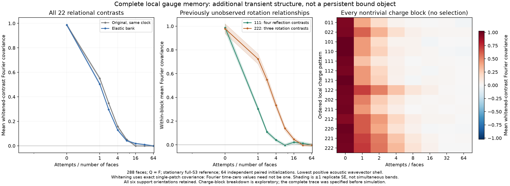

# Complete local gauge memory: 22 relational contrasts and a vacancy gate

The [spatial pair/fan detector](triangle-spatial-memory.md) keeps orientation and
wavelength, but its two indicator types do not span every local gauge observable.
This extension observes **every function of a three-loop disk's gauge state**,
after subtracting its conditional mean given the complete charge field. The
existing raw-link primitives, initial reference, and scheduler are unchanged.



## What was missing

Three based triangle-group holonomies have 49 simultaneous-conjugation orbits but
only 27 ordered charge patterns. Some different gauge states agree on both the
charge pattern and the old activity flags. For example, three nonidentity rotations
have four relative-orientation states; all have charges $222$, zero
distinct-reflection-pair flags, and zero reflection-fan activity.

The [short-word construction](triangle-patch-observer.md) already distinguishes
all 49 states. We now turn that lossless classification into a full-mesh statistical
observer, with an exact conditional reference rather than independent-label guesses.
The tuple comes from the actual rooted fan paths, in their existing product order.
Its orbit label is invariant under a common change of frame; no separated
basepoints are silently identified.

## Exact conditional distribution of every local orbit

Fix the complete charge field, with populations $\mathbf n=(n_0,n_1,n_2)$ in
the full-$S_3$, reflection-present sector. For a specified local based triple
$u=(a,b,c)$, let $p=abc$ and let $r_1,r_2$ count the remaining reflection and
rotation faces. Character convolution with the two torus handles gives

$$W(u\mid\mathbf n)=6\,3^{r_1}2^{r_2}
  [1+(-1)^{r_1}\operatorname{sgn}(p)]
  +3\,\mathbf1_{r_1=0}(-1)^{r_2}\chi_{\rm std}(p)
  -4\,\mathbf1_{n_2=0}\,N_{C_2}(u).$$

Here $N_{C_2}(u)$ counts reflection subgroups containing every entry of $u$.
It is three for the identity triple, one for a nonempty all-equal-reflection
triple with possible identities, and zero otherwise. This last subtraction
removes proper-subgroup handle completions. It is essential even for an all-flat
local patch when the rest of the mesh contains reflections.

If $j$ denotes a simultaneous-conjugation orbit with size $m_j$, its probability,
conditional on the full charge field and its actual local charge pattern, is

$$p_j(\mathbf n)=\frac{m_jW(u_j\mid\mathbf n)}
 {12\,3^{n_1}2^{n_2}-12\,\mathbf1_{n_2=0}}.$$

Only orbits matching the local charge pattern occur. Their probabilities sum to
one exactly. Exhaustive four- and five-face torus presentations independently
verify every populated local orbit probability and the resulting covariance.
These small presentations are counting tests, not substitute simulation meshes.

For each rooted patch define the 49-category residual vector

$$r_j=\mathbf1_{J=j}-\Pr(J=j\mid\text{entire charge field}).$$

Its conditional mean is zero. Each of the 27 charge-pattern buckets supplies one
sum-to-zero constraint. On the measured $Q=F$ references the exact covariance
$C=\mathbb E[rr^T]$ has rank **22**. The independent relational counts are:

| Local charge patterns | Number of ordered patterns | Contrasts per pattern |
|---|---:|---:|
| permutations of $011$ | 3 | 1 |
| permutations of $022$ | 3 | 1 |
| $111$ | 1 | 4 |
| permutations of $112$ | 3 | 2 |
| permutations of $122$ | 3 | 1 |
| $222$ | 1 | 3 |

All other charge patterns have a unique gauge orbit. Exact population and local
assignment counts yield $C$ as rational numbers. This covariance retains the
finite torus constraints and proper-subgroup exclusion.

## A basis-independent complete local memory measurement

Let $H$ contain one difference vector for each nonfinal category in each charge
bucket. Its 22 columns span the residual space. Factor the positive-definite
contrast covariance $H^TCH=LL^T$ and set

$$z=L^{-1}H^Tr,\qquad \mathbb E[zz^T]=I_{22}.$$

The metric is fixed by the exact stationary reference, not learned from the
trajectories. Its kernel

$$k(X,Y)=z(X)^Tz(Y)=r(X)^T C^+r(Y)$$

is independent of the contrast basis. No score or direction is optimized to make
a long-lived signal appear. Whitening is a diagnostic normalization, **not a
Hamiltonian, new interaction, noise source, or physical amplitude**. Tiny
counting presentations may leave contrasts unpopulated; their singular metric is
not repaired with an arbitrary regularizer.

Use the existing six rooted fan orientation channels and mesh translations to
compute

$$S(k,t)=\frac1{22\cdot6V}\sum_{c=1}^6\sum_{a=1}^{22}
  \mathbb E[\widehat z_{ca}(k,0)^*\widehat z_{ca}(k,t)].$$

Its inverse FFT gives displacement-resolved memory. The static *single-patch*
covariance is identity; overlapping patches can still give a Fourier time-zero
value different from one. No orientation, face, or momentum is counted as an
independent replicate. The positive-semidefinite even-time covariance argument
from the spatial experiment applies to all $6\cdot22$ channels.

Every fixed function of a single local gauge state can be expressed in the
categorical basis, and its charge-centered version lies in the retained space.
This includes nonlinear products of local holonomies. It does **not** cover every
function of multiple separated patches, their gluing data, time history, or
state-dependent moving supports. Completeness is local, not a whole-mesh closure.

## A kinetic explanation to test before calling slow memory binding

Exhausting all **2,700 primitive inputs** establishes:

> Every changing primitive containing an input rotation face also contains a
> vacancy. Each such input rotation face leaves the charge-two sector.

The vacancy pair rule has four enabled rotation-containing inputs, all of charge
pattern $02$ or $20$. The two elastic rules have none. Each of the twelve reaction
rules has twelve, all permutations of $012$. Spectator faces have no written
edges under the established raw-link lift. Therefore a region initially consisting
entirely of rotations cannot have its first changing face in a support wholly
inside that region: the first change must involve a support crossing its boundary.

This is a **vacancy-gated kinetic constraint derived from the actual rules**.
It is an alternative explanation for long rotation memory, not proof that it
quantitatively explains every measured correlation. Boundary activity can erode
such a region. Neither a locally inactive rotation triple nor its finite memory
is a bound particle or an independently protected excitation.

## Results: extra transient memory really was omitted by the smaller detector

The checked experiment uses 64 independent paired initializations on each of 72
and 288 faces: **128 pairs, 256 analyzed trajectories, 2,949,120 attempted
updates**. Both banks share initial raw connections and attempted operators
within each pair, using the padded original bank as control. The C++ event
targets, final raw hashes, and inverse echoes are independently checked.

For the elastic bank on 288 faces, the complete lowest-shell trace is
$0.0420\pm0.0059$ after eight attempts per face, $0.0189\pm0.0059$ at sixteen,
and $-0.0008\pm0.0052$ at sixty-four. Thus adding the omitted local states finds
measurable **transient** memory beyond the earlier reflection-only probes, not a
stable late-time mode. All errors are one standard error across independent
trajectories, not simultaneous confidence intervals.

The exploratory charge-block breakdown shows $222$ rotation contrasts retaining
$0.1395\pm0.0202$ at eight attempts per face, whereas the complete $111$
reflection block is $-0.0036\pm0.0125$. All fourteen nontrivial charge blocks
are shown in the figure; the highlighted comparison was inspected after the run,
not preregistered as a discovery test. At sixty-four attempts per face the rotation
block is $-0.0016\pm0.0135$. This does not establish a new scaling law, particle,
or binding mechanism. It provides a more complete detector and a specific
microscopic constraint for the next controlled experiment.

The [first-encounter experiment](triangle-encounter-memory.md) now separates
unvisited rotation domains from actual reconfiguration histories. It finds that
untouched regions dominate the long-wavelength rotation signal, with a smaller
transient local return excess. Transported-loop lineage, explicit connector paths,
and the distinction between returning and reaction-created rotations remain open.
Changing the dynamics to force a desired result would not answer that question.

## Reproduce

After building the C++ targets, with NumPy, SciPy, and python-flint installed:

```bash
python tests/triangle_complete_memory.py
python tools/triangle_complete_memory.py --output out/triangle-complete-memory.json
python tools/plot_triangle_complete_memory.py
```

The plot additionally needs Matplotlib. Tests check exact conditional counts,
rational covariance rank, whitening and basis invariance, real raw-patch
completeness, arbitrary local gauge frames, every mesh translation, direct
displacement correlations, the falsifiable primitive gate, all saved scalar
statistics, and a complete replay of the first paired trajectory at each size.
