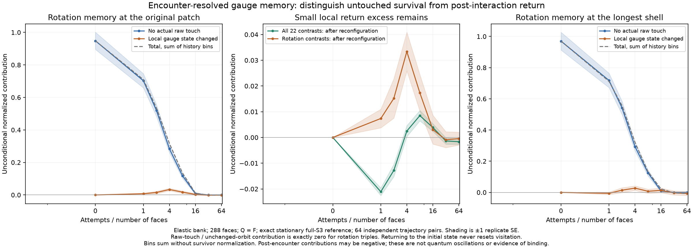

# First-encounter gauge memory and exact rotation return counts

The [complete local detector](triangle-complete-memory.md) found rotation
relationships that lasted longer than the earlier reflection probes. A necessary
next question is whether those relationships survive encounters or simply remain
untouched. This experiment records **actual changed raw links and complete local
gauge-state changes**, without changing the update bank, clock, or reference.



## Three histories, not just endpoint comparisons

For each rooted three-face patch, record the first attempt that changes any raw
edge in its actual read graph, the first attempt that changes its simultaneous
conjugacy orbit, and the number of orbit changes. At every fixed observation time
the patch belongs to exactly one bin:

1. **Untouched:** no actual raw-edge change in the patch's read graph.
2. **Raw-touched, orbit unchanged:** a raw interaction occurred, but the complete
   local physical gauge state has never changed.
3. **Orbit reconfigured:** that local gauge state changed at least once, including
   histories that subsequently return to their original state.

An attempted but disabled rule is not a touch. Neither is a static write-set entry
whose raw value remains unchanged. An incident-edge index identifies affected
patches; fresh rooted-loop products update their exact gauge states. Full raw and
full-orbit recomputation checks the incremental tracker at every attempt in a
short independent test. A primitive followed by its actual inverse is a positive
control: the final connection returns exactly, but the encounter history does not
reset. Time-independent arbitrary local gauge-frame changes preserve every bin.

Raw visitation refers to the engine's fixed frame convention. Independently
re-gauging every snapshot can change raw edges without a physical event; those
coordinate changes must not be counted as encounters. The orbit-change history
is invariant under such snapshot-wise frame choices. A time-dependent raw-frame
comparison would additionally require explicit temporal frame transport.

Let $z_a(p,t)$ denote the previous exact-reference-normalized relational features,
and $H_b(p,t)$ a history-bin indicator. For $d$ features and $N$ rooted supports,

$$C_b(r,t)=\frac1{dN}\sum_{p,a}
 \mathbb E[z_a(p,0)z_a(p+r,t)H_b(p+r,t)].$$

These are **unconditional contributions**, not correlations conditioned on
survival. They obey $\sum_b C_b(r,t)=C(r,t)$ for every displacement and time.
Dividing each term by its surviving population would destroy that decomposition
and could manufacture an apparent late-time plateau. The six support orientations
are kept separately before contraction. The code independently checks the sum
against the original complete Fourier spectrum at every recorded observation.

## Exact first-encounter identity

Fix a patch $p$ and write $R_p(X)$ for its raw edge tuple and $J_p(X)$ for its
complete gauge orbit in connection state $X$. With the actual transition matrix
$P$, define the two substochastic, or killed, kernels

$$K_R(X,Y)=P(X,Y)\mathbf1_{R_p(X)=R_p(Y)},$$
$$K_J(X,Y)=P(X,Y)\mathbf1_{J_p(X)=J_p(Y)}.$$

They retain paths that never cross the corresponding raw or physical boundary.
At zero displacement, for any one of the centered patch observables $f$,

$$C_0(n)=\langle f,K_R^n f\rangle,\quad
C_1(n)=\langle f,(K_J^n-K_R^n)f\rangle,\quad
C_2(n)=\langle f,(P^n-K_J^n)f\rangle.$$

The first physical encounter resolves the last difference exactly:

$$P^n=K_J^n+\sum_{j=0}^{n-1}K_J^j(P-K_J)P^{n-1-j}.$$

This follows by telescoping the products; it does **not** require $P$ and $K_J$
to commute or assume a Markovian evolution of the observed patch state alone.
An independent rational four-state example checks both this identity and a full
sum over histories, including change-and-return paths.

Since the crossing tests are symmetric in $X,Y$, both killed kernels are
self-adjoint in the same stationary reference as $P$. Their spectra lie in
$[-1,1]$, so their individual even-time autocorrelations have the usual
[reversible spectral representation](https://www.stat.berkeley.edu/~aldous/RWG/Book_Ralph/Ch3.S4.html).
But **differences** of these correlations need not be nonnegative. In particular,
the reconfigured contribution can be negative without violating reversibility.
Spatially displaced contributions use a different destination-patch cut for each
term; they must not be assigned the single-observable positivity theorem either.

This is an application of standard finite-state operator identities, not a new
general theorem about all Markov chains or a quantum interpretation of the cuts.

## Pure-rotation disks have an exact uniform relational reference

There is a further simplification specific to the derived triangle group. For a
contractible $k$-face disk whose based face holonomies are all nonidentity
rotations, each entry is $z$ or $z^{-1}$. Simultaneous conjugation identifies a
sign pattern with its global sign reversal, giving

$$M_k=2^{k-1}$$

relative-orientation states. The complement still contains all the reflection
faces of our reflection-present reference, so its standard-character term
vanishes. The remaining completion weight is independent of the disk's rotation
signs. All $M_k$ states are therefore **equally probable conditional on the entire
charge field**. This is exact, not an independent-label approximation.

Direct orbit enumeration and completion counts check $k=1,\ldots,8$. This
statement concerns a disk with an explicit common-root loop system, not arbitrarily
separated loops with unspecified connector transport. The binary signs are
classical relative group labels, not inserted spins or quantum amplitudes. Uniform
weights provide no equilibrium preference for a particular relative-orientation
motif in this conditional reference.

For three faces, $M_3=4$. Let $p_{222}$ be the exact stationary probability of that
ordered local charge pattern. Its four-category covariance block is

$$C_{222}=p_{222}\left(\frac14I-\frac1{16}\mathbf1\mathbf1^T\right).$$

For two rotation-triple states $i,j$, the complete three-contrast kernel becomes

$$z(i)^Tz(j)=\frac{4\delta_{ij}-1}{p_{222}},$$

and it vanishes if either endpoint is outside charge pattern $222$. Thus the
zero-displacement rotation-memory contribution of any history bin has the
independent **integer-count** expression

$$C_b^{\rm rot}(0,t)=
\frac{4N_{\rm same,b}(t)-N_{\rm both\,222,b}(t)}{3N p_{222}}.$$

Here the two counts include every original patch in the denominator, not only
surviving or returning patches. The implementation checks this formula against
the floating-point whitened detector on every recorded production sample.

### Untouched survival is not an orientation-return excess

The [primitive vacancy gate](triangle-complete-memory.md) has a stronger consequence
for rotation-only patches. Every edge in such a patch's read graph belongs to at
least one of its rotation faces. A changing primitive writing that edge must
include that face, and each input rotation of a changing primitive leaves its
charge-two sector. Thus the first raw touch of a $222$ patch changes its charge
pattern and hence its gauge orbit.

Consequently bin 1 contributes **exactly zero** to the rotation detector, at every
displacement and time. In operator form, $K_J^n f=K_R^n f$ for any feature supported
on $222$. For bin 0 at zero displacement, both endpoint counts equal the number
$N_{\rm unvisited\,222}$ of initially rotating patches still untouched, so

$$C_0^{\rm rot}(0,t)=\frac{N_{\rm unvisited\,222}(t)}{N p_{222}}.$$

The remaining contribution measures excess same-orbit returns after a genuine
reconfiguration, relative to the four-state reference. A value different from
zero is not proof of binding: transport out and back, inverse encounters, and
reaction histories can retain information. Nor does the unconditional uniform
reference assert that the history-selected return probability must be $1/4$.

## Measurements: untouched regions dominate, but a small local return signal remains

We use 64 new independent paired initializations on each of 72 and 288 faces:
128 pairs, 256 trajectories, and **2,949,120 attempted updates**. The initial
connections are drawn from the exact stationary full-$S_3$, reflection-present
$Q=F$ reference. The two banks share their initial state and attempted operators
within each pair. Every changing local target and final connection is independently
checked against C++, including the full inverse echo.

On 288 faces at eight attempts per face, the lowest-shell rotation contribution
from untouched destinations is $0.1246\pm0.0196$, while reconfigured destinations
contribute $0.0072\pm0.0131$. Most of that measured long-wavelength signal is
therefore associated with untouched patches, not a demonstrated encounter-resistant
structure. The error bars here and below are one standard error across the 64
independent trajectories, not simultaneous confidence intervals.

The zero-displacement result is more nuanced. After four attempts per face,
untouched rotation memory is $0.2836\pm0.0237$, and the reconfigured contribution
is $0.0334\pm0.0075$. At eight, they are $0.1184\pm0.0161$ and
$0.0173\pm0.0071$. This small positive local return excess should not be discarded
along with the much larger untouched contribution. It is transient: at 32 attempts
per face the local reconfigured rotation contribution is
$-0.0009\pm0.0031$, and at 64 it is $-0.0004\pm0.0025$.

By 64 attempts per face every observed patch in these runs has changed its local
gauge orbit. That is a finite-sample result, not a universal mixing-time bound.
No irreversible-history or survivor normalization is used to amplify the residual.
Total error bars are computed after summing the bins **within each replicate**;
they do not treat the bins as statistically independent.

The next concrete distinction is between an original rotation transported away
and back, and new rotation holonomy created by a reaction. Event-derived birth,
transport, and destruction histories can test that without inserting a particle
identity into the dynamics. Explicit connector transport will be needed before
comparing their relative loop alignments across different basepoints. Stable
bound objects, quantum dynamics, and emergent spacetime remain unestablished.

## Reproduce

After building the C++ targets, with NumPy, SciPy, and python-flint installed:

```bash
python tests/triangle_encounter_memory.py
python tools/triangle_encounter_memory.py --output out/triangle-encounter-memory.json
python tools/plot_triangle_encounter_memory.py
```

Matplotlib is additionally required for the plot. The saved dataset contains
initial/final orbit labels, first raw and physical change attempts, orbit-change
counts, integer endpoint-return counts, independent seeds, event counts, final
hashes, and spatial contribution means and standard errors. Tests replay the
first pair at each size and reconstruct all scalar and paired uncertainties.
