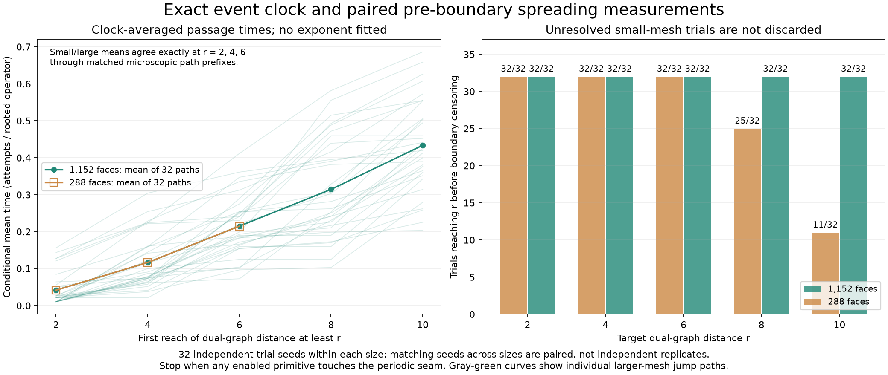

# An exact event clock and paired pre-boundary propagation tests

The nonabelian link dynamics can now skip no-op attempts **without changing its
discrete-time probability law**. A dependency-updated active set refreshes only
24 or 33 rooted pair/fan tuples per changing event in the checked runs. This
makes independent first-passage trials practical while retaining the original
rules, operator multiplicities, and stochastic residence times.

The first dataset has 32 independent trial seeds on each of two meshes, paired
across sizes. Each smaller-mesh spatial event stream is an exactly translated
prefix of its larger partner's stream, including the resulting raw connection.
The comparison stops when any enabled primitive reaches the periodic seam.
This is a stronger cutoff than waiting until a seam-crossing operator happens
to be selected. It exposes substantial censoring in the smaller box.



## 1. Preserve the clock, not just the sequence of changes

There are $M=78V$ rooted operator selections, including multiplicities. In raw
connection $U$, let $K(U)$ be the number that change it. The original uniform
attempt process has, for each particular changing operator $a$,

$$\Pr(T=t,A=a\mid U)=\left(1-\frac{K}{M}\right)^{t-1}\frac1M.$$

Consequently it is equivalent in law to drawing

$$T\sim\operatorname{Geom}(K/M),\qquad
A\sim\operatorname{Uniform}(\text{the }K\text{ changing operators}),$$

independently given the current state, then applying that original primitive.
At $K=0$ the connection remains fixed. No target energy, new update rule,
or physical interpretation of the attempt clock is introduced.

This uses established rejection-free Monte Carlo ideas: see the original
[Bortz–Kalos–Lebowitz paper](https://sites.math.rutgers.edu/~lebowitz/PUBLIST/1975jcp-bortz_kalos_113.pdf).
The specific implementation here keeps the discrete geometric residence law,
rather than replacing it by an exponential waiting-time approximation.

Uniform choice among enabled moves **alone** is not sufficient. If the original
stationary raw measure is uniform, the embedded jump chain generally samples
states in proportion to $K(U)$. Residence weighting corrects that bias. For
example, two swap involutions on a three-state path give degrees $(1,2,1)$:
the jump law has stationary weights $(1/4,1/2,1/4)$, while mean holding times
$(2,1,2)$ restore uniform occupation in the attempt clock. The regression suite
checks this exact small example.

## 2. Integer sampling of geometric waits

No floating logarithm or finite-precision uniform real enters the clock. For a
block of $B$ attempts, write $s=M-K$ and draw one uniform integer in
$[0,M^B)$. Allocate $s^B$ integers to the event that the entire block has no
change. The first change at attempt $t\in\{1,\ldots,B\}$ receives exactly

$$K s^{t-1}M^{B-t}$$

integers. These counts sum to $M^B$ with the survival count. Binary search on
the integer cumulative masses locates the first change. Entirely inactive
blocks are skipped and another block is drawn. The implementation uses
$B=\min(256,\max(1,\lfloor M/K\rfloor))$, shortening the last block at a finite
attempt horizon. This choice affects computation only, not the law.

The tests exhaust every integer outcome for $1\le M\le6$, every $1\le K\le M$,
and block lengths one through four. A separate multi-block enumeration checks
the right-censored law, including no event before the horizon. Thus frozen
states, all-active states, multiple skipped blocks, and finite horizons are
covered without a statistical tolerance or floating-point distribution fit.

## 3. Local dependency updates on actual raw links

All twelve triple rules share the same based tuple at a rooted fan. The cache
stores that tuple once, along with the pair tuples and the rules enabled at each
tuple. A dense list plus reverse index supports exact uniform active-operator
selection and constant-time insertion/removal. Operators leading to identical
successors are **not** merged; the original selection multiplicities matter.

After a primitive writes links, only tuples whose read sets intersect actually
changed links can change their enabled rules. A precompiled links-to-readers map
identifies those tuples. Local charges are updated on incident faces and their
conserved sum is checked. Initialization is global; subsequent updates depend
on the fixed-size primitive neighborhood, not the total mesh volume.

The 64 trials refresh 24 or 33 tuples per changing event. This is a measured
operation count for these supports, not a GPU throughput or wall-time speedup
claim. The Python implementation is a correctness-first reference for a future
compiled/GPU event queue.

Validation includes full cache reconstruction every 256 changing events and at
the end of every trial. Tests check the complete cache after every event in
random and seeded controls, compare every intermediate link array to C++ raw
snapshots, and reverse every event back to the exact initial raw connection.
Nonconstant local gauge frames preserve the selected operator order and produce
exactly transformed raw trajectories. Four full trial histories also receive
independent C++ replay of their complete changing-operator sequences.

No-op attempts are omitted from that raw replay because they do not alter links;
their residence-time distribution is verified separately by the integer clock
proof and exhaustive tests. The event-driven sampler reproduces the **law** of
the old uniform-attempt runner, not its trajectory under an identical RNG seed:
the two algorithms consume random numbers differently.

## 4. A stronger boundary cutoff and an exact finite-size pairing

The initial condition is the same specified horizontal single-link perturbation
of the frozen $S_3$ connection used in the [spreading audit](triangle-spreading.md).
All initial face charges remain one. There are 32 independent jump/clock seed
pairs within each size, $L=12$ and $L=24$. Matching trial IDs across sizes share
their respective RNG seeds and are paired comparisons, **not independent extra
replicates**. Jump choices and waiting times use separate RNG streams.

A run stops as soon as any currently enabled primitive has a read support
touching the periodic seam. The event that creates such an enabled support is
retained if its own read support is seam-free. No enabled seam-touching operator
is executed. This is more conservative than the earlier selected-event seam
warning and avoids taking further steps under a boundary-affected active set.

For all 32 pairs, normalized spatial event descriptors—rule, relative read paths,
based input/output, and active count—match exactly through the smaller run's
entire prefix. At that point the larger run's differing raw links, translated
relative to the seed, also match exactly. Digests record these comparisons;
the code constructs them from actual events and raw links, not from a fit to
macroscopic curves. All pairs pass. The discrete sampled waiting times need
not agree after division by mesh size.

This finite collection of exact couplings validates the local comparison. It
is not a proof of infinite-volume dynamics, emergent locality, or convergence
for all initial states. The geometry and primitive support locality are supplied.

## 5. Clock-averaged first-passage times

For target distance $r$, let $N_r$ be the first changing-event index at which
any face at dual distance at least $r$ departs from charge one. This measures
the earliest advancing part of the response, **not** the radius of a uniformly
filled region. If the successive active counts before those events are $K_j$,
the untruncated clock's conditional mean is

$$\mathbb E[T_r/M\mid\text{jump path}]=\sum_{j=1}^{N_r}\frac1{K_j}.$$

The program records this sum as an exact rational, separately from the actually
sampled integer first-passage time. The sum is not a replacement simulation clock
and not a conditional mean given that a finite time budget was passed. The
checked runs all stop at the active boundary cutoff, not at the attempt horizon
or event budget.

On the larger mesh, all 32 trials reach distances 2, 4, 6, 8, and 10 before the
cutoff. Mean conditional times, in attempted updates per rooted operator, are
approximately $0.0418573$, $0.116657$, $0.214988$, $0.314379$, and $0.433679$.
The smaller mesh has exactly the same conditional means at distances 2, 4, and
6, because every paired microscopic prefix reaching those distances agrees.

At distances 8 and 10 on the smaller mesh, respectively 7 and 21 trials are
censored. The code deliberately supplies **no mean** there. Averaging only the
completed trials would select faster-reaching histories; ordinary survival
estimators would also require assumptions about censoring that are not justified
by this state-dependent boundary stop. The plot displays observed/censored
counts rather than filling in an unsupported estimate.

The dataset contains 26,282 changing events across the 64 runs. It gives a
reproducible pre-boundary first-passage measurement, but the distance range is
short and the observable follows the earliest response. No ballistic/diffusive
exponent, universal propagation speed, or relativistic light cone is claimed.

## Reproduction and scope of tests

```bash
cmake -S . -B build -DCMAKE_BUILD_TYPE=Release
cmake --build build -j4
uv run --with numpy --with scipy --with python-flint python tools/triangle_event_clock.py --output out/triangle-first-passage.json
diff -u data/triangle-first-passage.json out/triangle-first-passage.json
uv run --with numpy --with scipy --with python-flint python tests/triangle_event_clock.py
uv run --with matplotlib --with numpy python tools/plot_triangle_first_passage.py
```

For a short trial, add `--trials 2`. CI repeats the first trial at both sizes
with C++ replay, exhausts the integer clock laws, stress-tests the active cache,
and verifies the stored cross-size comparisons and exact summary arithmetic.
The full command above reruns all 64 trajectories; the complete dataset also
reproduces byte-for-byte under Python 3.12.

The next physics question is whether larger, independently sampled pre-boundary
regions support a stable macroscopic propagation law or persistent relational
structures. These results establish neither quantum amplitudes nor molecule-like
binding. They provide an exact, less wasteful experimental engine and remove
two concrete sources of misleading results: wrong residence weighting and
averaging only uncensored first-passage trials.
