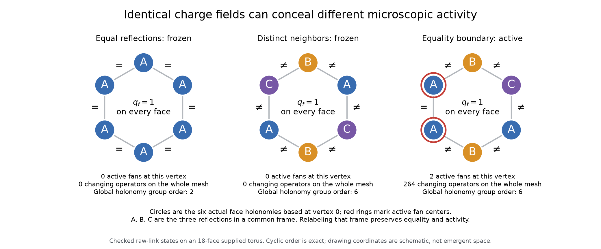

# Exact connection reference measures and kinetic constraints

The triangle-fiber bank now has an exact counting reference, an integer-weighted
sampler of actual raw connections, and an exact detector of frozen states. These
serve different purposes: a stationary measure is not a claim that every trajectory
samples it, and a frozen-state detector is not a classification of all connected
components. In fact, the full nonabelian reflection sector contains both frozen and
active states with the same uniform charge field.

All results here concern the existing twelve reaction involutions plus vacancy
transport, on the supplied periodic triangular mesh. No Hamiltonian, physical
temperature, wave equation, or new physical update has been introduced.



## 1. Counting from the fiber-derived group

Triangle adjacency gives $G=\operatorname{Aut}(C_3)=S_3$, with the already derived
scalar charge $q(e)=0$, $q(\text{reflection})=1$, $q(\text{three-cycle})=2$.
For side $L$, the torus has $V=L^2$ vertices, $F=2V$ faces, and $E=3V$ edges.
Let $Q$ denote total face charge.

The three irreducible characters are obtained directly from the actual permutation
action: the constant character, permutation sign, and number of fixed vertices minus
one. Their dimensions are $(1,1,2)$. The code checks orthogonality and
$\sum d_\chi^2=6$. Their central charge polynomials are

$$p_\chi(z)=\frac{1}{d_\chi}\sum_{g\in G}\chi(g)z^{q(g)},$$
$$p_0=1+3z+2z^2,\qquad p_1=1-3z+2z^2,\qquad p_2=1-z^2.$$

Here $z$ is a **formal counting variable**, not a Boltzmann weight assigned physical
meaning. An explicit rooted tree gauge leaves two handles and $F$ face elements,
subject to one surface-product relation. The canonical connection count is

$$Z_{\rm canonical}(z)=6\left[p_0(z)^F+p_1(z)^F+p_2(z)^F\right].$$

Restoring the $V-1$ independent non-root vertex frames gives

$$\boxed{Z_{\rm raw}(z)=6^V\left[(1+3z+2z^2)^F+(1-3z+2z^2)^F+(1-z^2)^F\right].}$$

The coefficient of $z^Q$ counts raw connections at charge $Q$. Checks include
$Z_{\rm raw}(1)=6^E$, flat count $3\cdot6^V$, and zero coefficients at odd $Q$.
The parity restriction follows also by applying permutation sign to the torus
surface relation: a commutator has positive sign.

The derivation uses the classical finite-group surface-counting framework, not a
new character-theory identity. See [Snyder's account of Mednykh's formula](https://arxiv.org/abs/math/0703073)
for background. Here the weighted specialization is independently checked: direct
enumeration of all 36 handle pairs gives commutator multiplicities
$(18,0,0,9,9,0)$, agreeing with $6\sum_\chi\chi(g)/d_\chi$.
Central convolution then gives the displayed charge polynomial. An independent
integer group-product recurrence agrees with its fixed-charge coefficients.

For **one ordered face-charge field**, with populations $(n_0,n_1,n_2)$,

$$W=6\left[(1+(-1)^{n_1})3^{n_1}2^{n_2}
+\mathbf1_{n_1=0}(-1)^{n_2}\right].$$

Multiplication by $F!/(n_0!n_1!n_2!)$ gives the population weight. These are raw
multiplicities after a rooted tree gauge, not an assumed uniform weighting of
gauge-equivalence classes. Global conjugation is still present.

## 2. Condition on preserved information before comparing statistics

Every primitive preserves both the subgroup generated by its based input tuple
and the presence of a reflection in that tuple. The check exhausts all 36 pair
inputs and all $12\cdot216$ reaction inputs. Boundary-fixed reconstruction uses
words in those elements and the boundary links. In a tree gauge with all links
in subgroup $H$, the output links therefore remain in $H$; applying the inverse
gives equality of the old and new global loop subgroups, up to conjugation.
Unchanged spectator faces establish preservation of global reflection presence.

Consequently, fixed $Q$, full based-loop image $S_3$, and at least one reflection
face define an invariant subset. To count it, subtract the three proper
single-reflection subgroups. For even $n_1>0$,

$$W_{S_3,\mathrm{ref}}=W-12\mathbf1_{n_2=0};$$

otherwise this filtered weight is zero. Each $C_2$ subgroup contributes four
handle choices when no rotation face occurs. Direct enumeration of all four-face
tuples and all handle pairs independently checks every ordered charge-field count.

For example, at $F=18,Q=4$, the full reference probabilities for $N_2=0,1,2$ are
$72/85,64/425,1/425$. In the nonabelian reflection subset they are instead
$50/59,9/59,0$. At $F=72,Q=4$, the filtered mean rotation count is exactly $9/239$.

In the full-$S_3$-image subset the connection stabilizer is the centralizer of
$S_3$ in itself, which is trivial. All full gauge orbits there have size $6^V$;
uniform raw and uniform orbit weighting therefore agree in that subset. This
does not justify that identification in sectors with different stabilizers.

## 3. Exact initialization of actual links, without burn-in

The sampler uses integer completion counts

$$D_{k,q}(g)=\#\{(h_1,\ldots,h_k):\ \sum_iq(h_i)=q,\ h_1\cdots h_k=g\}.$$

Handles $(A,B)$ receive weight $D_{F,Q}(B^{-1}A^{-1}BA)$. Given residual product
$g$ and charge $q$, the next element $h$ receives weight
$D_{k-1,q-q(h)}(h^{-1}g)$. Each conditional draw uses exact integer intervals;
the weights sum to the previous completion count. Multiplying the conditional
probabilities telescopes to a uniform distribution on canonical connections.

These elements are not used as an independently evolving face field. They are
reconstructed into the actual horizontal, vertical, and diagonal raw links.
The filtered sampler rejects completed draws outside the required invariant
subset. It fails without returning a sample if its explicit 10,000-draw limit
is exhausted. Rejection conditions initialization, never the physical update law.

### The axial reconstruction and periodic basepoint convention

Write the positive-direction links as $H(x,y),V(x,y),D(x,y)$, with coordinates
modulo $L$. Set $H(x,y)=e$ for $x<L-1$ and $V(0,y)=e$ for $y<L-1$.
These are exactly a rooted spanning tree. Write $A_y=H(L-1,y)$,
$A=A_0$, and $B=V(0,L-1)$.

Base both cell triangles at $(x,y)$, giving

$$h_0=D^{-1}V_{\rm right}H,\qquad
h_1=V_{\rm left}^{-1}H_{\rm top}^{-1}D,\qquad K(x,y)=h_1h_0.$$

With $P_y=K(0,y)\cdots K(L-1,y)$, reconstruction uses

$$V(x+1,y)=V(x,y)K(x,y)\quad(x<L-1),$$
$$A_{y+1}=A_yP_y^{-1}\quad(y<L-1),$$
$$A_0=BA_{L-1}P_{L-1}^{-1}B^{-1},\qquad D=V_{\rm right}Hh_0^{-1}.$$

Thus the required product is

$$P_{L-1}\cdots P_0=B^{-1}A^{-1}BA.$$

The face order is descending row, ascending column, triangle one before triangle
zero. It is **not** sorted face ID order. The engine itself cyclically rotates
face loops to their smallest vertex ID; across periodic seams this can conjugate
the holonomy relative to the cell basepoint. The sampler checks actual based
products and independently checks agreement of gauge-invariant native charges.
A regression case explicitly requires that those two holonomy arrays differ.

Finally choose $V-1$ independent uniform vertex frames, fix the root frame to
identity, and apply $U_{uv}\mapsto s_vU_{uv}s_u^{-1}$. Arbitrary raw connections
round-trip through the inverse axial map, including periodic seams, on sides
3, 4, 6, and 12. This verifies the additional factor $6^{V-1}$ by a constructive
bijection, not a gauge-orbit-size assumption.

## 4. Stationarity is not equilibration

Each primitive is a bijection preserving $Q$ and the stated subset. It preserves
the uniform raw measure. Any state-independent mixture or fixed composition of
these primitives also preserves that measure. No irreducibility assumption is
needed for this statement. State-dependent scheduling would need its own audit.

The reference weight of an ordered charge field depends only on its populations.
It is therefore spatially exchangeable, giving for distinct faces

$$\operatorname{Cov}(q_f,q_g)=-\frac{\operatorname{Var}(q_f)}{F-1},$$
$$\operatorname{Var}\left(\sum_{f\in S}q_f\right)
=\frac{m(F-m)}{F-1}\operatorname{Var}(q_f),\qquad |S|=m.$$

This is a reference law with no distance preference in its charge correlations,
not a no-binding theorem for each dynamically connected component. As a scale
check, the full reference mean $N_2$ at $Q=F$ is about 17.3405 for $F=72$ and
69.7516 for $F=288$. Agreement of one evolved endpoint with a mean does not prove
mixing. The dataset includes eight independently initialized connections per
reference case and replayed 2,000-attempt checks at the two dense mesh sizes;
these are implementation checks, not convergence evidence.

## 5. Exact activity and frozen-state criteria

Let $N_{\rm vac}$ count rooted vacancy operators whose two faces contain exactly
one vacancy, $N_{111}$ count rooted all-reflection fans with
$(a=b)\mathbin{\mathrm{xor}}(b=c)$, and $N_{012}$ count rooted fans with charge
tuple a permutation of $(0,1,2)$. The number of **changing operator selections** is

$$\boxed{K=N_{\rm vac}+12N_{111}+4N_{012}.}$$

This counts operator multiplicity, not distinct successor states. It is checked
against raw group-element tables, so a putative charge-preserving but hidden
link-only motion is not omitted. For the uniform full-bank schedule the exact
next-attempt change probability is $K/(78V)$, including all no-ops.

The dual mesh is connected. If both zero and positive face charges occur,
there is a vacancy/occupied boundary edge, hence $K>0$. If no vacancies occur,
the only possible changing rules are active all-reflection fans. Therefore

$$\text{frozen}\iff
\big(q_f=0\text{ for every }f\big)
\ \text{or}\ 
\big(q_f>0\text{ for every }f\text{ and }N_{111}=0\big).$$

In particular, **no connection with $0<Q<F$ is frozen**. This does not prove
irreducibility, a useful lower bound on mixing speed, or absence of periodic
motion. It only excludes a completely fixed state in those sectors.

At $Q=F$, a frozen connection must have $q_f=1$ everywhere. At a vertex, order
the six incident reflection holonomies cyclically, all based at that vertex:
$r_0,\ldots,r_5$. Define $e_i=\mathbf1_{r_i=r_{i+1}}$ with indices modulo six.
The number of active rooted fans at that vertex is

$$w=\sum_{i=0}^5|e_i-e_{i+1}|.$$

Thus a star is inactive exactly when all six holonomies are equal, or every
neighboring pair differs. Its activity is even. Among all $3^6=729$ local
reflection assignments, precisely $3+(2^6+2)=69$ are inactive: three constant
assignments and 66 proper three-colorings of a six-cycle. The check exhausts
all assignments against all twelve rules on all six fan supports.
These stars share links and faces; **their global compatibility is not independent**,
and $69^V$ is not a global frozen-state count.

The detector compiles the actual cyclic stars once and evaluates their based
loops in $O(E)$ time. Random local frame changes preserve its output. Independent
raw-table scans on sides 3, 4, 6, and 12 and full C++ operator/inverse scans on
16 initial states check its exact activity counts, including intermediate raw links.

## 6. Full nonabelian holonomy still permits frozen states

Assign the three distinct reflections to the positive horizontal, vertical, and
diagonal links. Every face has charge one. Each rooted fan has three distinct
reflections, so every gate is inactive. The complete based-loop subgroup is
nevertheless $S_3$. All operators are checked to fix these connections on
18-, 72-, and 288-face tori, including a nonconstant gauge-frame control.

Among all 216 constant-direction assignments on the 18-face torus, 108 have
uniform charge one, 18 are frozen, and six frozen assignments have full $S_3$
image. This is a complete census of **constant-direction assignments only**.
Disordered reflection links give active connections in the same full-$S_3$,
reflection-present, $Q=F$ subset. The subset is therefore not one reachable component.

Since all moves are invertible, an active component cannot enter a globally fixed
state: if a move mapped $x$ to fixed $y$, its inverse would also fix $y$, implying
$x=y$. Frozen states are isolated components, not attractors accessible from
active states under this bank. Long quiet intervals must be distinguished from
true freezing using the exact detector.

## Reproduction and next question

```bash
cmake -S . -B build -DCMAKE_BUILD_TYPE=Release
cmake --build build -j4
uv run --with numpy --with scipy --with python-flint python tools/triangle_reference.py --output out/triangle-reference.json
diff -u data/triangle-reference.json out/triangle-reference.json
uv run --with numpy --with scipy --with python-flint python tests/triangle_reference.py
uv run --with numpy --with scipy --with matplotlib python tools/plot_triangle_reference.py
```

The next unresolved question is the structure of the **active** components:
which additional loop constraints survive, how quickly charge and gauge memory
relax within a component, and whether any localized structure persists under
autonomous evolution. Uniform reference sampling and absence of a frozen state
are not substitutes for those measurements or proofs.
