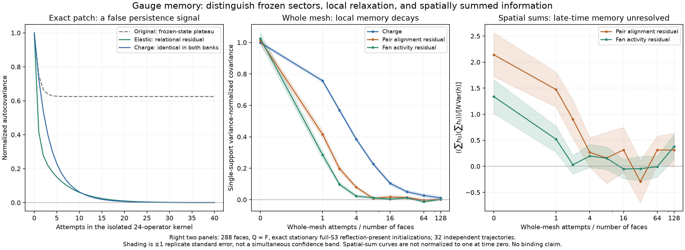

# Gauge-memory diagnostics: frozen plateaus, exact baselines, and measured relaxation

The [elastic candidate bank](triangle-elastic-scattering.md) can keep evolving, but
non-arrest is not evidence of a persistent object. We now distinguish three things:
memory caused by frozen components, decay of local gauge relations, and information
that survives after summing over spatial positions. The calculation introduces
**no new update rules**.



## 1. An exact false positive for persistence

Use the ten-state active component of the boundary-contained three-face elastic
kernel. Each state has a free common-frame orbit, so its uniform gauge-state
measure agrees with the conditional uniform raw-connection measure. Compare the
24-operator elastic bank with the original 16 operators padded by eight identity
slots. These are identical attempt clocks, not rescaled event clocks.

Let $A$ indicate an enabled three-reflection reaction and let $I_{111}$ indicate
three charge-one faces. On this component two of its four $111$ states are active.
The relational residual

$$h=2A-I_{111}$$

has zero conditional mean given the full three-face charge tuple. It separates
relative-alignment information from the charge pattern. Both $h$ and a single
face's centered charge have variance $2/5$ in this component.

Exact rational spectral projectors give normalized autocovariances

$$C_h^{\rm original}(n)=\frac58+\frac38\left(\frac13\right)^n,$$

$$C_h^{\rm elastic}(n)=\frac58\left(\frac16\right)^n+
\frac38\left(\frac56\right)^n.$$

The original bank's **permanent $5/8$ plateau** is entirely explained by its
disconnected components: two frozen singletons and an eight-state active component.
Projecting $h$ onto those component means gives covariance $1/4$, or $5/8$ of its
variance. This is not a bound particle or a dynamically protected internal mode.
The added collisions join the components and remove that plateau.

Meanwhile the first face's charge autocorrelation is identical in both banks:

$$C_q(n)=\frac5{24}\left(\frac7{12}\right)^n+
\frac58\left(\frac34\right)^n+
\frac16\left(\frac56\right)^n.$$

For the elastic bank, the discrete integrated autocorrelation times, with convention
$\tau_{\rm int}=1+2\sum_{n\ge1}C(n)$, are **5 attempts for $h$ and 7 for this charge
observable**. The slowest decay pole is shared: this is not a parametrically slow
new internal degree of freedom. All spectral weights and poles are exact, not fitted.

### What a sufficient local observer must retain

The ten states give seven distinct charge tuples. Those seven blocks are not a
Markov quotient: $111$ can be active or inactive. Exact partition refinement adds
one activity bit and yields eight blocks. Their outgoing probabilities agree within
each block, so this is the coarsest strongly lumpable partition refining charge.
This uses the established [Markov-chain lumpability criterion](https://arxiv.org/abs/2204.13896).

It is valid for this **uniform, boundary-contained kernel**. Individually selected
rules or interactions through the boundary need not preserve it. In particular,
the earlier whole-mesh counterexample to charge-plus-activity closure still applies;
the eight-state quotient is not a replacement for the full simulation.

## 2. Exact whole-mesh centering, without assuming independent fiber labels

The full-mesh measurements start from the exact stationary reference of uniform
raw connections with $Q=F$, full $S_3$ based-loop image, and at least one reflection
face. The original and elastic banks both preserve this measure. This does **not**
assert that it is a single reachable component, a physical temperature ensemble,
or the late-time distribution from an arbitrary preparation.

For each rooted pair define $B=1$ for distinct reflections and $I_{11}=1$ for two
reflections. For each rooted fan use $A$ and $I_{111}$ as above. We observe

$$b=B-\beta I_{11},\qquad a=A-\alpha I_{111},$$

where $\beta=\Pr(B=1\mid I_{11}=1)$ and
$\alpha=\Pr(A=1\mid I_{111}=1)$ are derived from the **finite torus reference**.
These residuals are orthogonal to every function of their respective local charge
tuples at equal time. They are not claimed orthogonal to the entire mesh's charge
configuration, nor to future charge fields.

Here is the exact counting construction. Let $d_{R,s}(v)$ count ordered remaining
face tuples with product $v$ and charge $s$. It is obtained by convolution of the
derived group multiplication table and charge. Let $c(w)$ count ordered handle
pairs with commutator $w$. Fixing $k$ local reflection faces of product $p$ leaves

$$W_k(p)=\sum_v d_{F-k,Q-k}(v)c(pv).$$

A local tuple with two distinct reflections already generates $S_3$. If all its
reflections are equal to $r$, subtract the completions entirely in $\{e,r\}$:

$$s_k=4\binom{F-k}{Q-k}$$

for even $Q$ and valid binomial indices, and zero otherwise. The factor four counts
the two commuting handle choices independently. Since the local tuple contains a
reflection, there are no other proper-subgroup exclusions to make. For a reflection
$r$ and nonidentity rotation $z$,

$$\beta=\frac{6W_2(z)}{3W_2(e)+6W_2(z)-3s_2},\qquad
\alpha=\frac{12W_3(r)}{27W_3(r)-3s_3}.$$

The denominators divided by the reference count give the conditioning probabilities.
Thus the variances used in the plots are exactly

$$\operatorname{Var}(b)=\Pr(I_{11}=1)\beta(1-\beta),\qquad
\operatorname{Var}(a)=\Pr(I_{111}=1)\alpha(1-\alpha).$$

Independent charge-population counts verify both conditioning probabilities.
Exhaustive four- and five-face torus presentations verify the relative-label
probabilities too. For example, at $F=Q=4$, $\beta=81/116$ and $\alpha=9/20$—not
the independent-reflection guesses $2/3$ and $4/9$. These small presentations are
algebraic counting controls, not the side-three simulation mesh.

## 3. Paired stationary trajectories on three mesh sizes

We run 32 independent initializations on each of 18, 72, and 288 faces. Each
initialization supplies a matched pair: the elastic bank and the original bank
padded with two identity pair slots. The pair shares its initial raw connection
and uniform operator schedule, but different pairs have independent initialization
and schedule seeds. There are **96 independent pairs, 192 analyzed trajectories,
and 3,096,576 attempted updates**.

Observations occur at fixed attempted times, through 128 attempts per face. They
are not sampled after a fixed number of changing events. Every event's local
input/target, the final raw links, and the C++ inverse echo are checked. Short
all-snapshot tests additionally compare each observed configuration with the
independent C++ raw snapshot stream.

For a field $f$ of $N$ rooted observables we estimate

$$C_f(t)=\frac{1}{N\operatorname{Var}(f)}
\mathbb E\!\left[\sum_i f_i(0)f_i(t)\right].$$

All means and variances are ensemble values, not estimated by subtracting each
trajectory's own time mean. Integer indicator cross-counts are stored, and exact
rational centering is performed before conversion to plotting floats. The finite
sample estimate of $C(0)$ is not forced to one.

Sites are averaged **within** each independent replicate. Uncertainty is the
standard deviation of replicate estimates divided by $\sqrt{32}$, not by the number
of sites, rooted supports, or time samples. Differences between banks use the
paired replicate differences. Error bars are pointwise standard errors, not
simultaneous confidence bands or a multiple-comparison-controlled discovery test.

On the 288-face mesh, at eight attempts per face, the elastic estimates are:

- Charge: $0.2269\pm0.0094$.
- Pair-alignment residual: $0.0088\pm0.0084$.
- Fan-activity residual: $0.0122\pm0.0065$.

At one attempt per face, the elastic-minus-baseline differences are
$-0.0818\pm0.0117$ for pair alignment and $-0.1160\pm0.0156$ for fan activity,
while charge differs by $0.0002\pm0.0016$. These measured differences show faster
early **local relational** relaxation, not a fitted hydrodynamic law.

## 4. A moving structure can leave its original position

Local decorrelation is not proof of information destruction. We also record

$$I_f(t)=\frac{\mathbb E[(\sum_i f_i(0))(\sum_j f_j(t))]}{N\operatorname{Var}(f)}.$$

This sum over all support pairs is unchanged by spatial permutations of either
configuration. It can retain a signal from a translated pattern with nonzero total
residual. It is **not normalized to one at time zero**. Here $N$ counts rooted
supports as specified by the operator bank; duplicate physical pair supports do
not become independent statistical samples. Charge's integrated statistic is
identically zero because total charge is fixed.

The spatial sums are much noisier. At 128 attempts per face on the largest mesh,
the elastic pair and fan estimates are respectively $0.313\pm0.321$ and
$0.379\pm0.237$ in this normalization. These measurements do not resolve a
late-time aggregate plateau. They do not justify either a persistence claim or
a claim that all relational memory has vanished.

Nor is this sum a general object detector: a moving pattern with zero total
residual can be invisible to it. Resolving that requires spatially resolved
cross-correlations, transported loop/world-tube observables, and controls for
long-wavelength charge modes and invariant components. None of the current
correlation plots establishes a molecule, binding, or emergent quantum evolution.

## Reproduce

```bash
uv run --with numpy --with scipy --with python-flint python tools/triangle_relational_memory.py
uv run --with numpy --with scipy --with python-flint python tests/triangle_relational_memory.py
uv run --with matplotlib python tools/plot_triangle_relational_memory.py
```

The checked-in dataset contains every seed, integer moment count, raw final-state
digest, exact patch spectral measure, and finite-reference marginal. Tests reproduce
selected paired trajectories on every mesh size and independently recalculate
the uncertainty estimates. Floating reporting precision is not a physics tolerance;
the underlying group operations, moment counts, and finite-patch identities are exact.
