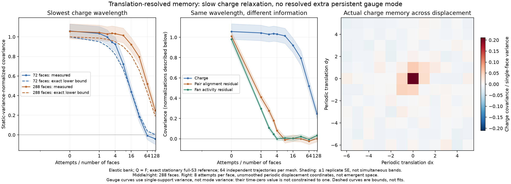

# Translation-resolved gauge memory and exact charge controls

The previous [memory experiment](triangle-relational-memory.md) could miss a
moving pattern whose spatial sum vanishes. This experiment keeps displacement,
wavelength, and support orientation. It also removes the equal-time conditional
mean given the **entire charge field**, not just the observed local charges.
Neither primitive bank nor its attempt clock is changed.



## Exact conditioning on the complete charge field

Work in the stationary uniform raw-connection reference on the supplied triangular
torus, with full based holonomy image $S_3$ and at least one reflection face. Let
$n_1$ and $n_2$ count reflection and nonidentity rotation faces. Here $n_1$ is even
and at least two. For each fixed placement of these charges the reference weight is

$$Z(\mathbf q)=12\,3^{n_1}2^{n_2}-12\,\mathbf1_{n_2=0}.$$

Fix a rooted pair of reflection faces. Write $B$ for the indicator that their
based reflections differ, and $I_{11}$ for the reflection-pair indicator. The exact
conditional probability, when that local charge event is present, is

$$\beta(\mathbf q)=
\frac{6[12\,3^{n_1-2}2^{n_2}-3\,\mathbf1_{n_1=2}(-1)^{n_2}]}{Z(\mathbf q)}.$$

For a rooted three-reflection fan, $A$ indicates an enabled reaction and $I_{111}$
the corresponding charge event. For $n_1\ge4$,

$$\alpha(\mathbf q)=\frac{144\,3^{n_1-3}2^{n_2}}{Z(\mathbf q)}.$$

For $n_1=2$, the fan event is impossible and we set its coefficient to zero.
The residuals

$$b=B-\beta(\mathbf q)I_{11},\qquad
a=A-\alpha(\mathbf q)I_{111}$$

satisfy $\mathbb E[b\mid\mathbf q]=\mathbb E[a\mid\mathbf q]=0$. They are
therefore orthogonal to **every function of the complete charge field at equal
time**, including all charge Fourier modes. This is not independence, and does not
exclude coupling to future charge fields.

These formulas come from exact group counts, not regression. After fixing $k$
reflections of ordered product $p$, convolution of the remaining conjugacy classes
with the torus handle-commutator count gives

$$W_k(p)=6\left[3^{n_1-k}2^{n_2}
  (1+(-1)^{n_1-k}\operatorname{sgn}(p))
  +\tfrac12\mathbf1_{n_1=k}(-1)^{n_2}\chi_{\rm std}(p)\right].$$

Here $\chi_{\rm std}$ is $2,0,-1$ on identity, reflection, and nonidentity
rotation. There are six distinct ordered reflection pairs and twelve active
reflection triples. Proper two-element subgroup completions must also be excluded:
four handle assignments per all-equal reflection tuple when $n_2=0$. For example,
$n_1=2,n_2=0$ gives $\beta=9/16$, and $n_1=4,n_2=0$ gives
$\beta=27/40,\alpha=9/20$. Exhaustive five-face presentations and independent
class-product convolution check these counts.

Single-support residual variances are computed exactly by summing
$\Pr(I\mid n_1,n_2)c(1-c)$ over the exact population distribution. They cannot
exceed the previous locally conditioned variances, by conditional projection.

## Spatial channels follow actual oriented supports

Translation acts on the actual face and rooted-loop specifications, preserving
path order and edge orientation. Its free orbits yield two face phases, six pair
orientations, and six fan orientations per $V=s^2$ translation cells. We retain
all channels before forming the trace correlation; averaging orientations first
could erase a pattern.

For a field $h_c(x)$ with $m$ channels and single-support variance $v_h$,

$$S_h(k,t)=\frac{1}{mVv_h}\sum_c
 \mathbb E[\widehat h_c(k,0)^*\widehat h_c(k,t)],$$

$$C_h(r,t)=\frac{1}{mVv_h}\sum_{c,x}
 \mathbb E[h_c(x,0)h_c(x+r,t)]
 =\operatorname{IFFT}[S_h](r,t).$$

The FFT convention has an unnormalized forward transform and inverse factor
$1/V$. No additional factor $V$ belongs in the displacement map. Tests compare
every displacement against a direct rolling dot product and recover a translated
zero-sum test pattern. That synthetic pattern is a detector control, not a claimed
simulation outcome. Fourier phases label supplied mesh translations: they are
neither physical quantum amplitudes nor emergent spatial coordinates.

The charge dual Laplacian has a two-by-two Fourier symbol. Its eigenvalues are
$\lambda_\pm(k)=3\pm|s(k)|$, with $s(k)$ the sum of the three actual neighbor
phases. The acoustic $k=0$ mode is conserved total charge. The optical $k=0$ mode
has eigenvalue six and is **not** conserved. The first two positive acoustic
eigenvalue shells are measured separately, averaging equivalent momenta within
each independent trajectory. The blocks are checked against the full dual graph.

Charge mode covariance is divided by its exact static variance $V\chi$, with
$\chi=\operatorname{Var}(q_f)F/(F-1)$. Its ensemble time-zero value is one.
Gauge trace spectra use single-support variance instead; their mode-dependent
time-zero values are not constrained to one. Finite-sample initial values are
never forced to one in either case.

## Exact restrictions on what these spectra can mean

Both banks choose uniformly among inverse-paired bijections, with identities
padding the original bank to the same clock. Their Markov operators $P$ are
self-adjoint in the stated stationary reference, whether or not that reference
is a single reachable component. Applying the standard
[reversible-chain spectral representation](https://www.stat.berkeley.edu/~aldous/RWG/Book_Ralph/Ch3.S4.html),
any fixed complex observable has

$$\langle f,P^n f\rangle=\sum_j w_j\mu_j^n,
\qquad w_j\ge0,\quad -1\le\mu_j\le1.$$

Our observation times are $n=F\tau$, with $F=2s^2$ even and integer $\tau$.
Thus $\mu_j^F\in[0,1]$: every stationary autocorrelation is a nonnegative
mixture of decays. It is nonincreasing, has nonnegative alternating forward
differences, and is log-convex. The expectation is real even for a single oriented
Fourier mode. These are ensemble statements, not restrictions imposed on noisy
estimates; signed observations are retained without clipping or symmetrization.
An independently measured oriented imaginary component checks noise without
averaging $k$ with $-k$, which would force it to vanish identically.

Moreover, the cross-orientation matrix
$K_{ab}(k,\tau)=\langle f_a,P^{F\tau}f_b\rangle$ is Hermitian positive
semidefinite. Hence $|K_{ab}|^2\le K_{aa}K_{bb}$ and
$\lambda_{\max}(K)\le\operatorname{Tr}K$. A genuinely small trace bounds all
absolute linear cross-orientation covariances in this feature family. It does
not bound nonlinear observables omitted from that family or arbitrary
nonequilibrium preparations. This is an application of standard spectral theory,
not a new general theorem or a proof against every possible emergent interpretation.

### A microscopic lower bound, not an assumed diffusion equation

The [exact initial response](triangle-charge-response.md) gives

$$\Gamma=\kappa_1 L_1+\kappa_2 L_2,\qquad L_2=6L_1-L_1^2,$$

where both coefficients come from primitive currents and exact stationary group
counts. For a charge mode of eigenvalue $\lambda$ define
$\gamma=\kappa_1\lambda+\kappa_2(6\lambda-\lambda^2)$.
Its normalized one-attempt covariance is $1-\gamma/M$, $M=45F$, in both banks.
Convexity of $x^{F\tau}$ on $[-1,1]$ gives the exact Jensen bound

$$C_q(\lambda,F\tau)\ge(1-\gamma/(45F))^{F\tau}.$$

This does **not** assert exponential relaxation, charge closure, a fitted
diffusion constant, or a hydrodynamic limit. It supplies a charge-persistence
control derived from the microscopic dynamics themselves.

## Measured results and limits

The checked dataset contains 64 independently initialized paired comparisons on
each of 72 and 288 faces: 128 pairs, 256 analyzed trajectories, and **5,898,240
attempted updates**. Each pair shares its initial connection and schedule;
different pairs have independent seeds. Both start from the exact stationary
full-$S_3$, reflection-present $Q=F$ reference. Every applied local target is
checked against C++, and final raw-link hashes and inverse echoes agree.
Uncertainties count independent replicates, not faces, orientations, or wavevectors.

On 288 faces, after eight attempts per face the lowest-positive-mode-shell pair and
fan signals are respectively $-0.011\pm0.031$ and $0.008\pm0.022$; charge is
$1.014\pm0.074$. After 64 attempts per face, charge still measures
$0.520\pm0.059$, with exact lower bound $0.435$. At 128 it is
$0.248\pm0.048$, lower bound $0.189$. Errors here are one replicate standard
error, not simultaneous confidence intervals. An estimate above one or below
zero is not claimed as physical amplification or oscillation.

The lowest charge mode lasts longer in the larger box. Its dual eigenvalue
changes from $0.35425$ to $0.09069$ when the side doubles. This is compatible with
slow conserved-charge relaxation, not a demonstrated continuum scaling law.
The additional measured gauge observables show no convincing persistent mode;
that is not proof that bound structures or more complicated gauge observables
cannot exist. A [complete local categorical extension](triangle-complete-memory.md)
now addresses the omitted three-loop states and finds additional transient rotation
memory. Transported multi-loop relationships and encounter survival remain open,
not a new renderer or an inserted force.

## Reproduce

From the repository root after building the C++ targets, using Python with
NumPy, SciPy, and python-flint installed:

```bash
python tests/triangle_spatial_memory.py
python tools/triangle_spatial_memory.py --output out/triangle-spatial-memory.json
```

The production defaults are 64 trials on sides six and twelve. Plot the checked
dataset with `python tools/plot_triangle_spatial_memory.py` (Matplotlib required).
Tests replay the first saved pair at each size and reconstruct all saved shell
and imaginary-component means and standard errors. The complete dataset records
seeds, populations, event counts, final hashes, spatial means, and spatial standard
errors; it does not retain every intermediate raw snapshot.
