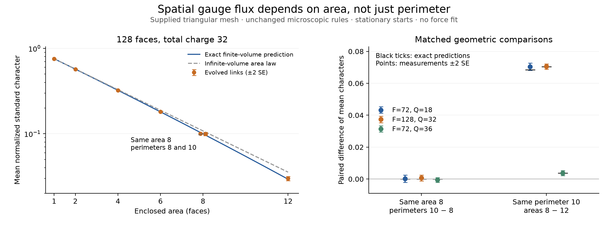

# Spatial Wilson loops: an exact area dependence and a nonabelian readout

The existing raw-link dynamics supports a directly measurable gauge
observable: characters of the holonomy around a disk boundary. Its
stationary expectation depends on enclosed face count, not boundary
perimeter. We derive the finite-volume prediction, including the actual
fixed-charge and full-holonomy-sector conditioning, and observe it under
unchanged primitive evolution.

There is also a primitive-level witness: an elastic update changes a
two-face loop's normalized standard character from $-1/2$ to $1$ while
leaving **every individual face charge unchanged**. Thus this loop
observable detects nonabelian information absent from the charge field.

Area laws and character expansions are established gauge-theory mathematics,
not a new general discovery here. The contribution is the exact
specialization to this derived fiber model, its invariant-sector corrections,
and its raw-link dynamical realization. The base triangular geometry remains
supplied. This is neither emergent spacetime nor a molecular binding law.

## Observe the actual boundary connection

For an oriented closed edge path $C$, multiply the actual edge transports
in path order, respecting inverses on reverse traversal. Write the result
$H_C$. Our stored-link convention composes each new edge on the left.
Changing the root frame conjugates $H_C$, so

$$W_t(C)=\frac{\chi_t(H_C)}{d_t}$$

is gauge invariant. This does not identify distant frames without connector
transport. We evaluate the boundary directly; a product of independently
based face holonomies would generally be wrong.

The three irreducible characters come from the actual triangle
automorphisms. On identity, reflection, and nonidentity rotation classes,
their values and dimensions are

$$\chi_0=(1,1,1),\qquad\chi_s=(1,-1,1),\qquad
\chi_t=(2,0,-1),\qquad(d_0,d_s,d_t)=(1,1,2).$$

Here $t$ denotes the standard two-dimensional representation. We use its
normalized real character, not complex amplitudes. Its values are
$(1,0,-1/2)$.

For a disk of faces $D$, the sign character has an especially simple
interpretation:

$$W_s(\partial D)=(-1)^{\sum_{f\in D}q_f}.$$

Interior edges cancel after applying this one-dimensional character.
Thus $W_s$ is charge-only. The standard character is not: its value can
depend on the relative nonabelian alignment of the enclosed curvature.

## Derive the loop expectation by counting

Let $F$ be the total number of torus faces, $A$ the number inside a simple
contractible loop, and $B=F-A$. Use a formal variable $z$ to count the
already conserved integer charge. No $z$ enters the update schedule or
acts as a newly supplied temperature.

For the central face weight $w_z(g)=z^{q(g)}$, the three convolution
eigenvalues are

$$p_0=1+3z+2z^2,\qquad p_s=1-3z+2z^2,\qquad p_t=1-z^2.$$

They follow from $p_r=d_r^{-1}\sum_g w_z(g)\chi_r(g)$. The derived
character products are $s\otimes s=0$, $s\otimes t=t$, and
$t\otimes t=0\oplus s\oplus t$; $0$ labels the trivial representation.
Let $N_{rs}^{u}$ be these tensor-product multiplicities.

The disk convolution at boundary element $g$ is

$$D_A(g)=\frac16\sum_r d_r p_r^A\chi_r(g).$$

Summing the two handle holonomies in the punctured-torus exterior gives

$$E_B(g)=6\sum_s\frac{p_s^B}{d_s}\chi_s(g).$$

The notation $p_s$ in a sum ranges over representations; elsewhere the
subscript $s$ specifically denotes the sign representation. Multiplying
the disk and exterior counts and inserting $\chi_u/d_u$ gives the
unfiltered canonical numerator

$$M_u^{\rm all}(z)
=6\sum_{r,s}\frac{d_r}{d_s d_u}N_{rs}^{u}\,p_r^A p_s^B.$$

For $u=0$, this is the partition polynomial
$6(p_0^F+p_s^F+p_t^F)$. Root-fixed vertex frames add the same multiplicity
to numerator and denominator and cancel. This is uniform counting of raw
connections, not uniform weighting of differently sized gauge orbits.

This disk/exterior character method is standard; see Aroca and Kubyshin,
[Calculation of Wilson loops in 2-dimensional Yang-Mills theories, section 4](https://arxiv.org/abs/hep-th/9901155).
Here the formal charge-counting weight and the sector subtraction below
come from our existing finite reference measure, not a chosen Wilson action.

## Keep the actual invariant sector

Our experiments condition on total charge $Q$, full $S_3$ holonomy image,
and at least one reflection face. Removing that conditioning would change
the finite-volume prediction.

First subtract configurations with no reflection faces. The same character
formula applies with $(p_0,p_s,p_t)$ replaced by $(a,a,p_t)$, where
$a=1+2z^2$. Then remove the three single-reflection $C_2$ subgroups with
at least one reflection. These three sets are disjoint after the
reflection-free configurations are removed.

Set $u=1+z$, $v=1-z$. Dividing the canonical count polynomials by their
common factor six gives the following closed expressions:

$$\mathcal D=p_0^F+p_s^F-2a^F-u^F-v^F+2,$$

$$\mathcal N_s=p_0^A p_s^B+p_s^A p_0^B-2a^F
-u^A v^B-v^A u^B+2,$$

$$\begin{aligned}
\mathcal N_t={}&p_t^A(p_0^B+p_s^B-2a^B)\\
&+\frac{p_t^B}{4}(p_0^A+p_s^A-2a^A)
-\frac12(u^A+v^A)(u^B+v^B)+2.
\end{aligned}$$

Consequently the exact fixed-charge means are

$$\boxed{\mathbb E_{F,Q}[W_s(C)]
=\frac{[z^Q]\mathcal N_s}{[z^Q]\mathcal D},\qquad
\mathbb E_{F,Q}[W_t(C)]
=\frac{[z^Q]\mathcal N_t}{[z^Q]\mathcal D}.}$$

These rational formulas depend on $A$ but not the shape or perimeter of
the disk. They require its complement to be a punctured torus; they do not
apply unchanged to winding loops, self-intersections, or multiple holes.

An independent direct sum over 7,776 canonical four-face torus connections,
including actual group-valued handle pairs, agrees with 120 exact character
expectations spanning both reference sectors, every available total charge,
and every prefix area. Actual geometric boundary paths are evaluated
separately in the dynamical measurements below.

## The bulk area law and its limits

For fixed finite disk area $A$ and an admissible sequence $Q/F\to\rho$,
with $0<\rho<2$, let the positive counting fugacity solve

$$\rho=\frac{z(3+4z)}{1+3z+2z^2}.$$

The same coefficient asymptotics as in the
[stationary reference](triangle-reference.md) give

$$\lim_{F\to\infty}\mathbb E_{F,Q}[W_r(C)]
=\left(\frac{p_r(z)}{p_0(z)}\right)^A.$$

The proper-subgroup and reflection-free subtractions are exponentially
negligible at fixed interior density. The trivial and parity-related sign
terms must both be retained: $p_s(z)=p_0(-z)$, and admissible total charge
is even. Their paired coefficient contributions cancel the corresponding
factor two in the normalization, leaving the displayed disk factor.
Taking the large-area
limit **after** this infinite-volume limit gives

$$|\mathbb E W_r(C)|=e^{-\kappa_r A},\qquad
\kappa_r=-\log\left|\frac{p_r(z)}{p_0(z)}\right|,$$

when the ratio is nonzero. A negative ratio gives an additional area-parity
sign; a zero ratio gives zero for every nonempty disk. At density $1/4$,

$$z=0.09659642538,\quad
p_s/p_0=0.5570498661,\quad p_t/p_0=0.7571312333,$$
$$\kappa_s=0.5851005169,\qquad\kappa_t=0.2782186809.$$

At density $1/2$, $\kappa_t=0.6363680751$. These are dimensionless
decay rates per supplied face, not physical string tensions. At finite
$F$, the fixed-$Q$ answer is generally not a pure exponential: the exact
coefficient formula, rather than a fitted bulk curve, is the experimental
prediction. Very small sign-character means are not statistically resolved
in all measured cases.

Together the two nontrivial characters determine the entire boundary
holonomy class distribution:

$$\Pr(e)=\frac{1+\mathbb EW_s+4\mathbb EW_t}{6},\quad
\Pr(R)=\frac{1-\mathbb EW_s}{2},\quad
\Pr(Z)=\frac{1+\mathbb EW_s-2\mathbb EW_t}{3}.$$

In the bulk, large disk boundaries therefore approach the Haar class
weights $(1/6,1/2,1/3)$. This is loss of net flux alignment with enclosed
area, not a statement about a relaxation rate in physical time.

## Independent evolution measurements

The confirmation uses 512 independently initialized trajectories in each
of three cases: $(F,Q)=(72,18),(128,32),(72,36)$. Each starts from the exact
uniform raw reference in the stated invariant sector, then runs the
unchanged vacancy/elastic/reaction bank with independent uniform proposals
for 256 attempts per face.

We observe every four attempts per face, including idle attempts in that
clock. The boundary links are read from the compiled engine's actual
states; observing only changing events would incorrectly activity-weight
the measure. We average translated loops and observation times within
each trajectory, then estimate uncertainty across trajectories. Error
bars below are one trajectory-cluster standard error, not errors obtained
by treating neighboring loops or consecutive frames as independent.

The confirmation comprises **35,651,584 forward proposals** and
**1,751,047 changing events** in the combined dynamics. These counts do
not include the engine's auxiliary transport-only run or inverse replay.
The earlier 128-trajectory-per-case exploratory runs are kept separately.

For $F=128,Q=32$, the standard-character results are:

| Enclosed faces | Cell shape | Perimeter edges | Exact mean | Evolved mean |
| ---: | --- | ---: | ---: | ---: |
| 1 | Single triangle | 3 | 0.756929 | $0.756794\pm0.000316$ |
| 2 | $1\times1$ | 4 | 0.571432 | $0.571234\pm0.000325$ |
| 4 | $2\times1$ | 6 | 0.323036 | $0.322710\pm0.000702$ |
| 6 | $3\times1$ | 8 | 0.180576 | $0.180678\pm0.000894$ |
| 8 | $4\times1$ | 10 | 0.099765 | $0.100414\pm0.000912$ |
| 8 | $2\times2$ | 8 | 0.099765 | $0.099741\pm0.000946$ |
| 12 | $3\times2$ | 10 | 0.029335 | $0.029915\pm0.000815$ |

The matched comparisons distinguish the two geometric variables:

- **Same area, different perimeter:** the area-eight means differ by
  $0.000673\pm0.000914$, consistent with the exact zero difference.
- **Same perimeter, different area:** the perimeter-ten means differ by
  $0.070498\pm0.000828$, compared with the exact $0.0704295$.

The corresponding equal-perimeter difference at $F=72,Q=18$ is
$0.070396\pm0.001114$, compared with $0.0685546$. At the higher density
$F=72,Q=36$, the standard character at area eight is
$0.003694\pm0.000547$ for the elongated rectangle and
$0.004255\pm0.000549$ for the compact rectangle; both compare with the
exact $0.00384790$. The area-twelve mean at that density is below the
measurement's resolution and should not be reported as an observed
nonzero signal.

Across all 42 character/shape/case means, the largest standardized
deviation from the exact prediction is about 2.83; those comparisons are
correlated. We do not turn this census into an uncorrected significance
claim. The matched area/perimeter contrasts and exact counting identify
the geometry of the observable more directly.

Stationary initialization means these experiments do **not** establish
equilibration from arbitrary seeds, ergodicity of the full sector, or
spontaneous formation of an equilibrium state. They measure the stated
gauge statistics while actual microscopic evolution is running.

The follow-up [nonstationary loop relaxation](triangle-wilson-relaxation.md)
starts from three elementary link preparations and separates charge
redistribution from nonabelian alignment through an exact conditional
Wilson projection.

## A flux rearrangement invisible to the scalar charge field

In the saved microscopic witness, a two-face cell loop has boundary path

$$[(11,+),(17,+),(37,-),(12,-)]$$

in actual edge IDs. Apply the existing elastic rule 1 on pair support 34.
Its based pair changes from encoded word 32 to 11, namely
$(5,2)\to(1,5)$, using the derived group-element IDs. Every face charge
is unchanged, but the boundary holonomy changes from rotation 3 to
identity 0:

$$W_t:\ -\tfrac12\longrightarrow1.$$

The complete before/after links are saved. This is a direct gauge-invariant
readout of rearranged relative curvature, not a fitted force, phase, or
independently glued local quotient. It also explains why charge-only
measurements miss part of the evolving gauge field.

## What this establishes toward physics

We now have an exact and observed spatial flux-disorder law beyond scalar
charge diffusion, with separate abelian and nonabelian loop readouts.
The distinction between area and perimeter is measurable without a
renderer or an imposed interaction potential.

It does **not** establish confinement of particles. The usual extraction
of a static interaction from a space-time Wilson rectangle needs matter
sources and a physical temporal transport/evolution interpretation. Our
loops here lie entirely in the supplied spatial mesh. Taking minus the
logarithm and calling it a molecular potential would skip those missing
steps. Quantum amplitudes, propagating matter, emergent spatial dimension,
and molecular binding remain unestablished.

Sources and calculation:
[exact loop reference](../tools/triangle_wilson_reference.py),
[actual loop evolution](../tools/triangle_wilson_dynamics.py),
[independent confirmation data](../data/triangle-wilson-confirmation.json),
[earlier exploratory data](../data/triangle-wilson-dynamics.json).
