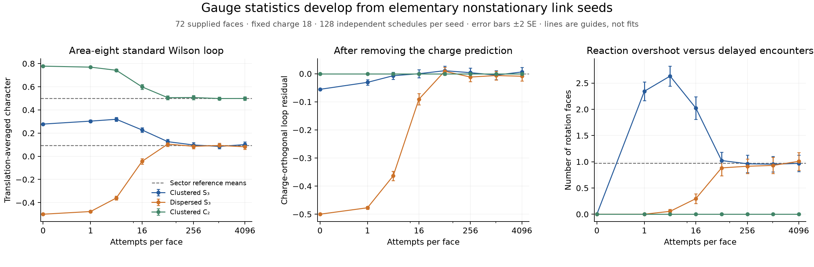

# Gauge-flux relaxation from simple raw-link seeds

The [spatial loop law](triangle-wilson-loops.md) is no longer observed only
from stationary initial samples. Two explicit nonstationary full-$S_3$
seeds develop loop means consistent with that law under the unchanged
primitive dynamics. A matched commuting seed instead remains in its
proper invariant sector and develops different loop statistics.

An exact conditional projection separates charge redistribution from
nonabelian alignment in these measurements. The corresponding loop
residual detects large transient gauge memory that a charge-only
description cannot measure.

These are finite classical gauge-relaxation results on the supplied
triangular mesh with the existing uniform random proposal schedule. They
do not prove whole-sector ergodicity, emergent spacetime, quantum dynamics,
or molecular binding.

## Three elementary preparations, no fitted initial field

Use the side-six torus, with 72 triangular faces and 108 links. Begin with
identity on every link, then set nine horizontal links to derived
reflections. All three preparations have total charge 18, exactly eighteen
charge-one faces, and no charge-two faces.

- **Clustered $S_3$:** horizontal links at cells $(i,j)$ for
  $i,j\in\{0,1,2\}$, with reflection labels cycling as $(i+2j)\bmod3$.
- **Dispersed $S_3$:** the same label pattern on cells $(2i,2j)$.
- **Clustered $C_2$ control:** exactly the clustered occupied links, but
  all nine carry the same reflection.

The actual based-loop holonomy groups have orders six, six, and two,
respectively. The two clustered preparations have **identical complete
initial charge fields** but different gauge information. All prepared
edge IDs, group elements, raw links, and charge fields are saved.

These are specified starting configurations, not proposed molecules or
an imposed continuum field. After preparation, no links are rearranged
except by the existing microscopic rules.

## Project out everything visible in the charge field

For a simple disk $D$, let $W_t(D)$ be its normalized standard Wilson
character. In the uniform full-$S_3$, reflection-present reference $\pi$,
define

$$\Phi_D(\mathbf q)=\mathbb E_\pi[W_t(D)\mid\mathbf q],\qquad
R_D=W_t(D)-\Phi_D(\mathbf q).$$

The conditioning is on the **entire** face-charge field, not merely the
charge sum in the disk. The exact count happens to reduce to the inside
and outside populations, so it is tractable even for many translated
loops.

Write those populations as $n=(n_0,n_1,n_2)$ and $m=(m_0,m_1,m_2)$, and set

$$A_0=3^{n_1}2^{n_2},\quad A_s=(-1)^{n_1}A_0,\quad
A_t=\mathbf1_{n_1=0}(-1)^{n_2},$$

with analogous $B_0,B_s,B_t$ from $m$. Let $N_i=n_i+m_i$.
For the stated sector, $N_1>0$ is even. The conditional character is

$$\boxed{
\Phi_D(\mathbf q)=
\frac{6A_t(B_0+B_s)+\frac32(A_0+A_s)B_t+3A_tB_t
-12\mathbf1_{N_2=0}\mathbf1_{n_1\,\mathrm{even}}}
{12\left(3^{N_1}2^{N_2}-\mathbf1_{N_2=0}\right)}.}$$

This follows from the disk/exterior character count with each face weight
replaced by the indicator of its prescribed charge class. The final
subtraction removes the three proper single-reflection subgroups. The
exterior carries the torus handle, so exchanging inside and outside is
not a symmetry of the formula.

For example, if both regions contain reflections, both $A_t$ and $B_t$
vanish. The conditional mean is then zero except for the small proper-
subgroup subtraction when the entire field contains no rotations. If
there are no reflections inside, some outside, and at least one rotation
somewhere, it simplifies exactly to $(-1/2)^{n_2}$.

An independent direct count on a four-face torus reproduces all 35
nonempty inside/outside population conditions in this sector.

By the defining conditional expectation,

$$\mathbb E_\pi[R_D\mid\mathbf q]=0,\qquad
\mathbb E_\pi[R_D f(\mathbf q)]=0$$

for **every** charge-only function $f$. This is an exact orthogonal
projection, not a Markov closure or an assumption that alignment remains
conditionally equilibrated while the system evolves. A nonzero mean
$R_D$ out of equilibrium detects a deviation of this Wilson observable
from its reference conditional gauge distribution. A zero mean for a
few measured loops does not establish equilibration of all hidden data.

## Actual finite-time evolution

Run 128 independent proposal schedules from each fixed preparation for
4096 attempts per face. Observe at
$\tau=0,1,4,16,64,256,1024,4096$. Idle attempts remain in the clock.
Every loop is evaluated on the compiled engine's actual boundary links.
Spatial translations are averaged within a trajectory; errors are
estimated across independent trajectories.

The three ensembles comprise **113,246,208 combined forward proposals**
and **3,648,484 changing events**. Auxiliary transport-only computations
and reverse replay are excluded from those counts.

For the elongated area-eight loop, the full-$S_3$ stationary prediction
is $\mathbb E_\pi W_t=0.09324838$. Selected measured values are:

| Time, attempts/face | Clustered $S_3$ | Dispersed $S_3$ |
| ---: | ---: | ---: |
| 0 | $0.277778$ | $-0.500000$ |
| 4 | $0.31923\pm0.00791$ | $-0.36013\pm0.00876$ |
| 16 | $0.22711\pm0.01030$ | $-0.04395\pm0.01236$ |
| 64 | $0.12598\pm0.01089$ | $0.10514\pm0.00957$ |
| 256 | $0.09744\pm0.01090$ | $0.08594\pm0.01041$ |
| 4096 | $0.10069\pm0.01105$ | $0.08181\pm0.01020$ |

Errors are one trajectory standard error. Both initial values are far
from the reference and even have opposite signs. The measured late
means are compatible with the same sector prediction. This is evidence
for relaxation of selected observables from these seeds, not proof that
both seeds explore the complete reference sector or mix at a known rate.

## Hidden alignment and charge redistribution need not relax together

For the same loop, the exact initial residuals are

$$R_D^{\rm cluster}=-\frac{2690420}{48427561}
\simeq-0.05555555,$$
$$R_D^{\rm spread}=-\frac{193710243}{387420488}
\simeq-0.4999999974.$$

The clustered residual is $-0.00713\pm0.00618$ at $\tau=4$ and
$0.00008\pm0.00701$ at $\tau=16$. Its mean charge field is still strongly
inhomogeneous at those times. By contrast, the dispersed residual remains
$-0.09060\pm0.01009$ at $\tau=16$, becoming unresolved by $\tau=64$
($0.00884\pm0.00707$).

To distinguish mean-field homogenization from ordinary fluctuations in
a single configuration, we use the cross-trajectory estimator of

$$I(\tau)=\frac1F\sum_f\left(\mathbb E[q_f(\tau)]-Q/F\right)^2.$$

It subtracts the finite-sample variance of each estimated mean and can
be slightly negative near zero. Both $S_3$ preparations start at
$I(0)=0.1875$. At $\tau=16$ their estimates are approximately 0.05868
and 0.00860; at $\tau=64$ they are 0.00649 and $-0.00027$.

The dispersed seed has therefore lost most of its mean charge pattern
by time 16 while retaining a clearly resolved nonabelian loop residual.
The clustered seed displays the converse ordering for this observable.
There is no universal separation of timescales inferred from these two
preparations, and no fitted exponential lifetime is assigned.

## Primitive-level explanation of the different startup

There are 3240 proposal slots, with $F/M=1/45$. Exhausting them at each
initial raw state gives the exact first-step contribution of each rule
family. For an observable $O$, the reported initial rate means

$$\dot O_0^{\rm attempt}:=
F\,\mathbb E[O(X_1)-O(X_0)\mid X_0=x]
=\frac1{45}\sum_a[O(T_ax)-O(x)].$$

It is a rescaled one-step expectation, not a fitted derivative over a
finite interval or a newly imposed continuous-time process.

The clustered $S_3$ seed has 32 changing vacancy slots, 24 changing elastic
slots, and **240 changing reaction slots**. The dispersed seed has 72
changing vacancy slots and no initially changing elastic or reaction
slots. The matched $C_2$ cluster has 32 changing vacancy slots only.

Consequently the initial rotation-population rates are

$$\dot N_{2,0}^{\rm cluster}=16/3,\qquad
\dot N_{2,0}^{\rm spread}=\dot N_{2,0}^{C_2}=0.$$

The clustered rotation count reaches $2.633\pm0.095$ at the sampled time
$\tau=4$, overshooting the full-$S_3$ reference mean 0.974874. The dispersed
seed instead has $0.0547\pm0.0202$ rotations at that time: transport first
has to create reactive encounters. At time 4096 the counts are
$0.9688\pm0.0784$ and $1.0078\pm0.0848$.

The initial area-eight Wilson rates are $-1/90$ for the clustered $S_3$
seed and $1/45$ for the dispersed seed. Yet the clustered mean at time
one is already above its initial value. Its transient therefore cannot
be described as a single monotone exponential chosen from the first-step
slope. The exact family contributions are saved, including the residual
and its charge projection; a vanishing initial elastic contribution to
this translation-averaged observable does not mean all elastic events
are inactive.

## The commuting control has an exact exclusion law

Within a single-reflection holonomy subgroup, every face curvature is
identity or that subgroup's reflection after connector transport. The
elastic rules and all reaction rules are inactive. Vacancy moves simply
exchange neighboring occupations $q_f\in\{0,1\}$.

There are two rooted vacancy slots per undirected dual edge. Thus, for
the degree-three dual graph Laplacian $L_1$, the mean field obeys exactly

$$\boxed{\mathbb E\mathbf q(n)
=\left(I-\frac{2}{45F}L_1\right)^n\mathbf q(0).}$$

This extends the already identified dilute exclusion mechanism to the
entire commuting reflected sector at arbitrary admissible occupation.
It is the familiar symmetric-exclusion heat equation, not a new general
diffusion theorem. Here its rate and domain follow from the actual rules.

Its uniform occupation reference at fixed $Q$ gives the exact disk law

$$\mathbb E W_s(D)=
\frac{\sum_k(-1)^k\binom Qk\binom{F-Q}{A-k}}{\binom FA},\qquad
W_t(D)=\frac{1+W_s(D)}2.$$

The second identity holds configuration by configuration, because the
standard representation restricted to $C_2$ has one trivial and one sign
component. The appropriate conditional loop residual is identically
zero, and no rotations can ever be produced in this invariant sector.

For area eight, the control approaches the distinct prediction 0.50015463;
its time-4096 mean is $0.49870\pm0.00746$, not the $S_3$ value near 0.09325.
In the bulk at occupation density $\rho$, its standard mean is
$[1+(1-2\rho)^A]/2$. The plateau is a trivial representation component
under subgroup restriction, **not evidence of a deconfinement transition**.

The identical starting charge fields of the two clusters therefore do
not determine their macroscopic loop statistics. Their invariant gauge
sectors matter. The control is not an unsuccessful attempt to equilibrate
to the wrong full-$S_3$ reference.

## What is established, and what is still open

The existing primitives produce reaction overshoot, transport-created
encounters, loss of a charge-orthogonal loop signal, and approach to
sector-specific spatial flux statistics from elementary nonstationary
seeds. None of these measurements requires a supplied force or amplitude.

We have not established whole-state equilibration, a thermodynamic
relaxation theorem, matter coupling, a physical temporal Wilson loop,
quantum interference, emergent dimension, or molecular binding. The raw
graph topology and random proposal schedule are still supplied. A next
physical question is how the gauge-memory and reaction-relaxation scales
behave with loop size and system size, rather than declaring their
finite-seed behavior universal.

Calculations:
[conditional loop count](../tools/triangle_wilson_reference.py),
[nonstationary evolution](../tools/triangle_wilson_quench.py),
[exact initial primitive drifts](../tools/triangle_wilson_seed_drift.py),
[trajectory data](../data/triangle-wilson-quench.json),
[exact drift and heat-equation data](../data/triangle-wilson-seed-drift.json).
