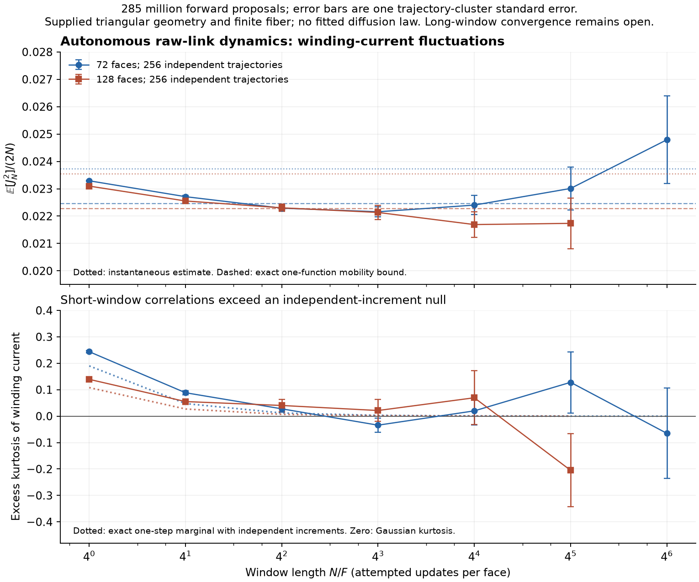

# Winding fluctuations under autonomous gauge dynamics

The variational calculations constrain long-time conserved-charge transport.
Here we measure the corresponding current directly under the unchanged
microscopic vacancy, elastic, and reaction bank. Geometry and fiber are
still supplied. No diffusion equation, binding force, or adaptive physical
schedule is inserted.

Across 285,212,672 forward proposals on 72- and 128-face tori, the
measurements show a crossover toward approximately linear-in-time winding
variance and near-Gaussian standardized fluctuations. Short-window
statistics differ clearly from independent microscopic increments.
This is evidence consistent with emergent **classical diffusive transport**
in this gauge-coupled model, not a hydrodynamic-limit proof or new physics
beyond established diffusion phenomena.

## A finite observation window is not the mobility limit

Use the actual lifted dual-edge current, including periodic crossings,
and write $J_N=\sum_{t=0}^{N-1}j_t$ for its $x$ component. Define

$$\mu_N=\frac{\mathbb E[J_N^2]}{2N},\qquad
\sigma_F=\lim_{N\to\infty}\mu_N.$$

The expectation starts in the exact stationary reference at $Q=F$, full
based-loop image $S_3$, and reflection presence. It need not represent a
single communicating component. With $M=45F$, $P=I-L/M$, and the physical
current drift $b=b_3/3$, inverse pairing gives

$$\mathbb E[j_0j_\ell]=-
\frac{\langle b,P^{\ell-1}b\rangle}{M^2},\qquad\ell\geq1.$$

Summing the stationary increment covariances therefore yields

$$\mu_N=\sigma_F^{(0)}-
\frac1{M^2N}\sum_{\ell=1}^{N-1}(N-\ell)
\langle b,P^{\ell-1}b\rangle.$$

For an eigenvalue $\lambda\ne1$,

$$\sum_{\ell=1}^{N-1}(N-\ell)\lambda^{\ell-1}
=\frac{N}{1-\lambda}-\frac{1-\lambda^N}{(1-\lambda)^2}.$$

The current drift is orthogonal to component constants. Consequently,
with $L^+$ the pseudoinverse,

$$\boxed{\mu_N-\sigma_F
=\frac1N\langle b,(L^+)^2(I-P^N)b\rangle\geq0.}$$

The sign follows from self-adjointness and $-1\leq\lambda\leq1$;
it does not require every eigenvalue of $P$ to be nonnegative. Also

$$0\leq\mu_N-\sigma_F\leq\frac{2\|L^+b\|^2}{N}.$$

This controls the form and sign of finite-time bias, not its useful
numerical size: the exact corrector norm is still unknown. A sample mean
of $J_N^2/(2N)$ is not itself a certified upper bound, and a plateau
across finitely many windows is evidence, not a convergence proof.
In particular, a short-window value above a variational upper bound is
not a contradiction: the two quantities differ by this positive bias.

## Independent trajectories, correlated windows

The measurement uses independent exact initial connections and independent
uniform primitive-proposal schedules. The existing compiled raw-link
engine executes the bank. Its event records supply the before/after
based tuples and the actual written-link supports.

For a pair, continuity gives $j=-\Delta q_0$ along its dual edge. For
a fan it gives $j_0=-\Delta q_0$, $j_1=\Delta q_2$ along its two-edge
dual path. Multiplying by the lifted cell-coordinate displacements and
summing gives winding current without requiring particle identities.
Every elastic event has zero charge-current increment.

The event-based current is checked against the endpoint charge polarization
modulo the torus periods. One complete trajectory additionally reconstructs
every event's charge change and agrees with the final raw-link charges.
These checks concern the mathematical observable; they do not alter or
repair trajectories based on their expected shape.

Each trajectory is divided into nonoverlapping windows at each chosen
length. Windows from one trajectory may be dependent. Their squared
currents are averaged within that trajectory first; standard errors use
the independent **trajectory means** as observations. Different window
lengths also share trajectories and are not independent replications.

The mean current is exactly zero in the stationary reference, so the
second moment is used without subtracting a fitted sample drift. The
fourth moment supplies an excess-kurtosis diagnostic; its reported
delta-method error also uses independent trajectory clusters. Agreement
with zero kurtosis alone would not prove a Gaussian limiting process.

## Measured finite-time transport

Each size uses 256 independent trajectories. The 72-face trajectories run
for 8192 attempts per face (seed base 195762001); the 128-face trajectories
run for 4096 attempts per face (seed base 206873001). Initial and proposal
seeds are respectively base $+2i$ and base $+2i+1$ for trajectory $i$.
There are 22,279,671 and 19,660,873 changing events, respectively; no-op
proposals remain included in the time normalization.

The following are estimates of $\mu_N$, with one trajectory-cluster
standard error:

| Window $N/F$ | 72 faces | 128 faces |
| --- | --- | --- |
| 1 | $0.023292\pm0.000024$ | $0.023097\pm0.000033$ |
| 4 | $0.022711\pm0.000046$ | $0.022554\pm0.000066$ |
| 16 | $0.022292\pm0.000088$ | $0.022304\pm0.000131$ |
| 64 | $0.022160\pm0.000181$ | $0.022135\pm0.000263$ |
| 256 | $0.022403\pm0.000349$ | $0.021692\pm0.000466$ |
| 1024 | $0.023011\pm0.000785$ | $0.021736\pm0.000927$ |

The additional 4096-window measurement at 72 faces is
$0.024791\pm0.001602$. It has only two windows per trajectory, compared
with 8192 at the shortest length. It does not establish a late upturn;
the longest windows have substantially less precision.

The exact instantaneous estimates are $0.02373010$ and $0.02353773$.
The observed reduction on intermediate windows is consistent with the
memory suppression established by the variational calculation. The
16--256 range is compatible with a transport scale near $0.022$, but
neither a plateau nor a fitted asymptotic coefficient is asserted from
these observations. The finite-window bias above remains unquantified.

The $y$ variance and cross covariance are also recorded. They are close
to $\mu_{yy}=\mu_{xx}$ and $\mu_{xy}=\mu_{xx}/2$, the isotropic tensor
form in these **oblique cell coordinates**. This is consistency with
the supplied triangular geometry, not emergent rotational symmetry or
an inferred spatial dimension.

These direct-trajectory errors are too large to isolate the extra
$\sim5\times10^{-5}$ hidden-gauge improvement resolved by
[stationary variational sampling](triangle-gauge-resolved-transport.md).
The two pieces of evidence must remain distinct.

## An exact independent-increment null for the fourth moment

The short-time excess kurtosis is not just a consequence of using
discrete, occasionally zero current increments. Compute the actual
one-step moments from the same microscopic bank before comparing.
Let $p_{abc}$ abbreviate the exact ordered charge-pattern probability
$p_F(a,b,c)$ used in the previous charge-moment census. Direct current
powers and birth/death reversal pairing give

$$m_2=\mathbb E[j^2]
=\frac{12p_{110}+48p_{101}+480p_{111}}{9\cdot45},$$

$$\boxed{m_4=\mathbb E[j^4]
=\frac{36p_{110}+576p_{101}+3168p_{111}}{81\cdot45}.}$$

The reaction contribution uses the four death slots on each $(0,1,2)$
permutation and their equal reverse-birth expectations. No average hidden
gate activity is inserted. Here the subscripts count charge populations
on an ordered support; they are not the literal charge values of one
tuple.

If increments with this exact marginal were independent, the excess
kurtosis of an $N$-step sum would be

$$\kappa_{\rm iid}(N)=\frac{m_4/m_2^2-3}{N}.$$

At one attempt per face this predicts $0.19000$ on 72 faces and
$0.10792$ on 128 faces. Actual evolution instead gives
$0.24377\pm0.00420$ and $0.13916\pm0.00577$. The independent-increment
null misses the short-window statistics even though it matches the
exact microscopic one-step distribution.

At 64 attempts per face, the measured excess kurtoses are
$-0.03425\pm0.02696$ and $0.02122\pm0.04132$, consistent with zero on
this empirical error scale. Together with the variance crossover, this
supports coarse-scale diffusive behavior while retaining detectable
microscopic temporal correlations. It does not identify how much of the
fourth-moment discrepancy is hidden-gauge memory versus nonlinear charge
memory, establish independent increments at larger windows, or prove a
Gaussian process limit.

## What this leaves open

The observations concern ensemble-averaged transport at two fixed finite
volumes. They do not establish irreducibility, the thermodynamic mobility,
a hydrodynamic limit, localization or binding, quantum interference, or
emergent geometry. A useful next calculation is a more precise long-time
estimator using the derived corrector and its residual, alongside a
controlled volume study; an imposed diffusion equation would not answer
that question.

Calculation: [triangle_winding_trajectories.py](../tools/triangle_winding_trajectories.py).
Numerical record: [triangle-winding-fluctuations.json](../data/triangle-winding-fluctuations.json).
